# AI Business Operating System — Architecture Decision Records

**Document type:** ADR Collection
**Companion to:** System Architecture, Implementation Roadmap, Database Design, API Specification, Security Architecture
**Version:** 1.0

---

## ADR Format

Every ADR follows this structure: **Title · Status · Date · Context · Decision · Alternatives Considered · Pros · Cons · Trade-offs · Consequences · Future Revisions · Related ADRs.**

Status values: `Accepted` | `Proposed` | `Deprecated` | `Superseded by ADR-XXX`.

---

# ADR-001: Repository Strategy — Monorepo with Turborepo

**Status:** Accepted
**Date:** 2026-01-15

**Context:** The platform consists of multiple services (API, AI orchestrator, workflow engine, workers, realtime gateway), three client apps (web, mobile, admin), and shared packages (design system, contracts, SDKs). The team must decide between a monorepo, a polyrepo, or a hybrid approach. Early velocity matters — the founding team is 6–12 engineers who need to ship cross-cutting changes quickly.

**Decision:** Single monorepo managed with Turborepo (TypeScript packages) and uv/Poetry (Python services). pnpm workspaces for TS; Python services each have their own `pyproject.toml`. One GitHub repository, one CI pipeline, one PR workflow.

**Alternatives Considered:**
1. *Polyrepo (one repo per service/app):* Maximum isolation, independent release cycles.
2. *Nx monorepo:* Mature, but heavier configuration; better fit for Angular-centric stacks.
3. *Bazel monorepo:* Hermetic builds, polyglot-native; very high learning curve.

**Pros:** Single source of truth, atomic cross-service refactors, shared CI pipeline, simpler dependency management for shared contracts, one PR for end-to-end features, code review across the full stack.

**Cons:** Larger repo checkout, CI times grow if caching is not tuned, merge contention on `main` with >20 engineers, Python and TS toolchains are not natively unified.

**Trade-offs:** We accept increased CI complexity (caching, selective builds) in exchange for delivery velocity and code coherence during the 0-to-1 phase.

**Consequences:** (a) All engineers work in one repo — onboarding is one `git clone`. (b) Turborepo caching and task pipelines must be tuned quarterly as the repo grows. (c) Branch protection and CODEOWNERS per directory are critical to avoid merge chaos. (d) If the team exceeds ~40 engineers, we may revisit polyrepo extraction for services with independent release cadence.

**Future Revisions:** If CI times exceed 15 minutes despite caching, evaluate Nx or Bazel. If a service needs a fundamentally different release cadence (e.g., mobile app with App Store review cycles), extract it to a separate repo with shared contract validation.

**Related ADRs:** ADR-021 (Docker), ADR-023 (CI/CD), ADR-039 (Dependencies).

---

# ADR-002: Modular Monolith Architecture

**Status:** Accepted
**Date:** 2026-01-15

**Context:** The platform has six business modules (CRM, Finance, Projects, HR, Inventory, Support), a shared kernel (auth, tenancy, RBAC, audit, events, storage), and satellite services (AI orchestrator, workflow engine, realtime gateway, workers). We need an architecture that delivers fast while preserving the option to extract microservices later.

**Decision:** The core application is a modular monolith — a single deployable FastAPI service with strictly isolated Python packages per bounded context. Each module has its own `api/`, `application/`, `domain/`, `infrastructure/` layers. Modules communicate only via the in-process event bus or the public application-layer interfaces, never by importing another module's domain internals. The AI orchestrator, workflow engine, realtime gateway, and Celery workers are separate services because their scaling, dependency, and failure profiles differ fundamentally from CRUD business modules.

**Alternatives Considered:**
1. *Microservices from day one:* Maximum isolation and independent scaling.
2. *Serverless (Lambda/Cloud Functions):* Auto-scaling, zero ops for compute.
3. *Majestic monolith (no internal module boundaries):* Simplest possible start.

**Pros:** Single deployment simplifies ops; in-process calls are fast; shared DB transaction boundaries simplify consistency; module boundaries enforce clean architecture without distributed-system overhead; extraction seams are explicit (each module owns its own DB schema).

**Cons:** All modules share a process — a crash in one module affects others; scaling is uniform (cannot scale Finance independently); a discipline failure erodes module boundaries over time.

**Trade-offs:** We accept coupled deployment and uniform scaling in exchange for dramatically lower operational and development complexity during the first 18 months. The explicit module boundaries (enforced by CI import linting) preserve the extraction option.

**Consequences:** (a) CI must lint for cross-module domain imports and block violations. (b) Database schemas are per-module, making future DB-per-service extraction a schema migration, not a rewrite. (c) The satellite services (AI, workflow, realtime, workers) are already separate — they serve as the template for future extractions. (d) A "module health" dashboard tracks coupling metrics (cross-module imports, shared-table writes).

**Future Revisions:** When any module needs independent scaling (e.g., Finance at month-end close) or independent deployment (e.g., AI orchestrator already separate), extract it. The module boundary is the extraction seam. Target: first extraction candidate evaluated at 10k active tenants.

**Related ADRs:** ADR-003 (Multi-Tenant), ADR-004 (PostgreSQL), ADR-009 (FastAPI), ADR-019 (Event-Driven).

---

# ADR-003: Multi-Tenant Architecture — Shared DB, Row-Level Isolation

**Status:** Accepted
**Date:** 2026-01-20

**Context:** The platform serves multiple independent organizations (tenants). Each tenant's data must be completely isolated. The approach must support thousands of tenants economically while offering a physical-isolation upgrade path for regulated or enterprise customers.

**Decision:** Shared database, shared schema, with `tenant_id` on every row. Isolation enforced by PostgreSQL Row-Level Security (RLS) as the database-level backstop, plus application-middleware tenant context as the primary control. Enterprise tenants can be escalated to dedicated schema or dedicated database without application code changes.

**Alternatives Considered:**
1. *Database-per-tenant:* Complete physical isolation; easiest compliance story.
2. *Schema-per-tenant:* Moderate isolation; per-tenant migration overhead.
3. *Application-level filtering only (no RLS):* Simpler DB setup; relies entirely on app correctness.

**Pros:** Maximum tenant density (thousands per DB); single migration path; single connection pool; lowest operational cost; RLS provides defense-in-depth independent of application correctness.

**Cons:** Noisy-neighbor risk on shared resources; cross-tenant bug has higher theoretical blast radius (though RLS prevents data leakage); compliance-sensitive tenants may demand physical isolation.

**Trade-offs:** We accept shared-resource noisy-neighbor risk (mitigated by per-tenant rate limiting and query timeouts) and a more complex RLS setup in exchange for operational simplicity and cost efficiency at scale. The escalation path to dedicated schema/DB preserves optionality for enterprise.

**Consequences:** (a) Every tenant-scoped table must have `tenant_id` + RLS policy — enforced by migration lint. (b) `tenant_id` is denormalized onto child tables for RLS and index performance. (c) The `TenantResolver` middleware is a critical security component — it must be tested with cross-tenant CI tests on every PR. (d) Connection pool is shared; per-tenant query rate limiting prevents one tenant from exhausting the pool.

**Future Revisions:** Introduce dedicated-schema mode when first Enterprise customer requests it. Introduce database sharding (by tenant) if single-DB reaches capacity ceiling (~50k active tenants or ~10TB).

**Related ADRs:** ADR-004 (PostgreSQL), ADR-013 (RLS), ADR-007 (Redis isolation).

---

# ADR-004: PostgreSQL as Primary Database

**Status:** Accepted
**Date:** 2026-01-20

**Context:** The platform needs a relational OLTP database for structured business data (invoices, deals, employees, tasks). It must support multi-tenancy, strong consistency, rich querying, and extensions for vector search and partitioning.

**Decision:** PostgreSQL 16 as the single source of truth for all OLTP data. Extensions: `pgcrypto` (UUIDs), `pg_partman` (partitioning), `pgvector` (embeddings), `pg_trgm` + `btree_gin` (fuzzy search), `btree_gist` (EXCLUDE constraints). Managed deployment (RDS/CloudSQL) with Multi-AZ.

**Alternatives Considered:**
1. *MySQL 8:* Mature, but weaker extension ecosystem; no native RLS; no vector support.
2. *CockroachDB:* Distributed SQL; excellent horizontal scaling; higher operational complexity and cost; less mature extension ecosystem.
3. *MongoDB:* Flexible schema; poor fit for relational business data (invoices, double-entry ledger); no RLS equivalent.
4. *Vitess (sharded MySQL):* Horizontal MySQL scaling; complex operational model.

**Pros:** Battle-tested reliability, RLS for tenant isolation, `pgvector` eliminates a separate vector DB for small-to-medium scale, `pg_partman` handles time-series tables, rich constraint system (CHECK, EXCLUDE, partial UNIQUE), JSONB for flexible schemas, mature tooling (Alembic, SQLAlchemy, pg_dump), managed offerings from all major clouds.

**Cons:** Single-node write scalability ceiling (~50k TPS before sharding); vertical scaling for large datasets; `pgvector` is slower than dedicated vector DBs (Qdrant, Pinecone) at scale; operational burden of partitioning and vacuuming.

**Trade-offs:** We accept single-node write limits (sufficient for ~50k active tenants) and moderate vector performance in exchange for a single, well-understood data platform that covers OLTP + vectors + full-text + time-series partitioning. Dedicated vector DB (Qdrant) is the escape hatch when pgvector becomes a bottleneck.

**Consequences:** (a) All OLTP state lives in Postgres — it is the single source of truth. (b) Analytics is offloaded to ClickHouse via CDC; Postgres is not used for OLAP. (c) pgvector is the default for tenant embeddings; Qdrant is behind a feature flag for large-scale tenants. (d) Managed Postgres (RDS/CloudSQL) handles HA, backups, patching.

**Future Revisions:** Evaluate CockroachDB if multi-region active-active write is needed. Evaluate Qdrant promotion from flag to default when median tenant exceeds 1M chunks.

**Related ADRs:** ADR-003 (Multi-Tenant), ADR-005 (SQLAlchemy), ADR-006 (Alembic), ADR-013 (RLS), ADR-017 (pgvector).

---

# ADR-005: SQLAlchemy 2.0 as ORM

**Status:** Accepted
**Date:** 2026-01-22

**Context:** The application needs an Object-Relational Mapper to bridge Python domain models and PostgreSQL tables. The ORM must support async, typed annotations, composable queries, and advanced Postgres features (RLS GUC setting, EXCLUDE constraints, pgvector types, partitioned tables).

**Decision:** SQLAlchemy 2.0 with declarative `Mapped[...]` annotations, `mapped_column()`, and `asyncio` engine. Async sessions via `async_sessionmaker`. Connection pool managed by SQLAlchemy (with PgBouncer in front in production). Session-level GUC (`SET LOCAL app.tenant_id`) set via a `begin` event hook.

**Alternatives Considered:**
1. *Django ORM:* Tightly coupled to Django framework; weaker async support; no native GUC setting.
2. *Tortoise ORM:* Async-first, lighter; less mature, smaller ecosystem, weaker advanced Postgres support.
3. *Raw SQL (asyncpg):* Maximum performance and control; no ORM abstraction, higher maintenance burden.
4. *Prisma (Python client):* Early stage; TypeScript-first; insufficient Postgres feature coverage.

**Pros:** Most mature Python ORM; full Postgres feature support (custom types, GUC, EXPLAIN); first-class async support in 2.0; typed annotations for IDE/mypy; `version_id_col` for optimistic concurrency; composable `select()` for read models; massive ecosystem (Alembic, sqlacodegen, etc.).

**Cons:** Steep learning curve; verbose for simple cases; async mode has some footguns (lazy loading disabled, which is actually a safety benefit); migration from 1.x patterns still in community memory.

**Trade-offs:** We accept higher initial learning cost in exchange for the most complete Postgres-native ORM available in Python, which directly supports our RLS strategy, partitioned tables, and pgvector integration.

**Consequences:** (a) All models use `Mapped[...]` annotations (no legacy `Column()` patterns). (b) `lazy="raise"` on all relationships to prevent N+1 — explicit loading required. (c) Async sessions only; no sync fallback in application code. (d) Raw SQL is allowed only in migration scripts and must be reviewed by the DB security lead.

**Future Revisions:** None anticipated — SQLAlchemy 2.x is the long-term investment.

**Related ADRs:** ADR-004 (PostgreSQL), ADR-006 (Alembic), ADR-009 (FastAPI).

---

# ADR-006: Alembic Migration Strategy — Online-Safe, Zero-Downtime

**Status:** Accepted
**Date:** 2026-01-22

**Context:** Database schema evolution must be safe, reversible, and deployable without downtime. The migration system must handle standard DDL, RLS policies, partitioning, triggers, and enum evolution — some of which Alembic's autogenerate does not detect.

**Decision:** Alembic as the migration framework, with a strict set of online-safety rules: additive-first (expand/contract pattern), `CREATE INDEX CONCURRENTLY` for all index additions, `NOT VALID` + `VALIDATE CONSTRAINT` for constraint additions, enum values only added (never removed), every migration has a tested `downgrade`. RLS policies, triggers, EXCLUDE constraints, and partitioning are hand-written in migrations (not autogenerated).

**Alternatives Considered:**
1. *Django migrations:* Tied to Django ORM.
2. *Flyway:* JVM-based, SQL-file-driven; no Python ORM integration.
3. *sqitch:* Change-management-centric; dependency-based ordering; less community support in Python.

**Pros:** Native SQLAlchemy integration; autogenerate as a starting point; full control over raw SQL for advanced features; community standard in Python.

**Cons:** Autogenerate misses RLS, triggers, partitions — manual work needed; migration naming is sequential (not content-addressable); merge conflicts on migration ordering possible.

**Trade-offs:** We accept manual migration authoring for advanced features in exchange for the tightest possible ORM-to-migration integration and the broadest community support.

**Consequences:** (a) Every migration is CI-tested: apply → downgrade → apply on both empty and seeded DBs. (b) The `alembic check` command runs in CI to verify model-DB sync. (c) Cross-tenant RLS test runs after every migration that touches tenant-scoped tables. (d) A migration ordering convention (`0001_extensions`, `0002_enums`, etc.) prevents dependency issues.

**Future Revisions:** Evaluate `atlas` (Ariga) if Alembic's sequential ordering becomes a bottleneck with many concurrent feature branches.

**Related ADRs:** ADR-004 (PostgreSQL), ADR-005 (SQLAlchemy), ADR-013 (RLS).

---

# ADR-007: Redis as Cache, Session Store, and Queue Broker

**Status:** Accepted
**Date:** 2026-01-25

**Context:** The platform needs: (a) a low-latency cache for hot data, (b) a session store for auth tokens, (c) a rate-limit store, (d) a pub/sub backplane for realtime, (e) a broker for Celery tasks, and (f) distributed locks. Using separate systems for each would multiply operational overhead.

**Decision:** Redis 7 (Cluster mode in production) serves all six roles. Tenant isolation via key prefix `t:{tenant_id}:`. Redis ACLs restrict the application role to its key patterns. TLS in transit and at rest.

**Alternatives Considered:**
1. *Memcached (cache) + RabbitMQ (broker) + Redis (pub/sub):* Best-of-breed per role; 3× operational overhead.
2. *Valkey (Redis fork):* API-compatible; community younger; less managed-service support.
3. *DragonflyDB:* Multi-threaded Redis alternative; less mature; managed offerings limited.

**Pros:** One system to operate; sub-millisecond latency for cache hits; native pub/sub for realtime; proven Celery broker support; cluster mode for horizontal scaling; Redis Streams for durable AI token buffering.

**Cons:** Single point of failure if Redis goes down (cache, sessions, queues all affected simultaneously); Redis is single-threaded per shard (high throughput requires more shards); memory-bound (expensive for large datasets).

**Trade-offs:** We accept the blast radius of a Redis outage (mitigated by Multi-AZ cluster + application fallback to DB for critical paths) in exchange for a single, well-understood data plane for all ephemeral state.

**Consequences:** (a) Application must handle Redis unavailability gracefully — cache misses fall through to DB, rate limiting falls back to in-memory counters, sessions validated against DB if Redis is down. (b) Redis is never a source of truth for business data — only a performance layer. (c) RBAC decisions cached in Redis are treated as advisory; the DB is re-queried for high-stakes permission checks.

**Future Revisions:** Evaluate DragonflyDB when managed offerings mature. Consider RabbitMQ for task broker if Celery workloads exceed Redis capacity.

**Related ADRs:** ADR-003 (Multi-Tenant), ADR-008 (Celery), ADR-018 (WebSocket).

---

# ADR-008: Celery Worker Architecture

**Status:** Accepted
**Date:** 2026-01-25

**Context:** Many operations must happen asynchronously: email delivery, PDF rendering, AI batch jobs, file scanning, report generation, webhook dispatch, workflow steps. The system needs a distributed task queue with retries, rate limiting, scheduling, and per-tenant fairness.

**Decision:** Celery 5 with Redis broker (RabbitMQ as a future option). Separate queues per concern (`emails`, `notifications`, `ai`, `ingest`, `reports`, `integrations`, `webhooks`, `beat`). Separate worker pools for I/O-bound (`gevent`) and CPU-bound (`prefork`) queues. `acks_late=True` + `task_reject_on_worker_lost=True` for at-least-once semantics. Dead-letter queue per queue. Per-tenant rate limiting via Redis token bucket in a task base class.

**Alternatives Considered:**
1. *Temporal:* Durable execution, built-in retries and state; higher operational complexity; considered for workflow engine (and may be adopted there).
2. *Dramatiq:* Simpler API than Celery; smaller ecosystem; fewer battle scars.
3. *AWS SQS + Lambda:* Fully managed; vendor lock-in; cold start latency; no persistent workers.
4. *Arq (asyncio):* Lightweight, async-native; less mature, fewer features.

**Pros:** Most mature Python task queue; battle-tested at scale; rich retry/rate-limit/priority features; Celery Beat for scheduling; extensive monitoring (Flower).

**Cons:** Celery codebase is large and complex; configuration footguns (broker vs. result backend); `gevent` mode has greenlet-related debugging challenges; no built-in durable execution (workflows need explicit checkpointing).

**Trade-offs:** We accept Celery's complexity in exchange for its proven reliability and feature depth. For the workflow engine specifically, Temporal is the preferred runtime (ADR-019 Future Revisions) because workflows need durable execution semantics that Celery does not natively provide.

**Consequences:** (a) Task payloads are signed (HMAC) to prevent injection. (b) Tasks carry only IDs, not full objects — workers re-fetch from DB. (c) Per-tenant concurrency limits prevent one tenant from monopolizing a queue. (d) DLQ monitoring is alerting-mandatory; non-zero DLQ triggers a PagerDuty P3.

**Future Revisions:** Adopt Temporal for the workflow engine if Celery-based DAG execution proves brittle. Evaluate Arq if async-native tasks become dominant.

**Related ADRs:** ADR-007 (Redis), ADR-019 (Event-Driven), ADR-020 (Outbox).

---

# ADR-009: FastAPI as Backend Framework

**Status:** Accepted
**Date:** 2026-01-28

**Context:** The API service needs a Python web framework that supports async, type-safe request/response handling, OpenAPI generation, dependency injection, and WebSocket. It must integrate cleanly with SQLAlchemy 2.0 async and the Pydantic ecosystem.

**Decision:** FastAPI with Pydantic v2 for request/response schemas. Uvicorn as the ASGI server. Dependency injection for auth, tenant context, DB session, rate limiting, and permission checking.

**Alternatives Considered:**
1. *Django + DRF:* Mature, batteries-included; synchronous by default; less Pydantic integration; heavy for an API-first platform.
2. *Flask + Marshmallow:* Lightweight; no async; no native OpenAPI; manual dependency injection.
3. *Starlette (raw):* FastAPI's foundation; all control, less structure; more boilerplate.
4. *Litestar:* FastAPI competitor; younger community; DTO-based validation.

**Pros:** First-class async, native Pydantic v2 integration, automatic OpenAPI 3.1 generation, dependency injection system maps cleanly to cross-cutting concerns (auth, tenant, RBAC), high performance (Starlette + Uvicorn), large and growing community.

**Cons:** Not batteries-included (no admin panel, no ORM, no auth module — all assembled); some advanced patterns (middleware ordering, exception handler scope) require deep ASGI knowledge; `Depends()` chains can become deeply nested.

**Trade-offs:** We accept the assembly-required nature (we want to control each layer precisely) in exchange for maximum async performance, type safety, and OpenAPI-native development.

**Consequences:** (a) OpenAPI spec is auto-generated from code — the API spec document and the running code are always in sync. (b) Pydantic v2 schemas are the single source of truth for validation — no separate validation layer. (c) Every route uses `Depends()` for `require(permission)`, `get_tenant_context()`, `get_db_session()` — these are enforced by CI lint.

**Future Revisions:** None anticipated — FastAPI is the long-term investment for the Python backend.

**Related ADRs:** ADR-005 (SQLAlchemy), ADR-034 (API Versioning), ADR-037 (Error Handling).

---

# ADR-010: Next.js as Frontend Framework

**Status:** Accepted
**Date:** 2026-01-28

**Context:** The web application needs server-side rendering (for SEO on public pages like the knowledge base), a component-based UI, code splitting, and a modern developer experience. It must support a design system, i18n, and realtime features (WebSocket).

**Decision:** Next.js 14+ (App Router) with TypeScript, TanStack Query for server state, Tailwind CSS + shadcn/ui for the design system, next-intl for i18n. Generated API client from OpenAPI spec for type-safe API calls.

**Alternatives Considered:**
1. *Remix:* Excellent data loading model; smaller ecosystem; less SSR/ISR maturity.
2. *Nuxt (Vue):* Mature; Vue ecosystem is smaller for enterprise components.
3. *SvelteKit:* Excellent DX; smallest ecosystem; fewer enterprise-grade component libraries.
4. *Angular:* Batteries-included; heavier; TypeScript-native but more opinionated than needed.

**Pros:** Most mature React meta-framework; App Router enables fine-grained SSR/SSG/ISR; Tailwind + shadcn/ui provide a fast, customizable design system; TypeScript-first; largest ecosystem for React components; Vercel deployment option for edge performance.

**Cons:** App Router is complex (RSC, server actions, route groups); framework churn (Pages Router → App Router migration stories in community); Vercel-optimized (self-hosting is supported but less documented).

**Trade-offs:** We accept App Router complexity in exchange for the best SSR/ISR capabilities and the largest component ecosystem. Self-hosting on Kubernetes with `output: 'standalone'` avoids Vercel lock-in.

**Consequences:** (a) Design system published as a shared package consumed by web, admin, and mobile (React Native shares tokens). (b) API client generated in CI from OpenAPI spec — type mismatches caught at compile time. (c) Web app is a client of the REST API only — no direct DB access from Next.js.

**Future Revisions:** Evaluate React Server Components + server actions for data-heavy admin pages. Evaluate Remix if Next.js App Router stability concerns persist.

**Related ADRs:** ADR-001 (Monorepo), ADR-034 (API Versioning), ADR-040 (Coding Standards).

---

# ADR-011: JWT Authentication with Rotating JWKS

**Status:** Accepted
**Date:** 2026-02-01

**Context:** The platform needs stateless API authentication that works across services, supports short-lived sessions, and enables revocation. The auth system must support both interactive users and programmatic API keys.

**Decision:** RS256 JWT access tokens (10-minute TTL) + rotating refresh tokens (7-day sliding). JWKS endpoint publishes public keys. Session record in Redis for revocation. API keys as a separate auth path (hashed, scoped, IP-restricted).

**Alternatives Considered:**
1. *Opaque session tokens (server-side lookup on every request):* Simpler; every request hits Redis/DB; no distributed verification.
2. *Paseto tokens:* More opinionated, arguably safer defaults; smaller ecosystem; no JWKS standard.
3. *HS256 JWT (symmetric):* Simpler key management; every service needs the secret; vulnerable to algorithm confusion.

**Pros:** RS256 is asymmetric — only the auth service holds the private key; all other services verify with the public JWKS. Short TTL limits exposure window. Refresh token rotation with reuse detection provides theft awareness. JWKS rotation is zero-downtime.

**Cons:** 10-minute window of valid token after session revocation (mitigated by Redis session check on sensitive endpoints). JWT size (~1KB) adds overhead to every request. Key rotation requires careful dual-key period management.

**Trade-offs:** We accept a short validity window after revocation (mitigated by session check on high-impact endpoints) in exchange for stateless verification on the hot path (no Redis call for most read requests).

**Consequences:** (a) Gateway validates JWT signature + expiry + issuer + audience on every request (fast, stateless). (b) Sensitive endpoints (mutations, exports, admin) additionally check Redis session record (stateful, but only on the critical path). (c) JWKS rotation every 90 days with 15-minute dual-key overlap.

**Future Revisions:** Evaluate DPoP (Demonstrating Proof of Possession) for API keys to bind tokens to a client key pair, preventing token theft.

**Related ADRs:** ADR-012 (RBAC/ABAC), ADR-035 (Security Model).

---

# ADR-012: RBAC + ABAC Authorization Model

**Status:** Accepted
**Date:** 2026-02-01

**Context:** The platform needs fine-grained access control that supports both coarse role-based gating and attribute-based conditions (e.g., "invoices over $10k require a senior approver"). Tenant admins must be able to define custom roles without engineering support.

**Decision:** Hybrid RBAC + ABAC. RBAC handles coarse gating (roles → permissions → routes). ABAC evaluates dynamic conditions on top of RBAC grants. Roles can be scoped to tenant/org/department/team/own. Policy engine (OPA sidecar or Casbin embedded) evaluates ABAC rules.

**Alternatives Considered:**
1. *RBAC only:* Simpler; insufficient for attribute-based rules (amount thresholds, time-of-day restrictions).
2. *ABAC only:* Maximum flexibility; very complex to administer; no simple role assignment UI.
3. *ReBAC (relationship-based, e.g., Zanzibar/SpiceDB):* Powerful for graph-based permissions; higher complexity; better fit for social/document-sharing platforms.

**Pros:** RBAC is intuitive for admins (assign roles, see permissions). ABAC adds precision where needed without replacing the entire model. Custom roles give tenants flexibility. Scoped grants enable department-level delegation.

**Cons:** Two models to reason about. Policy engine adds a dependency. ABAC conditions can create hard-to-debug permission denials if not well-documented.

**Trade-offs:** We accept the complexity of a dual model in exchange for the expressiveness needed to serve both simple (small business, 3 roles) and complex (enterprise, 50 custom roles with attribute conditions) tenants.

**Consequences:** (a) Every route has a `require(permission)` dependency (RBAC). (b) High-stakes use cases additionally evaluate ABAC conditions. (c) Permission denial responses include the failing condition for debuggability. (d) RLS is the backstop — if both RBAC and ABAC are bypassed, RLS prevents data leakage.

**Future Revisions:** Evaluate SpiceDB if graph-based permission patterns (e.g., "user can access document because they're in a group that was shared the folder") become dominant.

**Related ADRs:** ADR-011 (JWT), ADR-013 (RLS), ADR-035 (Security Model).

---

# ADR-013: PostgreSQL Row-Level Security

**Status:** Accepted
**Date:** 2026-02-05

**Context:** Multi-tenant data isolation is the highest-priority security requirement. Application-layer filtering alone is insufficient — a single missing `WHERE tenant_id = ...` clause would be a cross-tenant data breach. A database-level backstop is needed.

**Decision:** RLS enabled and forced (`FORCE ROW LEVEL SECURITY`) on every tenant-scoped table. Policy: `tenant_id = current_setting('app.tenant_id')::uuid`. Session GUC set via `SET LOCAL` at the start of every transaction. Unset GUC returns NULL, which fails the comparison, returning zero rows (fail-closed).

**Alternatives Considered:**
1. *Application-layer filtering only:* Simpler; one bug = cross-tenant breach.
2. *Database views with tenant filter:* Partial protection; views can be bypassed by direct table access.
3. *Schema-per-tenant with `search_path`:* Stronger isolation; 10,000 schemas is operationally impractical.

**Pros:** Defense-in-depth — even a complete application layer bug cannot leak cross-tenant data. Fail-closed behavior (no GUC → no rows). Composable with application-layer filtering (both can coexist). Battle-tested Postgres feature.

**Cons:** Performance overhead (~2–5% on queries, measured in benchmarks). Debugging is harder — "why are my rows missing?" is often a GUC issue. Partitioned table PKs must be composite (include partition key) for RLS to work with FKs, adding complexity. RLS policies must be maintained per table (migration overhead).

**Trade-offs:** We accept the performance overhead and debugging complexity in exchange for a mathematically guaranteed tenant isolation backstop at the database level.

**Consequences:** (a) Every new tenant-scoped table must have an RLS policy — enforced by migration lint. (b) The cross-tenant CI test is a merge-blocking gate. (c) An RLS violation alert (`TENANT_ISOLATION_VIOLATION`) is a Critical-severity security event. (d) `aibos_app` DB role has `FORCE ROW LEVEL SECURITY` — not even the table owner can bypass it.

**Future Revisions:** None — RLS is permanent. If performance degrades, optimize policies (e.g., join-free policies, index-only scans).

**Related ADRs:** ADR-003 (Multi-Tenant), ADR-004 (PostgreSQL), ADR-006 (Alembic).

---

# ADR-014: AI Gateway Architecture — Provider-Agnostic Orchestrator

**Status:** Accepted
**Date:** 2026-02-10

**Context:** The platform integrates multiple AI providers (Anthropic, OpenAI, Google, self-hosted vLLM). Business modules should not couple to any single provider. The system needs centralized cost tracking, routing, guardrails, and fallback.

**Decision:** A separate AI Orchestrator service that acts as a provider-agnostic gateway. Business modules call the orchestrator via a typed Python SDK (`ai_client.chat(...)`). The orchestrator handles provider selection, prompt assembly, streaming, tool bridging, cost accounting, guardrails, and caching.

**Alternatives Considered:**
1. *Direct provider SDK calls from business modules:* Simpler; couples every module to every provider; no centralized cost control or guardrails.
2. *Third-party AI gateway (Portkey, LiteLLM):* Faster to start; external dependency; less control over routing and guardrails.
3. *Single provider lock-in:* Simplest; no negotiating leverage; single point of failure.

**Pros:** Provider-agnostic — swap providers without touching business code. Centralized cost tracking and budget enforcement. Centralized guardrails (PII, injection, moderation). Centralized caching (semantic dedup). Independent scaling (AI calls are long-lived, different from CRUD).

**Cons:** Additional service to operate. Latency overhead of an extra hop (~5ms, negligible vs. LLM latency). Must maintain adapters per provider.

**Trade-offs:** We accept the operational overhead of a separate service in exchange for provider independence, centralized security, and cost control.

**Consequences:** (a) No business module ever imports a provider SDK directly. (b) The AI orchestrator is the only service with egress to AI provider endpoints. (c) Every AI call is logged with token count, cost, latency, tenant, feature, and model. (d) Provider health is monitored; unhealthy providers are circuit-broken.

**Future Revisions:** Evaluate open-source AI gateways (Portkey, LiteLLM) as the adapter layer within the orchestrator if adapter maintenance becomes a burden.

**Related ADRs:** ADR-015 (Multi-LLM Routing), ADR-016 (RAG), ADR-017 (pgvector).

---

# ADR-015: Multi-LLM Routing Strategy

**Status:** Accepted
**Date:** 2026-02-10

**Context:** Different tasks have different cost/quality/latency profiles. A customer support auto-reply needs speed and low cost; a financial analysis copilot needs accuracy and reasoning depth. The router must balance these dynamically.

**Decision:** The AI orchestrator routes requests based on: (a) required capability (vision, tool use, JSON mode, long context), (b) tenant plan (free tier → smaller models), (c) cost budget remaining, (d) current provider latency and health, (e) explicit model override from prompt registry or user. A fallback chain handles provider outages (e.g., Anthropic → OpenAI → self-hosted).

**Alternatives Considered:**
1. *Single model for everything:* Simplest; sub-optimal cost/quality trade-off.
2. *User-selected model:* Maximum control; users don't know which model fits the task.
3. *Fine-tuned single model:* Best quality for specific tasks; training and hosting cost; single point of failure.

**Pros:** Right-sized model per task (cost optimization). Automatic failover on provider outage. A/B testing of model versions via the routing layer. Prompt registry pins model version for production prompts.

**Cons:** Routing logic is complex. Different models have different tool-calling schemas (normalization overhead). Model behavior differences can surprise users.

**Trade-offs:** We accept routing complexity in exchange for cost optimization (estimated 40–60% savings vs. always using the largest model) and resilience (no single-provider dependency).

**Consequences:** (a) Provider adapters normalize all models to a common `ChatRequest` / `ChatChunk` shape. (b) Prompt registry entries specify a `model_preference` that the router respects. (c) Tenant plans define a model tier ceiling. (d) Health check runs every 30 seconds per provider; circuit breaker trips after 3 consecutive failures.

**Future Revisions:** Add ML-based routing (predict optimal model from prompt characteristics) when sufficient telemetry exists.

**Related ADRs:** ADR-014 (AI Gateway), ADR-016 (RAG).

---

# ADR-016: Retrieval-Augmented Generation (RAG)

**Status:** Accepted
**Date:** 2026-02-15

**Context:** Copilot must answer questions about tenant-specific data (uploaded documents, knowledge base articles). Pure LLM responses hallucinate on specifics. RAG grounds responses in retrieved evidence.

**Decision:** Hybrid retrieval pipeline: semantic (vector ANN) + lexical (BM25 via OpenSearch). Cross-encoder reranker on the combined candidate set. Chunks carry provenance metadata (document_id, ordinal) so responses cite sources.

**Alternatives Considered:**
1. *Vector-only retrieval:* Simpler; misses keyword-exact matches (product codes, invoice numbers).
2. *BM25-only (keyword):* No semantic understanding; misses paraphrased queries.
3. *Fine-tuning per tenant:* Best quality; infeasible cost and latency for thousands of tenants.

**Pros:** Hybrid catches both semantic and exact matches. Reranker improves precision. Provenance enables source verification (anti-hallucination). Chunking + embedding is a batch operation (not on the hot path).

**Cons:** Two retrieval systems to maintain (pgvector + OpenSearch). Reranker adds ~200ms latency per query. Embedding large document sets is slow (batch Celery job).

**Trade-offs:** We accept dual-system complexity and reranker latency in exchange for significantly higher retrieval quality (measured by recall@10 on golden sets).

**Consequences:** (a) Every indexed document is chunked and embedded (batch Celery job). (b) Retrieved chunks are tagged as `[RETRIEVED CONTEXT]` in the prompt to mitigate indirect injection. (c) Retrieval quality is tracked via recall@k dashboards. (d) Users see source citations in Copilot responses.

**Future Revisions:** Evaluate ColBERT or late-interaction models for higher-quality retrieval. Evaluate graph-based retrieval (knowledge graphs) for structured data.

**Related ADRs:** ADR-014 (AI Gateway), ADR-017 (pgvector).

---

# ADR-017: pgvector for Embeddings (Default)

**Status:** Accepted
**Date:** 2026-02-15

**Context:** RAG needs a vector store for embedding storage and approximate nearest-neighbor (ANN) search. The options range from extending PostgreSQL (pgvector) to dedicated vector databases (Qdrant, Pinecone, Weaviate).

**Decision:** pgvector (PostgreSQL extension) as the default vector store. HNSW index with `vector_cosine_ops`. Tenant isolation via `WHERE tenant_id = :tid` co-filter. Qdrant is behind a feature flag for tenants exceeding 10M chunks.

**Alternatives Considered:**
1. *Qdrant (dedicated):* Purpose-built, faster at scale, richer filtering; additional service to operate.
2. *Pinecone (managed SaaS):* Zero-ops; vendor lock-in; cost at scale; data residency concerns.
3. *Weaviate:* Full-featured; JVM-based; heavier operational profile.
4. *Chroma:* Lightweight; not production-grade at scale.

**Pros:** pgvector lives inside PostgreSQL — no new service to operate. Transactional consistency (embeddings and metadata in one commit). RLS works on vector tables (tenant isolation for free). Sufficient performance for tenants with < 10M chunks.

**Cons:** pgvector is slower than Qdrant for large-scale ANN (> 10M vectors). HNSW index rebuild on bulk insert is slow. No native multi-tenancy support beyond WHERE filter.

**Trade-offs:** We accept pgvector's scale ceiling in exchange for operational simplicity (one fewer service) and transactional consistency. Qdrant is the escape hatch.

**Consequences:** (a) Embedding dimension fixed at 1536 (OpenAI text-embedding-3-small compatible). (b) HNSW index per-table (not per-tenant) with `WHERE tenant_id` filter. (c) Qdrant adapter behind feature flag — same retrieval API, different backend. (d) Migration from pgvector to Qdrant is a batch embedding copy, not a schema change.

**Future Revisions:** Promote Qdrant to default when median tenant exceeds 1M chunks or when pgvector ANN latency exceeds 100ms p95.

**Related ADRs:** ADR-004 (PostgreSQL), ADR-016 (RAG).

---

# ADR-018: WebSocket Architecture — Dedicated Realtime Gateway

**Status:** Accepted
**Date:** 2026-02-20

**Context:** The platform needs realtime features: AI token streaming, notification delivery, task board updates, presence, typing indicators. WebSocket connections are long-lived and have different scaling characteristics than HTTP requests.

**Decision:** A separate Realtime Gateway service handles WebSocket/SSE connections. Redis pub/sub is the fan-out backplane. AI token streams use Redis Streams for durability and resume-on-reconnect. Connection auth uses a single-use, 60-second WebSocket token obtained via REST.

**Alternatives Considered:**
1. *WebSocket on the app service (no separate gateway):* Simpler; long-lived WS connections tie up app workers; slow clients back-pressure HTTP handling.
2. *Centrifugo (dedicated realtime server):* Mature, feature-rich; additional system to learn and operate; Go-based.
3. *Pusher/Ably (managed SaaS):* Zero-ops; vendor lock-in; cost at scale; latency.
4. *SSE-only (no WebSocket):* Unidirectional; insufficient for chat, typing indicators, presence.

**Pros:** Dedicated service scales independently of HTTP traffic. Redis pub/sub is lightweight and well-understood. Redis Streams provide durable delivery for AI token streams (reconnect resumes from last cursor). WebSocket token avoids putting JWTs in query strings.

**Cons:** Additional service to operate. Redis pub/sub is fire-and-forget (no persistence except for Streams). Channel subscription requires permission checking at both subscribe time and delivery time.

**Trade-offs:** We accept an additional service in exchange for clean separation of long-lived connections from short-lived HTTP requests, preventing one from degrading the other.

**Consequences:** (a) The realtime gateway is stateless (connection state is in Redis) — it can be restarted without losing subscriptions (clients reconnect). (b) Per-connection message buffer limit (1000 messages) prevents slow-consumer memory exhaustion. (c) Heartbeat/keepalive at 30s intervals; 90s timeout disconnects idle clients.

**Future Revisions:** Evaluate Centrifugo if the custom gateway becomes a maintenance burden.

**Related ADRs:** ADR-007 (Redis), ADR-014 (AI Gateway).

---

# ADR-019: Event-Driven Architecture

**Status:** Accepted
**Date:** 2026-02-25

**Context:** Business modules need to react to each other's state changes without direct coupling. CRM needs to notify Finance when a deal is won; Finance needs to notify Support when an invoice is paid; all modules need to feed analytics.

**Decision:** Domain events published via an in-process event bus (for same-service subscribers) and a message broker (RabbitMQ for v1, Kafka/Redpanda for v2) for cross-service and durable subscriptions. Events follow a canonical envelope schema. Consumers are idempotent (keyed by `event_id`).

**Alternatives Considered:**
1. *Direct synchronous calls between modules:* Simpler; tight coupling; cascading failures.
2. *Kafka from day one:* Durable, ordered, replayable; operationally heavy for the early stage.
3. *Webhooks-only (no internal events):* Suitable for external integrations; insufficient for internal coordination.

**Pros:** Decouples modules (producer doesn't know about consumers). Enables async processing (PDF generation, indexing, notifications). Provides a natural audit trail (events are business facts). Enables CDC to ClickHouse for analytics.

**Cons:** Eventual consistency — consumers see events after a delay. Debugging async flows is harder than synchronous calls. Event schema evolution requires coordination.

**Trade-offs:** We accept eventual consistency and debugging complexity in exchange for module decoupling and system resilience (a slow consumer doesn't block the producer).

**Consequences:** (a) Every write operation in a business module emits a domain event. (b) Event schema is versioned (semver) and published in `packages/contracts`. (c) Breaking event changes require consumer coordination (expand/contract). (d) The outbox pattern (ADR-020) ensures events are never lost, even during crashes.

**Future Revisions:** Migrate from RabbitMQ to Kafka/Redpanda when event replay and ordered delivery become requirements (anticipated at the analytics maturity stage).

**Related ADRs:** ADR-002 (Modular Monolith), ADR-008 (Celery), ADR-020 (Outbox).

---

# ADR-020: Transactional Outbox Pattern

**Status:** Accepted
**Date:** 2026-02-25

**Context:** Domain events must be published after a database write succeeds. A dual-write (write to DB + publish to broker) risks inconsistency if either fails. The classic failure mode: DB commits but broker publish fails, or vice versa.

**Decision:** Events are written to an `outbox` table in the same transaction as the business state change. A relay process (polling or CDC-based) reads unpublished events and publishes them to the broker, then marks them published. This guarantees that if the DB transaction commits, the event will eventually be published.

**Alternatives Considered:**
1. *Direct publish after commit:* Simpler; event lost if process crashes between commit and publish.
2. *Change Data Capture (Debezium) on business tables:* No outbox table needed; CDC configuration is more complex; event payload is tied to table schema rather than domain semantics.
3. *Saga / choreography without outbox:* Eventual consistency without the transactional guarantee.

**Pros:** Atomic — event and state change commit together. At-least-once delivery guaranteed. Relay is simple (poll `WHERE published_at IS NULL`). Event payload is domain-semantic, not table-schema-tied.

**Cons:** Relay introduces a small delay (polling interval, typically 1–5 seconds). Outbox table grows and must be partitioned/pruned. At-least-once means consumers must be idempotent.

**Trade-offs:** We accept relay delay and outbox table management in exchange for guaranteed event delivery with zero message loss.

**Consequences:** (a) Outbox table is partitioned monthly and pruned after 3 months. (b) Relay worker is a Celery beat task (every 2 seconds). (c) Every consumer is idempotent — keyed by `event_id` with a dedup check. (d) If relay is down, events queue up in the outbox and are published when relay recovers (self-healing).

**Future Revisions:** Replace polling relay with CDC-based relay (Debezium reading the outbox WAL) for lower latency.

**Related ADRs:** ADR-019 (Event-Driven), ADR-008 (Celery), ADR-004 (PostgreSQL).

---

# ADR-021: Docker Containerization

**Status:** Accepted
**Date:** 2026-03-01

**Context:** All services need a consistent, reproducible packaging and deployment format across dev, staging, and production.

**Decision:** Every service ships as a Docker container. Multi-stage builds separate the build environment from the minimal runtime image. Images are based on `python:3.12-slim-bookworm` (backend) and `node:22-alpine` (frontend). Non-root user (`uid=1001`), read-only root filesystem, all capabilities dropped. Images signed with Cosign and scanned with Trivy in CI.

**Alternatives Considered:** (1) *Bare-metal/VM deployment* — non-reproducible, high ops burden. (2) *Nix builds* — hermetic, polyglot; steep learning curve, small community. (3) *Buildpacks (Cloud Native)* — less control over image layers.

**Pros:** Universal packaging; reproducible across environments; Kubernetes-native; layer caching accelerates CI; image scanning integrates easily.

**Cons:** Image size management requires discipline; multi-stage builds add Dockerfile complexity; local dev requires Docker or a good dev-container setup.

**Trade-offs:** We accept Dockerfile maintenance in exchange for a single packaging format that works everywhere.

**Consequences:** All services containerized. No production deployment outside containers. Dev environment uses `docker compose` for local stack. CI builds, scans, signs, and pushes images on every merge.

**Future Revisions:** Evaluate distroless base images for smaller attack surface.

**Related ADRs:** ADR-001 (Monorepo), ADR-022 (Nginx), ADR-023 (CI/CD).

---

# ADR-022: Nginx as Reverse Proxy

**Status:** Accepted
**Date:** 2026-03-01

**Context:** The platform needs a reverse proxy for TLS termination, static asset serving, security headers, request routing, and connection buffering in front of the ASGI application servers.

**Decision:** Nginx as the ingress reverse proxy, deployed as the Kubernetes ingress controller (`ingress-nginx`). Handles TLS termination, security header injection (HSTS, CSP, X-Frame-Options), request body size limits, and proxying to upstream services. WAF (Cloudflare/ModSecurity) sits in front of Nginx.

**Alternatives Considered:** (1) *Envoy* — more features (gRPC, Wasm filters); higher config complexity. (2) *Traefik* — Kubernetes-native auto-discovery; less proven at high scale. (3) *Caddy* — auto-HTTPS; smaller community.

**Pros:** Battle-tested, very fast, well-understood configuration, extensive documentation, native Kubernetes ingress support.

**Cons:** Configuration is imperative (not declarative like Envoy's xDS); limited dynamic reconfiguration; Lua needed for complex routing logic.

**Trade-offs:** We accept Nginx's configuration model in exchange for proven reliability and simplicity.

**Consequences:** `server_tokens off`, TLS 1.3 only, HSTS with preload, CSP header, rate-limiting at ingress level for volumetric attacks.

**Future Revisions:** Evaluate Envoy if gRPC becomes a primary external protocol or if Wasm filter extensibility is needed.

**Related ADRs:** ADR-021 (Docker), ADR-009 (FastAPI).

---

# ADR-023: GitHub Actions for CI/CD

**Status:** Accepted
**Date:** 2026-03-05

**Context:** The platform needs automated build, test, scan, and deploy pipelines. The team uses GitHub for source control.

**Decision:** GitHub Actions for CI (lint, test, SAST, DAST, image build/scan/sign). Argo CD for CD (GitOps deployment to Kubernetes). Production deployments require manual approval from the `security-approved` team. All third-party actions pinned to commit SHA.

**Alternatives Considered:** (1) *GitLab CI* — would require migrating source control. (2) *Jenkins* — self-hosted, high maintenance, legacy UX. (3) *CircleCI* — good DX; additional vendor. (4) *Buildkite* — fast, self-hosted agents; additional infrastructure.

**Pros:** Integrated with GitHub (no context switch); OIDC for cloud auth (no static credentials); large action marketplace; environment protection rules for prod.

**Cons:** GitHub-hosted runners are slower than self-hosted for large builds; YAML-based (verbose); vendor lock-in to GitHub.

**Trade-offs:** We accept GitHub lock-in (source control is already there) in exchange for integration depth and minimal infrastructure.

**Consequences:** All CI checks must pass before merge. SBOM generated for every release. Image signing with Cosign. Argo CD syncs from a `deploy/` directory — CI pushes manifests, Argo applies.

**Future Revisions:** Add self-hosted runners (GitHub Actions on EKS) if CI times exceed 15 minutes.

**Related ADRs:** ADR-001 (Monorepo), ADR-021 (Docker), ADR-039 (Dependencies).

---

# ADR-024: Observability Stack — OpenTelemetry + Prometheus + Grafana + Loki + Tempo

**Status:** Accepted
**Date:** 2026-03-10

**Context:** The platform needs end-to-end observability: metrics, logs, and traces correlated by `trace_id`. The stack must be open-standards-based to avoid vendor lock-in.

**Decision:** OpenTelemetry (OTel) as the instrumentation standard. OTel Collector as the telemetry pipeline. Prometheus for metrics. Loki for logs. Tempo for traces. Grafana for dashboards. Sentry for error tracking with source maps.

**Alternatives Considered:** (1) *Datadog (all-in-one SaaS)* — excellent DX; very expensive at scale; vendor lock-in. (2) *Elastic Stack (ELK)* — mature; heavy operational burden; licensing concerns. (3) *New Relic / Splunk* — enterprise-grade; cost and lock-in.

**Pros:** Open standards (OTel); no vendor lock-in; Prometheus is the Kubernetes-native metric standard; Loki is lightweight (indexes labels, not log content); Tempo is trace-native with Grafana integration; Grafana unifies dashboards across all three signals.

**Cons:** Multiple systems to operate (Prometheus, Loki, Tempo, Grafana, OTel Collector); requires tuning for retention and storage; no built-in ML anomaly detection (add-on needed).

**Trade-offs:** We accept multi-system operational overhead in exchange for open standards, cost control, and no vendor lock-in.

**Consequences:** Shared instrumentation libraries (`aibos.observability`) wrap OTel APIs. Every service emits traces, metrics, and structured logs from day one. 100% trace sampling for errors; 10% baseline; per-tenant debug toggle.

**Future Revisions:** Evaluate Grafana Cloud (managed) to reduce self-hosted ops. Evaluate Mimir for long-term metric storage.

**Related ADRs:** ADR-025 (Prometheus), ADR-026 (Grafana), ADR-027 (OTel), ADR-038 (Logging).

---

# ADR-025: Prometheus for Metrics

**Status:** Accepted
**Date:** 2026-03-10

**Context:** Kubernetes-native metric collection is needed for autoscaling, alerting, and SLO tracking.

**Decision:** Prometheus (via kube-prometheus-stack) for metric collection and storage. RED metrics (Rate, Error, Duration) per endpoint. USE metrics (Utilization, Saturation, Errors) per resource. Business KPIs (signups, DAU, AI cost) as custom metrics.

**Alternatives Considered:** (1) *InfluxDB* — push-based; less Kubernetes-native. (2) *Victoria Metrics* — Prometheus-compatible; better compression; smaller community.

**Pros:** Kubernetes-native service discovery; PromQL is powerful and well-documented; native HPA integration; massive ecosystem of exporters.

**Cons:** Single-node storage ceiling (mitigated by Thanos/Mimir for long-term); pull-based scraping adds complexity for short-lived jobs.

**Consequences:** Every service exposes `/metrics` endpoint. Alert rules defined as PrometheusRule CRDs. Multi-window multi-burn-rate SLO alerts.

**Related ADRs:** ADR-024 (Observability), ADR-026 (Grafana).

---

# ADR-026: Grafana for Dashboards

**Status:** Accepted
**Date:** 2026-03-10

**Context:** A unified dashboard layer is needed to visualize metrics (Prometheus), logs (Loki), and traces (Tempo) in one place.

**Decision:** Grafana as the single pane of glass. Dashboards committed as JSON to the monorepo under `ops/dashboards/`. Provisioned via Grafana's sidecar provisioner in Kubernetes. Dashboard categories: platform health, tenant health, AI cost/quality, workflow reliability, incident overview.

**Alternatives Considered:** (1) *Datadog dashboards* — tied to Datadog ingest. (2) *Kibana* — tied to Elasticsearch. (3) *Custom dashboard (React + Recharts)* — maximum flexibility; massive build effort.

**Pros:** Native data sources for Prometheus, Loki, Tempo. Explore mode for ad-hoc investigation. Alerting integration. Free and open-source.

**Cons:** Dashboard-as-code (JSON) is verbose. Grafana UI changes sometimes break provisioned dashboards.

**Consequences:** Dashboards version-controlled. Every new service ships with a dashboard or the PR is blocked. Alert annotations link to dashboards.

**Related ADRs:** ADR-024 (Observability), ADR-025 (Prometheus).

---

# ADR-027: OpenTelemetry for Distributed Tracing

**Status:** Accepted
**Date:** 2026-03-10

**Context:** Requests span multiple services (gateway → app → AI orchestrator → provider → worker). End-to-end tracing is required to diagnose latency and errors.

**Decision:** OpenTelemetry SDK for auto and manual instrumentation. W3C Trace Context (`traceparent` header) propagated across all service boundaries, Celery tasks, and AI provider calls. OTel Collector deployed as agent (DaemonSet) and gateway. Traces stored in Tempo.

**Alternatives Considered:** (1) *Jaeger client libraries* — being deprecated in favor of OTel. (2) *AWS X-Ray* — vendor-specific; limited Kubernetes support. (3) *Zipkin* — simpler; less feature-rich.

**Pros:** Vendor-neutral standard; auto-instrumentation for FastAPI, SQLAlchemy, httpx, Celery; trace context flows end-to-end including into Celery task headers and AI streaming responses; Grafana Tempo integrates natively.

**Cons:** OTel Python SDK is still maturing (some auto-instrumentation gaps); collector configuration is YAML-heavy.

**Consequences:** Every request has a `trace_id` visible in logs, error responses, and the UI (for support tickets). AI provider calls include `trace_id` as a metadata tag for correlation. Sampling: 100% for errors, 10% for baseline, per-tenant debug override.

**Related ADRs:** ADR-024 (Observability), ADR-038 (Logging).

---

# ADR-028: Immutable Audit Logging

**Status:** Accepted
**Date:** 2026-03-15

**Context:** Regulatory (SOC 2, GDPR, ISO 27001) and forensic requirements demand a tamper-evident record of who did what, when, from where, for every mutation in the system.

**Decision:** Dual audit mechanism: (a) Domain-level audit emitted by the application UoW (business-semantic events). (b) Database-trigger-level audit on sensitive tables (defense-in-depth). Audit log is append-only (INSERT-only grant for `aibos_app`). Hash-chained daily for tamper evidence. Exported nightly to Object Lock S3 (WORM, 7-year retention).

**Alternatives Considered:** (1) *Application-only audit* — misses direct DB access. (2) *CDC-based audit (Debezium)* — captures all DB changes but payload is table-schema, not domain-semantic. (3) *Third-party audit service (Audit Board)* — vendor lock-in for a critical compliance function.

**Pros:** Dual mechanism catches both app-level and DB-level changes. Hash chain provides tamper evidence. Object Lock prevents deletion even by admins.

**Cons:** INSERT-only semantics mean the table grows indefinitely (mitigated by partitioning). DB triggers add small write overhead. Hash chain computation is a nightly batch job.

**Consequences:** Audit log partitioned monthly by `pg_partman`. 24 months hot, then cold (S3 Glacier). Audit log is visible in the admin console and the tenant's security settings. Every error response includes `trace_id` that links to the audit trail.

**Related ADRs:** ADR-004 (PostgreSQL), ADR-013 (RLS), ADR-038 (Logging).

---

# ADR-029: File Storage — S3 with Presigned URLs

**Status:** Accepted
**Date:** 2026-03-20

**Context:** The platform handles file uploads (documents, receipts, avatars, exports) ranging from kilobytes to hundreds of megabytes. Files must be tenant-isolated, virus-scanned, and encrypted.

**Decision:** S3-compatible object storage (AWS S3 or Cloudflare R2). Clients never access S3 directly with permanent credentials — all access via presigned URLs (PUT for upload, GET for download) issued by the API after permission checks. Files scanned by ClamAV worker after upload. Tenant-prefixed keys. SSE-KMS encryption.

**Alternatives Considered:** (1) *Local filesystem* — not scalable, not durable. (2) *MinIO (self-hosted S3)* — operational burden; needed only if avoiding cloud S3. (3) *Database BLOB storage* — poor for large files; bloats DB backups.

**Pros:** 11 nines durability; cost-effective; tenant isolation via key prefix and IAM; lifecycle policies for tiered storage; CDN-distributable for public assets.

**Cons:** Presigned URL management adds complexity; S3 consistency model (now strong for PUT) requires understanding; virus scanning adds latency to file availability.

**Consequences:** Files are not usable until `POST /files/{id}/confirm` + virus scan completes. SHA-256 checksum stored at confirm time. Multipart upload supported for files > 100MB. Export files auto-expire in 7 days.

**Related ADRs:** ADR-003 (Multi-Tenant), ADR-031 (Encryption).

---

# ADR-030: Secret Management — HashiCorp Vault + External Secrets Operator

**Status:** Accepted
**Date:** 2026-03-25

**Context:** The platform manages numerous secrets: DB credentials, API keys, JWT signing keys, encryption keys, integration OAuth tokens. Secrets must never appear in source code, container images, CI logs, or environment variable dumps.

**Decision:** HashiCorp Vault (or AWS Secrets Manager as a simpler alternative) as the secret backend. Kubernetes External Secrets Operator (ESO) syncs secrets from Vault into Kubernetes Secrets. Dynamic database credentials via Vault's database secret engine (1-hour TTL, auto-renewed).

**Alternatives Considered:** (1) *Kubernetes Secrets alone* — base64-encoded (not encrypted by default); no rotation; no dynamic credentials. (2) *AWS Secrets Manager only* — simpler; less portable across clouds. (3) *SOPS (encrypted files in Git)* — suitable for static config; no dynamic credentials.

**Pros:** Dynamic secrets minimize blast radius (1-hour DB credentials). ESO provides a clean abstraction. Vault audit log tracks all secret access. Secret rotation automated.

**Cons:** Vault is operationally complex (HA setup, unsealing). ESO adds a dependency in the cluster. Vault outage blocks secret refresh (mitigated by ESO caching).

**Consequences:** No static DB passwords in production. Developers never see production secrets. Secret scanning (Gitleaks) blocks any commit with secret-like patterns.

**Related ADRs:** ADR-031 (Encryption), ADR-023 (CI/CD).

---

# ADR-031: Encryption Strategy — Envelope Encryption with KMS

**Status:** Accepted
**Date:** 2026-03-25

**Context:** Data at rest must be encrypted to meet SOC 2, GDPR, and ISO 27001 requirements. Different data categories have different sensitivity levels.

**Decision:** Three-tier encryption: (a) Instance-level encryption (RDS, S3, Redis) via AES-256 managed by cloud provider. (b) Application-level envelope encryption for sensitive columns (passwords, MFA secrets, integration credentials) with per-tenant Data Encryption Keys (DEKs) encrypted by a Key Encryption Key (KEK) in KMS. (c) TLS 1.3 for all data in transit.

**Alternatives Considered:** (1) *Instance-level only* — insufficient for column-level sensitivity. (2) *Full database encryption (TDE)* — encrypts everything uniformly; no per-tenant key isolation. (3) *Application-level only* — maximum control; enormous development overhead.

**Pros:** Layered defense. Per-tenant DEK allows key rotation without re-encrypting all data. KMS master key is HSM-backed and never extracted. Cloud-managed instance encryption is zero-effort.

**Cons:** Envelope encryption adds a KMS API call per request for DEK decryption (cached in memory per request lifecycle). Key rotation is a background job.

**Consequences:** Sensitive columns identified in data model and documented. DEK decrypted once per request (not per column access). Key rotation schedule: DEK annually, KEK on demand, JWKS every 90 days.

**Related ADRs:** ADR-030 (Secrets), ADR-032 (Backup).

---

# ADR-032: Backup Strategy

**Status:** Accepted
**Date:** 2026-04-01

**Context:** Data loss is unacceptable for a business operating system. RPO must be ≤ 5 minutes; RTO must be ≤ 30 minutes.

**Decision:** Automated daily RDS snapshots (35-day retention) + continuous WAL archiving for PITR (5-minute RPO). Weekly snapshots retained for 1 year. Monthly snapshots for 7 years (compliance). Snapshots replicated to a separate AWS account. Monthly restore test (automated).

**Alternatives Considered:** (1) *pg_dump only* — slow for large DBs; downtime during dump; no PITR. (2) *Logical replication to hot standby* — real-time; more complex to manage. (3) *WAL archiving without snapshots* — works but recovery time is longer.

**Pros:** PITR to any point in the last 35 days. Cross-account replication protects against account compromise. Monthly restore test proves backup integrity. RDS manages snapshot lifecycle.

**Cons:** Snapshot storage cost grows with DB size. Restore test creates temporary infrastructure cost. Cross-account setup adds IAM complexity.

**Consequences:** Backup access requires `staff.security` role + MFA + audit entry. Restore runbook tested quarterly. DR drill includes full stack restore in secondary region.

**Related ADRs:** ADR-033 (Disaster Recovery), ADR-031 (Encryption).

---

# ADR-033: Disaster Recovery — Warm Standby

**Status:** Accepted
**Date:** 2026-04-01

**Context:** The platform must survive a full region outage with RTO ≤ 30 minutes and RPO ≤ 5 minutes.

**Decision:** Warm standby in a secondary region per home region. Stateless services (API, AI, workers) deployed in both regions with traffic directed to primary. Database: cross-region read replica promoted on failover. Object storage: cross-region replication for critical buckets. DNS failover via Route 53 health checks.

**Alternatives Considered:** (1) *Active-active multi-region* — lowest RTO; extremely complex for stateful services (multi-master DB). (2) *Cold standby (backup restore only)* — cheapest; RTO measured in hours. (3) *Pilot light (minimal infra in secondary)* — cheaper than warm; slower recovery.

**Pros:** RTO ≤ 30 minutes is achievable. Stateless services are already multi-region ready. DB promotion is a managed operation (RDS/CloudSQL).

**Cons:** Warm standby has ongoing cost (~30% of primary). DB promotion requires application restart to point to new endpoint. Some data loss possible (RPO = replication lag, typically < 1 minute).

**Consequences:** DR drill quarterly. Failover runbook tested and timed. Application connection strings via DNS (not hardcoded) so failover only requires DNS update. Celery workers in secondary region activate on failover.

**Related ADRs:** ADR-032 (Backup), ADR-004 (PostgreSQL).

---

# ADR-034: API Versioning — URL Path

**Status:** Accepted
**Date:** 2026-04-10

**Context:** The API will evolve. Breaking changes must not surprise consumers. A versioning strategy must balance stability for integrators with velocity for the platform team.

**Decision:** URL path versioning (`/v1/`, `/v2/`). Non-breaking changes added within a version. Breaking changes require a new major version. Maximum 2 concurrent versions. 12-month deprecation window with `Sunset` header. Date-based sub-versioning (Stripe-style `X-API-Version: 2026-07-01`) for webhook payload evolution within a major version (future).

**Alternatives Considered:** (1) *Header-based versioning (`Accept: application/vnd.aibos.v1+json`)* — RESTfully correct; less visible; harder to debug. (2) *Query parameter (`?version=1`)* — simple; cache unfriendly. (3) *No versioning (always backwards-compatible)* — ideal but unrealistic long-term.

**Pros:** URL versioning is the most visible and easiest to understand. Reverse proxies can route by path without header inspection. Clear in documentation and logs.

**Cons:** URL pollution (`/v1/` in every path). Major version bumps require new route registrations.

**Consequences:** SDKs generated per version. Deprecated endpoints return `X-Deprecation-Warning` header. Usage of deprecated endpoints tracked and tenant admins notified.

**Related ADRs:** ADR-009 (FastAPI), ADR-037 (Error Handling).

---

# ADR-035: Security Model — Defense in Depth

**Status:** Accepted
**Date:** 2026-04-15

**Context:** A single security control failure must not result in a data breach. The security model must be layered so that each layer independently prevents or limits damage.

**Decision:** Six defense layers: (1) Edge: WAF + DDoS protection. (2) Gateway: JWT validation + rate limiting. (3) Application: RBAC + ABAC permission checks. (4) Database: RLS tenant isolation. (5) Encryption: at-rest + in-transit + per-tenant keys. (6) Monitoring: anomaly detection + alerting. Every layer is independently capable of preventing unauthorized access.

**Consequences:** Security is not delegated to a single component. A compromised application layer is contained by RLS. A compromised gateway is contained by application-layer auth. A compromised database is contained by encryption. Every layer is tested independently in CI and pen tests.

**Related ADRs:** ADR-011 (JWT), ADR-012 (RBAC/ABAC), ADR-013 (RLS), ADR-031 (Encryption).

---

# ADR-036: Testing Strategy — Pyramid with Cross-Tenant Gate

**Status:** Accepted
**Date:** 2026-04-20

**Context:** Quality is a security and reliability requirement. The test strategy must enforce both correctness and tenant isolation.

**Decision:** Testing pyramid: (a) Unit tests (≥80% coverage on domain/application layers, pytest). (b) Integration tests (DB, Redis, external service mocks, per-module). (c) Contract tests (OpenAPI/AsyncAPI schema validation, SDK generation). (d) E2E tests (Playwright for web, critical flows). (e) Cross-tenant isolation test (merge-blocking CI gate). (f) Load tests (k6, weekly on staging). (g) Chaos tests (monthly, kill pods/throttle DB). (h) Security tests (SAST + DAST + pen test).

**Alternatives Considered:** (1) *E2E-heavy (diamond shape)* — slow, flaky, expensive to maintain. (2) *No integration tests (unit + E2E only)* — fast but misses wiring bugs.

**Pros:** Pyramid is fast (most tests are unit). Cross-tenant gate catches the highest-severity bug class. Contract tests prevent SDK drift. Load/chaos tests validate NFRs.

**Cons:** Maintaining four+ test layers requires discipline. Integration tests need test DB/Redis fixtures. E2E tests are inherently slower and flakier.

**Consequences:** PR merge requires green unit + integration + cross-tenant tests. E2E runs nightly. Load test runs weekly. Pen test runs annually + before GA. Test coverage tracked per module in CI dashboard.

**Related ADRs:** ADR-013 (RLS), ADR-023 (CI/CD).

---

# ADR-037: Error Handling — Structured, Traceable, Consistent

**Status:** Accepted
**Date:** 2026-04-25

**Context:** API consumers and support engineers need consistent, actionable error information. Error responses must never leak internal implementation details.

**Decision:** Every error response follows the `ErrorResponse` schema: `code` (machine-readable), `message` (human-readable), `details` (optional context), `field_errors[]` (per-field validation), `trace_id`, `timestamp`, `doc_url`. Domain errors → 422. Auth errors → 401/403. Validation errors → 400. Infra errors → 502/503. Every error includes `trace_id` linked to the distributed trace.

**Alternatives Considered:** (1) *RFC 7807 (Problem Details)* — standard; less adopted in the Python ecosystem; slightly different shape. (2) *Custom error format per module* — inconsistent; hard for SDK generation.

**Pros:** Consistent across all modules. `trace_id` enables instant support escalation. `doc_url` links to error documentation. SDK can generate typed error classes from the schema.

**Cons:** Rigid format may not fit every edge case. Discipline required to never leak stack traces.

**Consequences:** A global exception handler catches all unhandled exceptions and returns a sanitized 500 with `trace_id`. Stack traces go to Sentry, never to the client. 404 vs 403 ambiguity resolved: if user lacks permission to even know the resource exists, return 404 (not 403) to prevent enumeration.

**Related ADRs:** ADR-009 (FastAPI), ADR-034 (API Versioning).

---

# ADR-038: Logging Strategy — Structured JSON, Redacted, Correlated

**Status:** Accepted
**Date:** 2026-05-01

**Context:** Logs must support debugging, auditing, and compliance without leaking PII or secrets.

**Decision:** Structured JSON on stdout. Standard fields: `timestamp`, `level`, `service`, `env`, `region`, `trace_id`, `span_id`, `tenant_id`, `user_id`, `request_id`, `route`, `status`, `latency_ms`. Redaction middleware strips known sensitive keys (`password`, `token`, `secret`, `authorization`, `card_number`). Separate log streams: app (30d), access (90d), audit (7y), security (1y), AI (90d).

**Alternatives Considered:** (1) *Unstructured text logs* — hard to parse at scale. (2) *Log directly to Elasticsearch* — vendor coupling at the log layer.

**Pros:** Machine-parseable. Correlated by `trace_id` across services. Redaction prevents accidental PII in logs. Separate retention per category matches compliance needs.

**Cons:** JSON logs are verbose (larger storage). Redaction regex must be maintained.

**Consequences:** Every log line has `trace_id`. PII detector runs on free-text fields. Log violations (PII found) trigger an alert.

**Related ADRs:** ADR-024 (Observability), ADR-027 (OTel), ADR-028 (Audit).

---

# ADR-039: Dependency Management — Pinned, Scanned, Audited

**Status:** Accepted
**Date:** 2026-05-05

**Context:** Supply-chain attacks are a top-10 industry risk. The platform depends on hundreds of open-source packages.

**Decision:** All dependencies version-pinned with integrity hashes in lock files (`pnpm-lock.yaml` with `integrity`, `requirements.txt` with `--hash`). Dependabot + Snyk for automated vulnerability PRs. SBOM generated (Syft) for every release. Third-party GitHub Actions pinned to commit SHA. New dependencies require a security review comment in the PR.

**Alternatives Considered:** (1) *Unpinned (latest)* — fast; reproducibility nightmare; supply-chain risk. (2) *Vendored dependencies (committed to repo)* — maximum control; massive repo size; update burden.

**Pros:** Reproducible builds. Known vulnerable versions flagged automatically. SBOM provides supply-chain transparency. SHA pinning prevents tag-based attacks on CI actions.

**Cons:** Lock file merge conflicts. Dependency update PRs can pile up. Review overhead for new dependencies.

**Consequences:** CI validates lock file integrity. Dependabot configured for weekly security-only updates. Quarterly manual dependency audit for major version bumps.

**Related ADRs:** ADR-001 (Monorepo), ADR-023 (CI/CD).

---

# ADR-040: Coding Standards — Linted, Formatted, Enforced

**Status:** Accepted
**Date:** 2026-05-05

**Context:** Consistent code style across 6+ engineers prevents style debates, improves readability, and enables automated checks.

**Decision:** Python: `ruff` (linting + formatting, replaces black + isort + flake8), `mypy --strict` (type checking). TypeScript: `eslint` + `prettier` + `biome`. Commit messages: Conventional Commits (`feat:`, `fix:`, `chore:`). Pre-commit hooks enforce all checks locally. CI enforces the same checks (no drift between local and CI).

**Alternatives Considered:** (1) *Black + isort + flake8 (Python)* — multiple tools, slower; ruff replaces all three. (2) *No strict mypy* — faster development; type errors caught later. (3) *No pre-commit hooks (CI-only)* — developers push broken code and wait for CI feedback.

**Pros:** Single-tool Python formatting/linting (ruff) is fast. Strict mypy catches type bugs at dev time. Pre-commit prevents broken commits from reaching CI. Conventional Commits enable automated changelog generation.

**Cons:** Strict mypy is painful initially (many `type: ignore` in legacy-adjacent code). Pre-commit hooks add 2–5 seconds per commit.

**Consequences:** All Python code passes `ruff check`, `ruff format`, `mypy --strict`. All TS code passes `eslint`, `prettier`. CI rejects non-conforming code. No exception for "quick fixes."

**Related ADRs:** ADR-001 (Monorepo), ADR-009 (FastAPI), ADR-010 (Next.js).

---

# Decision Dependency Graph

```mermaid
graph TD
    ADR001[ADR-001\nMonorepo] --> ADR021[ADR-021\nDocker]
    ADR001 --> ADR023[ADR-023\nCI/CD]
    ADR001 --> ADR039[ADR-039\nDependencies]
    ADR001 --> ADR040[ADR-040\nCoding Standards]

    ADR002[ADR-002\nModular Monolith] --> ADR003[ADR-003\nMulti-Tenant]
    ADR002 --> ADR004[ADR-004\nPostgreSQL]
    ADR002 --> ADR009[ADR-009\nFastAPI]
    ADR002 --> ADR019[ADR-019\nEvent-Driven]

    ADR003 --> ADR013[ADR-013\nRLS]
    ADR003 --> ADR007[ADR-007\nRedis]
    ADR003 --> ADR029[ADR-029\nFile Storage]

    ADR004 --> ADR005[ADR-005\nSQLAlchemy]
    ADR004 --> ADR006[ADR-006\nAlembic]
    ADR004 --> ADR013
    ADR004 --> ADR017[ADR-017\npgvector]

    ADR005 --> ADR006

    ADR007 --> ADR008[ADR-008\nCelery]
    ADR007 --> ADR018[ADR-018\nWebSocket]

    ADR009 --> ADR034[ADR-034\nAPI Versioning]
    ADR009 --> ADR037[ADR-037\nError Handling]

    ADR011[ADR-011\nJWT] --> ADR012[ADR-012\nRBAC/ABAC]
    ADR012 --> ADR013
    ADR012 --> ADR035[ADR-035\nSecurity Model]
    ADR013 --> ADR028[ADR-028\nAudit]

    ADR014[ADR-014\nAI Gateway] --> ADR015[ADR-015\nMulti-LLM]
    ADR014 --> ADR016[ADR-016\nRAG]
    ADR016 --> ADR017

    ADR019 --> ADR020[ADR-020\nOutbox]
    ADR019 --> ADR008

    ADR021 --> ADR022[ADR-022\nNginx]
    ADR023 --> ADR036[ADR-036\nTesting]

    ADR024[ADR-024\nObservability] --> ADR025[ADR-025\nPrometheus]
    ADR024 --> ADR026[ADR-026\nGrafana]
    ADR024 --> ADR027[ADR-027\nOTel]
    ADR024 --> ADR038[ADR-038\nLogging]

    ADR030[ADR-030\nSecrets] --> ADR031[ADR-031\nEncryption]
    ADR031 --> ADR032[ADR-032\nBackup]
    ADR032 --> ADR033[ADR-033\nDR]

    style ADR013 fill:#ef4444,color:#fff
    style ADR035 fill:#ef4444,color:#fff
    style ADR014 fill:#10b981,color:#fff
```

---

# Architecture Evolution Timeline

| Quarter | ADRs Active | Milestone |
|---|---|---|
| Q1 2026 | ADR-001→010 | Foundation: repo, infra, DB, framework choices locked |
| Q2 2026 | ADR-011→020 | Platform core: auth, RBAC, RLS, AI gateway, events, outbox |
| Q3 2026 | ADR-021→033 | Ops & security: Docker, CI/CD, observability, encryption, backup, DR |
| Q4 2026 | ADR-034→040 | Polish: API versioning, testing, error handling, logging, coding standards |
| Q1 2027 | (Future ADRs) | Post-GA evolution: Kafka, Qdrant promotion, multi-region active-active |

---

# Technology Selection Matrix

| Concern | Selected | Runner-up | Rejected | Key Differentiator |
|---|---|---|---|---|
| Backend framework | FastAPI | Django + DRF | Flask, Litestar | Async-native + Pydantic + OpenAPI |
| Frontend framework | Next.js 14 | Remix | Angular, SvelteKit | SSR + largest React ecosystem |
| ORM | SQLAlchemy 2.0 | Tortoise ORM | Django ORM | Postgres feature depth + async |
| Database | PostgreSQL 16 | CockroachDB | MySQL, MongoDB | RLS + pgvector + pg_partman |
| Vector store | pgvector (default) | Qdrant (flag) | Pinecone, Weaviate | Transactional consistency + simplicity |
| Cache/queue | Redis 7 | Valkey | Memcached, DragonflyDB | Single system for 6 roles |
| Task queue | Celery 5 | Temporal | Dramatiq, Arq | Maturity + feature depth |
| AI orchestration | Custom gateway | LiteLLM | Direct SDK calls | Cost control + guardrails + routing |
| Container runtime | Docker + K8s | Podman | VMs, Lambda | Universal standard |
| CI/CD | GitHub Actions + Argo CD | GitLab CI | Jenkins, CircleCI | GitHub integration depth |
| Observability | OTel + Prometheus + Grafana | Datadog | ELK, New Relic | Open standards + cost control |
| Secrets | Vault + ESO | AWS Secrets Manager | K8s Secrets alone | Dynamic credentials |
| Migration | Alembic | Flyway | Django migrations | SQLAlchemy-native |

---

# Rejected Alternatives — Summary

| Rejected | In Favor Of | Reason |
|---|---|---|
| Microservices from day one | Modular monolith | Premature complexity; extraction seams preserved |
| Database-per-tenant | Shared DB + RLS | Operational cost at 10k+ tenants |
| MongoDB | PostgreSQL | Relational data (invoices, ledgers) needs ACID + constraints |
| Django + DRF | FastAPI | Async-native, Pydantic, OpenAPI generation |
| Kubernetes Secrets alone | Vault + ESO | No dynamic credentials, no rotation, no audit |
| Direct AI provider calls | AI gateway | No centralized cost control, guardrails, or routing |
| Pinecone | pgvector | Vendor lock-in, data residency concerns |
| Datadog | OTel + Prometheus + Grafana | Cost at scale, vendor lock-in |
| ELK stack | Loki + Tempo | Operational weight of Elasticsearch |
| Offset-based pagination | Cursor-based pagination | Unstable under concurrent writes, O(n) on large offsets |
| HS256 JWT | RS256 JWT | Symmetric key must be shared with all verifiers |
| Application-layer-only tenant filtering | RLS | Single bug = cross-tenant breach |
| Unstructured text logs | Structured JSON | Unparseable at scale |

---

# Future ADR Candidates

| ID | Title | Trigger |
|---|---|---|
| ADR-041 | Kafka/Redpanda Event Backbone | When event replay and ordered delivery are required |
| ADR-042 | Qdrant as Default Vector Store | When median tenant exceeds 1M chunks |
| ADR-043 | Temporal for Workflow Engine | When Celery-based DAG execution proves brittle |
| ADR-044 | Multi-Region Active-Active | When business requires active-active writes across regions |
| ADR-045 | GraphQL for Admin Console | When admin console read patterns justify graph queries |
| ADR-046 | gRPC for Internal APIs | When inter-service latency justifies binary protocol |
| ADR-047 | Feature Flag Service (Unleash → Custom) | When flag evaluation volume exceeds Unleash capacity |
| ADR-048 | Tenant Sharding (Postgres) | When single-DB capacity ceiling approached |
| ADR-049 | ML-Based AI Model Router | When telemetry sufficient for model-task prediction |
| ADR-050 | DPoP Token Binding | When API key theft becomes a measured risk |
| ADR-051 | HIPAA Compliance Module | When healthcare vertical enters roadmap |
| ADR-052 | Distroless Container Images | When reducing container attack surface is prioritized |

---

*ADR collection complete. Awaiting signal for next stage.*
