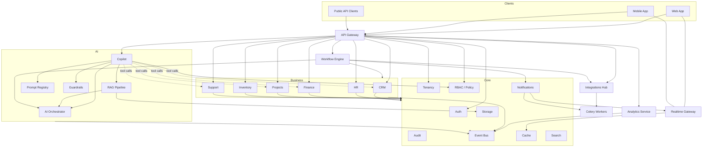
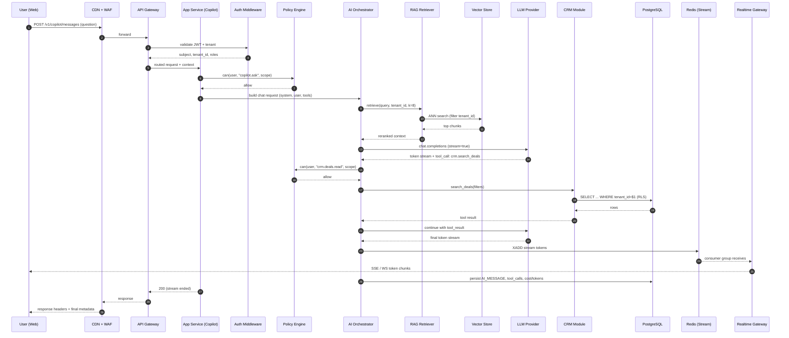

# AI Business Operating System — System Architecture

**Document type:** Lead Architect deliverable
**Scope:** End-to-end platform design (no application code)
**Version:** 1.0

---

## 1. Functional Requirements

The platform is a multi-tenant SaaS that unifies core business operations under an AI-native control plane. It must support the following capabilities.

**Identity & tenancy**
- Multi-tenant onboarding, tenant lifecycle (trial → paid → suspended → offboarded).
- User registration, invitation, SSO (Google, Microsoft, SAML), MFA.
- Organization hierarchy: Tenant → Organization → Department → Team → User.
- Fine-grained role and permission management, per-tenant custom roles.

**Business modules (each is independently deployable and toggle-able per tenant)**
- CRM: leads, contacts, deals, pipelines, activity timeline.
- HR: employees, attendance, leave, payroll ledger, performance reviews.
- Finance: invoices, quotes, payments, expenses, chart of accounts, tax rules.
- Projects: projects, tasks, milestones, time tracking, Gantt/kanban.
- Inventory: products, SKUs, warehouses, stock movements, purchase orders.
- Support: tickets, SLAs, knowledge base, customer portal.

**AI capabilities**
- Conversational assistant (Copilot) with per-module context grounding.
- Retrieval-Augmented Generation over tenant documents.
- Natural-language reporting ("show me churn risk this quarter").
- Document intelligence (OCR, extraction, classification).
- Task/email drafting, meeting summarization, action-item extraction.
- Prompt library, prompt versioning, per-tenant prompt overrides.

**Workflow & automation**
- Visual workflow builder (triggers, conditions, actions, AI steps).
- Scheduled jobs and event-driven triggers.
- Integrations Hub: Gmail, Slack, Stripe, QuickBooks, WhatsApp, Google Drive, etc.

**Cross-cutting**
- Notification center (in-app, email, push, SMS, WhatsApp).
- Global search across modules with permission filtering.
- Analytics and dashboards, custom report builder, exports (CSV/XLSX/PDF).
- Audit trail (who did what, when, from where), immutable log.
- API keys and webhooks for external developers.

---

## 2. Non-Functional Requirements

| Category | Target |
|---|---|
| Availability | 99.9% monthly for core APIs; 99.5% for AI endpoints |
| Latency (API) | P50 < 120 ms, P95 < 350 ms, P99 < 800 ms |
| Latency (AI streaming) | First token < 1.5 s, sustained > 30 tok/s |
| Throughput | 5k RPS sustained per region, 20k RPS burst |
| Tenant isolation | Logical isolation by default; physical isolation for Enterprise tier |
| Data durability | 11 nines for object storage, PITR ≤ 5 min RPO for OLTP |
| RTO / RPO | RTO ≤ 30 min, RPO ≤ 5 min for critical services |
| Security | SOC 2 Type II, ISO 27001, GDPR, DPDP (India) |
| Compliance data residency | Region-pinned tenants (US, EU, IN) |
| Scalability | Horizontal, stateless services, target 10k+ active tenants |
| Observability | 100% traced requests, structured logs, SLO dashboards |
| Maintainability | Modular monolith with well-defined bounded contexts, ≥ 80% test coverage on core |
| Cost efficiency | AI cost per active user tracked and capped per tenant plan |
| Accessibility | WCAG 2.1 AA for the web client |

---

## 3. System Architecture

The system is a **modular monolith at the core with satellite services** for AI, workers, and analytics. This gives a fast delivery cadence early on while keeping seams for future extraction.

**Layers, from client to storage:**

1. **Edge** — CDN, WAF, DDoS protection, TLS termination.
2. **Gateway** — API gateway (routing, auth, rate limiting, request shaping).
3. **Application services** — the modular monolith (business modules).
4. **AI Orchestration Service** — separate service; owns LLM calls, RAG, prompt registry.
5. **Workflow Engine** — separate service; executes user-defined automations.
6. **Async workers** — Celery workers consuming task queues.
7. **Real-time layer** — WebSocket/SSE gateway backed by Redis pub/sub.
8. **Data layer** — PostgreSQL (OLTP), Redis (cache/broker), ClickHouse (OLAP), Qdrant/pgvector (embeddings), OpenSearch (full-text), S3 (objects).
9. **Integrations layer** — outbound connectors, webhook dispatcher.
10. **Observability layer** — logs, metrics, traces, alerts.

Tenant isolation is enforced at three points: (a) middleware that stamps a `tenant_id` into the request context, (b) row-level security policies in PostgreSQL, and (c) prefix-scoped keys in Redis and object storage.

---

## 4. High-Level Design

```
                        ┌──────────────────────────────────────────┐
                        │                Clients                   │
                        │  Web (Next.js)  Mobile (RN)  Public API  │
                        └────────────────────┬─────────────────────┘
                                             │  HTTPS / WSS
                                    ┌────────▼────────┐
                                    │   CDN + WAF     │
                                    └────────┬────────┘
                                             │
                                  ┌──────────▼──────────┐
                                  │    API Gateway      │
                                  │  (auth, RL, routing)│
                                  └─┬─────────┬─────────┘
                                    │         │
                       ┌────────────▼──┐   ┌──▼─────────────┐
                       │ App Services  │   │  Realtime GW   │
                       │ (Monolith)    │   │  (WS / SSE)    │
                       └──┬─────┬──────┘   └──────┬─────────┘
                          │     │                 │
        ┌─────────────────┘     └────────┐        │
        │                                │        │
 ┌──────▼──────┐   ┌───────────────┐  ┌──▼────────▼──┐
 │  Workflow   │   │ AI Orchestr.  │  │    Redis     │
 │   Engine    │◄─►│   Service     │  │ cache/queue  │
 └──────┬──────┘   └───────┬───────┘  │  pub/sub     │
        │                  │          └──────┬───────┘
        │                  │                 │
        │        ┌─────────▼─────────┐       │
        │        │  LLM Providers    │       │
        │        │ OpenAI/Anthropic/ │       │
        │        │ Google/Local (vLLM)│      │
        │        └───────────────────┘       │
        │                                    │
 ┌──────▼─────────────────────────────────────▼──────┐
 │            Celery Workers (task pool)              │
 └──────┬──────────────────────────────────────┬─────┘
        │                                      │
 ┌──────▼─────┐   ┌────────────┐   ┌───────────▼──────┐
 │ PostgreSQL │   │ ClickHouse │   │   S3 (objects)   │
 │  (OLTP)    │   │  (OLAP)    │   │                  │
 └────────────┘   └────────────┘   └──────────────────┘
 ┌────────────┐   ┌────────────┐
 │ pgvector / │   │ OpenSearch │
 │  Qdrant    │   │  (search)  │
 └────────────┘   └────────────┘
```

**Reasoning for the shape:**
- Modular monolith avoids premature microservice tax while enforcing module boundaries.
- AI Orchestration is separated because it has different scaling and dependency characteristics (long-lived streams, external provider quotas).
- Workflow Engine is separated because it's stateful over time and needs its own scheduler.
- Realtime Gateway is separated so a slow client doesn't tie up an app-service worker.

---

## 5. Low-Level Design

Each business module follows a **clean architecture** shape with four inner layers.

**API layer**
- HTTP routers (FastAPI routers or Django views).
- Request/response schemas (Pydantic).
- Auth dependency, tenant context injection, rate-limit dependency.

**Application layer**
- Use case classes (`CreateInvoice`, `ScoreLead`, `AssignTicket`).
- Orchestrates domain services and repositories.
- Emits domain events to the event bus.

**Domain layer**
- Entities and value objects (`Invoice`, `Money`, `TaxRate`).
- Domain services (invariants, calculations).
- No I/O; pure Python.

**Infrastructure layer**
- Repositories (SQLAlchemy or Django ORM).
- External adapters (Stripe, SendGrid, S3, provider SDKs).
- Cache adapters, queue adapters.

**Cross-cutting**
- `TenantContext`: request-scoped, holds `tenant_id`, `user_id`, `role`, `feature_flags`.
- `UnitOfWork`: transaction boundary; commits atomically and dispatches queued events on success.
- `EventBus`: in-process for same-service subscribers, RabbitMQ for cross-service.
- `PolicyEngine`: evaluates ABAC rules with tenant + user + resource + action.
- `AuditRecorder`: middleware that captures mutations from the UoW.

**Naming conventions**
- Modules follow `noun.plural` (`invoices`, `leads`).
- Use cases follow `Verb + Noun` (`ArchiveProject`).
- Events follow `noun.past_tense` (`invoice.created`, `lead.qualified`).

**Error strategy**
- Domain errors → 422 with error code.
- Auth errors → 401/403.
- Validation errors → 400 with per-field detail.
- Infrastructure errors → 502/503 with retry-after where applicable.
- Every error carries a `trace_id` for support.

---

## 6. Folder Structure

Monorepo layout, one repository, workspace-aware tooling.

```
ai-bos/
├── apps/
│   ├── web/                     # Next.js web client
│   ├── mobile/                  # React Native client
│   └── admin/                   # Internal ops console
├── services/
│   ├── api/                     # Modular monolith (app services)
│   │   ├── src/
│   │   │   ├── core/            # shared kernel
│   │   │   │   ├── auth/
│   │   │   │   ├── tenancy/
│   │   │   │   ├── rbac/
│   │   │   │   ├── audit/
│   │   │   │   ├── events/
│   │   │   │   ├── cache/
│   │   │   │   ├── storage/
│   │   │   │   └── notifications/
│   │   │   ├── modules/
│   │   │   │   ├── crm/
│   │   │   │   │   ├── api/
│   │   │   │   │   ├── application/
│   │   │   │   │   ├── domain/
│   │   │   │   │   └── infrastructure/
│   │   │   │   ├── hr/
│   │   │   │   ├── finance/
│   │   │   │   ├── projects/
│   │   │   │   ├── inventory/
│   │   │   │   └── support/
│   │   │   ├── integrations/
│   │   │   └── main.py
│   │   ├── tests/
│   │   └── migrations/
│   ├── ai-orchestrator/         # AI provider gateway + RAG
│   │   ├── providers/
│   │   ├── prompts/
│   │   ├── rag/
│   │   ├── guardrails/
│   │   └── router/
│   ├── workflow-engine/         # DAG executor
│   │   ├── triggers/
│   │   ├── steps/
│   │   ├── scheduler/
│   │   └── runtime/
│   ├── workers/                 # Celery apps
│   │   ├── queues/
│   │   ├── tasks/
│   │   └── beat_schedule.py
│   ├── realtime/                # WebSocket gateway
│   └── analytics/               # ClickHouse ingest + query svc
├── packages/                    # shared libraries
│   ├── contracts/               # OpenAPI + AsyncAPI schemas
│   ├── sdk-ts/                  # generated TS client
│   ├── sdk-py/                  # generated Python client
│   └── design-system/           # UI components
├── infra/
│   ├── terraform/
│   ├── helm/
│   ├── k8s/
│   └── docker/
├── ops/
│   ├── runbooks/
│   ├── dashboards/
│   └── alerts/
├── docs/
│   ├── architecture/
│   ├── adr/                     # architecture decision records
│   └── api/
└── .github/workflows/           # CI/CD pipelines
```

---

## 7. Module Breakdown

**Core (shared kernel)**
- `auth`: OIDC, JWT, MFA, session, API keys.
- `tenancy`: tenant lifecycle, feature flags, plan/quota enforcement.
- `rbac`: roles, permissions, policy evaluation.
- `audit`: append-only audit log writer.
- `events`: in-process bus + broker publisher.
- `cache`: Redis client, cache-aside helpers.
- `storage`: S3 client, presigned URLs, virus scan hooks.
- `notifications`: template registry, channel dispatcher.
- `search`: OpenSearch indexer + query.

**Business modules** — CRM, HR, Finance, Projects, Inventory, Support. Each owns its own tables, its own domain, and communicates with others only via events or a public application-layer interface.

**AI module family**
- `ai-orchestrator`: provider abstraction, routing, streaming.
- `ai-copilot`: conversation state, tool calling, module tools.
- `ai-rag`: chunking, embedding, retrieval, reranking.
- `ai-prompts`: prompt registry, versioning, A/B testing.
- `ai-guardrails`: input/output moderation, PII redaction.

**Automation**
- `workflow-engine`: trigger → condition → action DAG runtime.
- `integrations`: connector SDK, OAuth broker, webhook receiver/dispatcher.

**Analytics**
- `analytics-ingest`: change-data-capture from Postgres → ClickHouse.
- `analytics-query`: semantic layer, report engine.

**Ops**
- `admin-console`: tenant support, impersonation (with audit), billing overrides.

---

## 8. Technology Stack

| Layer | Choice | Rationale |
|---|---|---|
| Web client | Next.js 14+ (App Router), TypeScript, TanStack Query, Tailwind, shadcn/ui | SSR/edge caching, mature ecosystem, DX |
| Mobile | React Native + Expo | Code sharing with web, fast iteration |
| API service | Python 3.12 + FastAPI + Pydantic v2 + SQLAlchemy 2 + Alembic | Async-native, typed, matches AI ecosystem |
| Realtime | Python + `websockets` or `starlette` WS, Redis pub/sub backplane | Simple, horizontal scale |
| AI orchestrator | Python 3.12 + FastAPI + `httpx` + provider SDKs | Streaming and long-lived connections |
| Workflow engine | Python + Temporal (or a Celery-based DAG runner for v1) | Durable execution semantics |
| Workers | Celery 5, RabbitMQ or Redis broker | Mature, battle-tested queue |
| DB — OLTP | PostgreSQL 16 with RLS, `pgvector`, `pg_partman` | Multi-tenant, extensible |
| DB — OLAP | ClickHouse | Fast aggregations on event data |
| Cache / broker | Redis 7 (Cluster mode in prod) | Cache, sessions, queues, locks |
| Search | OpenSearch | Full-text + faceted search |
| Vector | pgvector for small scale, Qdrant for large scale | Start simple, scale out |
| Object storage | S3 (AWS) or R2 (Cloudflare) | Durable, cheap |
| Message broker | RabbitMQ for tasks, Kafka/Redpanda for event backbone (v2) | Right tool per use case |
| Containers | Docker, Kubernetes (EKS/GKE) | Standard orchestration |
| IaC | Terraform + Helm + Argo CD | GitOps |
| CI/CD | GitHub Actions + Argo CD | Familiar and effective |
| Auth | Keycloak or Auth0 (managed to start), OIDC | OIDC, SAML, MFA out of the box |
| Secrets | AWS KMS + HashiCorp Vault | Envelope encryption, dynamic secrets |
| Observability | OpenTelemetry, Prometheus, Grafana, Loki, Tempo, Sentry | Open standards |
| Feature flags | OpenFeature + Unleash (self-hosted) | Vendor-neutral |

---

## 9. Database Selection

**PostgreSQL** — primary source of truth for OLTP.
- One database per region; **logical multi-tenancy via `tenant_id` + row-level security**.
- `pgvector` for tenant-scoped embeddings (small tenants) with per-tenant HNSW indexes.
- Partitioning on high-volume tables (`events`, `audit_log`, `messages`) by `created_at` monthly.
- Read replicas for reporting and heavy read paths.
- PITR via WAL archiving (RPO ≤ 5 min).
- Enterprise tenants can be moved to **dedicated schemas or dedicated DBs** without app rewrites, because tenant resolution is centralized.

**Redis** — cache, sessions, rate limits, queues, locks, pub/sub.
- Cluster mode with 3+ shards in prod.

**ClickHouse** — analytics warehouse.
- Ingest via Debezium (Postgres CDC) → Kafka → ClickHouse materialized views.
- Powers dashboards, cohort analysis, funnel/retention reports.

**Qdrant / pgvector** — vector storage.
- pgvector inside Postgres for tenants < ~10M chunks.
- Qdrant cluster for scale-out (multi-collection, per-tenant filter).

**OpenSearch** — full-text and faceted global search across modules.

**S3-compatible object store** — files, exports, model artifacts, PDF renders.

**Choice principle:** OLTP writes go to Postgres only; everything else is a projection.

---

## 10. Redis Usage

Redis is used deliberately for a small number of well-defined roles.

| Role | Pattern | Notes |
|---|---|---|
| Application cache | Cache-aside with TTL, keyed `t:{tenant}:cache:{entity}:{id}` | Invalidate on write via events |
| Session store | `t:{tenant}:sess:{sid}` → JSON, TTL sliding | Refreshed on activity |
| Rate limiting | Token bucket via `CL.THROTTLE` (redis-cell) or lua script | Per tenant, per user, per API key |
| Idempotency keys | `idem:{key}` with 24h TTL | Prevents duplicate POSTs |
| Distributed locks | Redlock via `SET NX PX` | Used for scheduled job leaders |
| Feature flags | Local cache warmed from Unleash → Redis fallback | 30s TTL |
| Queue broker | Celery broker when RabbitMQ not warranted | Default for smaller queues |
| Pub/Sub | Realtime fan-out for WebSocket gateway | Channels per tenant + user |
| Streaming tokens | AI streaming buffered via Redis Streams for reliable resume | Consumer group per session |
| Presence | Set with TTL per user id | For collaboration features |

**Discipline:** every key is prefixed with `t:{tenant_id}:` to prevent cross-tenant leakage and to make key-space audits trivial.

---

## 11. Celery Usage

Celery is the async execution substrate for anything that shouldn't block an HTTP request.

**Queue topology** (routing keys):
- `default` — general async work.
- `emails` — transactional email dispatch.
- `notifications` — push, SMS, WhatsApp.
- `ai` — LLM calls that don't need to stream (bulk classification, embeddings).
- `ingest` — file processing (OCR, extraction, indexing).
- `reports` — heavy report generation, CSV/PDF exports.
- `integrations` — outbound sync to Stripe, QuickBooks, etc.
- `webhooks` — inbound webhook processing.
- `beat` — periodic jobs.

**Worker pools:**
- `ai` and `ingest` on dedicated worker pools (higher memory, GPU-adjacent nodes if needed).
- I/O-bound queues run with `gevent` concurrency; CPU-bound queues run `prefork`.
- Per-tenant task-level rate limiting via a Redis token bucket in a task base class.

**Reliability:**
- `acks_late=True` and `task_reject_on_worker_lost=True` for at-least-once semantics on critical queues.
- Dead-letter queue per queue, monitored with alerts on non-zero size.
- Exponential backoff with jitter; max retries per task type.
- Idempotency keys derived from `(tenant_id, resource_id, operation, version)`.

**Scheduling (Celery Beat):**
- Nightly report generation.
- Hourly integration sync.
- 15-min invoice reminders, SLA breach checks.
- Daily cost roll-up per tenant (AI token accounting).
- Weekly data retention sweeps.

**Progress reporting:** long tasks push progress events into Redis pub/sub; the WebSocket gateway relays to the client.

---

## 12. AI Provider Architecture

The AI Orchestrator is a **provider-agnostic gateway**. Business modules never call a provider SDK directly.

**Components:**

1. **Provider adapters** — one adapter per provider (OpenAI, Anthropic, Google, Mistral, self-hosted vLLM). Adapters normalize to a common `ChatRequest` / `ChatChunk` shape.
2. **Router** — chooses provider per request based on: capability requirement (vision, tools, JSON mode), tenant plan, cost budget, current latency, and provider health. Supports pinned overrides.
3. **Prompt registry** — versioned prompts stored as records; each has variables, expected schema, evaluation set. Per-tenant overrides supported.
4. **Context builder** — assembles system prompt + user prompt + retrieved chunks + tool schemas. Applies token budgeting.
5. **RAG pipeline** — chunker → embedder (batched) → vector store → retriever → reranker (cross-encoder) → context assembler. Retrievers can be hybrid (vector + BM25).
6. **Tool bridge** — exposes module use cases as callable tools (`crm.search_deals`, `finance.get_invoice`), enforcing RBAC at the tool boundary.
7. **Guardrails** — input filters (prompt injection, PII), output filters (moderation, schema validation, hallucination checks against retrieved evidence).
8. **Streaming layer** — server-sent chunks pushed to Redis Streams, relayed via the realtime gateway. Supports resume on reconnect.
9. **Cache** — semantic cache keyed by `(prompt hash, retrieved-context hash, model, params)` with a similarity gate for near-duplicates.
10. **Cost & token accounting** — every call logs `tokens_in`, `tokens_out`, `cost_usd`, `latency_ms`, `provider`, `model`, `tenant_id`, `feature`. Enforced monthly budgets per tenant.
11. **Fallback chain** — provider failure or budget breach triggers ordered fallback (e.g., Anthropic → OpenAI → self-hosted).
12. **Evaluation harness** — offline: golden sets per prompt version; online: shadow calls comparing candidate model vs. incumbent.

**Data isolation:** provider calls opt out of training/data retention where available; tenant IDs are never passed as content; user PII is redacted or hashed before it leaves the perimeter unless the tenant explicitly opts in.

---

## 13. Security Architecture

**Guiding principle:** zero trust between components; least privilege for every subject.

**Identity & access**
- OIDC-based auth via Keycloak/Auth0.
- MFA required for Admin+ roles.
- SSO (SAML, OIDC) for enterprise tenants.
- Service-to-service auth via mTLS in the mesh + workload identity (SPIFFE).

**Data protection**
- TLS 1.3 in transit everywhere, including intra-cluster.
- AES-256 at rest for DB, object store, backups.
- Envelope encryption via KMS; per-tenant DEKs for sensitive columns (PII, financial).
- Column-level encryption for the highest-sensitivity fields (bank accounts, ID numbers).
- Field-level redaction for logs.

**Tenant isolation**
- Row-level security policies enforced by Postgres, using `current_setting('app.tenant_id')`.
- Middleware sets that GUC on every DB session; violating queries fail closed.
- Redis and S3 keys are tenant-prefixed; access grants restrict prefixes.

**Application security**
- Input validation via Pydantic; strict content types; no eval-like paths.
- Rate limiting per IP, per user, per tenant, per API key.
- CSRF on cookie-authed endpoints, SameSite=strict cookies, secure flag.
- CORS allow-list per tenant custom domain.
- Content Security Policy, HSTS, X-Content-Type-Options.
- Dependency scanning (Snyk/Trivy) in CI; SBOM on every release.
- SAST and secret-scanning in CI; DAST in staging.

**AI-specific security**
- Prompt-injection filters on retrieved content and tool outputs.
- Tool-call allow-list per role; sensitive tools require step-up MFA.
- Output validators (JSON schema, refusal detection).
- PII scrubbing before provider egress; provider allow-list per tenant region.

**Compliance & governance**
- Immutable audit log (append-only, hash-chained daily).
- Data subject access / erasure workflows (GDPR / DPDP).
- Region pinning honored end-to-end (data plane never crosses regions).
- Vendor risk reviews for every third-party provider.

**Incident response**
- Runbooks per class of incident; PagerDuty rotations.
- Blameless post-mortems; 5-day RCA target.

---

## 14. Deployment Architecture

**Environments:** `dev`, `staging`, `prod`. Each environment is a separate cloud account for blast-radius isolation.

**Compute:** Kubernetes (EKS/GKE), one cluster per region.
- Namespaces: `api`, `ai`, `workers`, `workflow`, `realtime`, `platform`, `observability`.
- Node pools: `general`, `mem-optimized` (workers/RAG), `gpu` (self-hosted models), `spot` (workers only).
- Service mesh (Istio or Linkerd) for mTLS, retries, timeouts, traffic shifting.

**Delivery:** GitOps with Argo CD; Helm charts per service; sealed secrets or External Secrets Operator backed by Vault.

**Release strategy:**
- Trunk-based development; PRs must pass lint, tests, contract tests, security scans.
- Deploys to staging on merge to `main`.
- Canary to prod: 5% → 25% → 100% gated by SLO burn rate and error budget.
- Feature flags for risky changes; kill switches for AI features.

**Data plane:**
- PostgreSQL: managed (RDS/CloudSQL) with Multi-AZ, read replicas, automated backups.
- Redis: managed cluster with AZ redundancy.
- ClickHouse: self-managed on stateful sets or ClickHouse Cloud.
- Object store: S3/R2 with cross-region replication for critical buckets.

**Multi-region:**
- Region-pinned tenants (US, EU, IN) with local data plane.
- Global control plane for auth and billing.
- DR: warm standby in a secondary region per home region; automated failover for stateless services, RTO ≤ 30 min for stateful.

**Cost controls:** namespace quotas, per-tenant AI budgets, spot for non-critical workers, right-sizing via VPA recommendations.

---

## 15. API Architecture

**Style:** REST for external APIs, gRPC for internal high-throughput service-to-service, WebSocket/SSE for realtime, GraphQL only for the admin console (complex read shapes).

**Versioning:** URL versioning `/api/v1/...`; a version is supported for 12 months after deprecation notice.

**Conventions**
- Resource-oriented URLs, plural nouns.
- Consistent envelope: `data`, `meta`, `errors`.
- Cursor-based pagination for lists; `limit` ≤ 100.
- Filtering via typed query params; sorting via `sort=field,-other`.
- Sparse fieldsets via `fields=...`.
- Idempotency-Key header for POST/PATCH.
- ETag + If-Match for optimistic concurrency.
- Rate-limit headers (`X-RateLimit-*`) on every response.

**Contracts**
- OpenAPI 3.1 is source of truth; SDKs (TS/Python) generated in CI.
- AsyncAPI documents the event catalog.
- Backwards-incompatible changes forbidden within a major version.
- Contract tests run in CI against generated mocks.

**Public developer API**
- API keys scoped per tenant with role and IP allow-list.
- Webhooks with HMAC signatures, retry with exponential backoff, replay protection via `event_id`.
- Sandbox environment mirrors prod schema with synthetic data.

**Realtime**
- WebSocket for bi-directional (Copilot, collaboration).
- SSE for one-way streams (AI token stream, notifications).
- Backpressure via message-level ACKs and per-connection buffer limits.

---

## 16. Event Flow

The platform is **event-driven internally**. Every write in a business module publishes a domain event; other modules react asynchronously.

**Layers:**
- **In-process bus** for same-service subscribers (fast, transactional with UoW).
- **Broker** (RabbitMQ v1, Kafka/Redpanda v2) for cross-service and durable subscriptions.

**Envelope (canonical):**
```
{
  "event_id": "uuid",
  "event_type": "invoice.created",
  "event_version": 1,
  "occurred_at": "iso8601",
  "tenant_id": "...",
  "actor": {"type":"user","id":"..."},
  "trace_id": "...",
  "data": { ... },
  "metadata": { "source":"finance", "correlation_id":"..." }
}
```

**Delivery semantics:** at-least-once. Consumers are idempotent, keyed by `event_id`.

**Ordering:** partition by `tenant_id` and, where needed, by `aggregate_id`.

**Outbox pattern:** domain events are written to an `outbox` table in the same transaction as the state change; a relay publishes to the broker and marks them sent. This eliminates dual-write drift.

**Illustrative flows**

1. *New lead → CRM enrichment*
   - `lead.created` → AI Orchestrator enriches → `lead.enriched` → CRM updates score → `lead.qualified` (if threshold met) → Notifications sends assignment.

2. *Invoice paid*
   - Stripe webhook → `payment.received` → Finance marks invoice paid → `invoice.paid` → Notifications emails receipt, Analytics ingests, Projects updates budget.

3. *File upload → RAG index*
   - `document.uploaded` → OCR worker → `document.parsed` → chunker/embedder → `document.indexed` → Copilot can now retrieve.

**Event catalog** is versioned in `packages/contracts` and validated in CI.

---

## 17. Authentication Flow

**Primary flow (interactive users):** OIDC Authorization Code + PKCE.

```
User → Web client → Auth Provider (Keycloak/Auth0) → Web client (code) →
API Gateway (exchange) → API (session + JWT access + refresh) → Redis (session)
```

Steps:
1. Client redirects to the auth provider with PKCE code challenge.
2. User authenticates (password / SSO), completes MFA if required.
3. Provider returns authorization code to the client.
4. Client exchanges code at the API for an access token (short-lived JWT, 10 min) and a refresh token (rotating, 7-day sliding).
5. Access token is sent as `Authorization: Bearer …`. Refresh handled by silent renewal.
6. Server-side session record kept in Redis for revocation and audit.

**Token contents (access JWT):** `sub`, `tenant_id`, `roles`, `scopes`, `session_id`, `token_use=access`, `iat`, `exp`, `iss`, `aud`. Signed with rotating RS256 keys (JWKS published).

**MFA:** TOTP by default; WebAuthn for phishing-resistant MFA on privileged roles. Step-up MFA required for admin actions, exports, and integration credential rotations.

**Service-to-service:** mTLS via mesh + workload identity claims; short-lived tokens minted by an internal auth service.

**API keys:** hashed at rest, scope- and IP-restricted, viewable once, rotatable, revocable, with independent audit.

**Impersonation (support):** explicit, time-boxed, audited, requires 2-person approval; the impersonated tenant is notified.

**Session hygiene:** device tracking, concurrent session limits, forced logout on password change or role revocation.

---

## 18. Permission Model

**Model:** RBAC as the base, ABAC for fine-grained rules.

**Layers:**
1. **Roles** — coarse capabilities (`owner`, `admin`, `manager`, `member`, `guest`, plus per-module roles like `finance.accountant`).
2. **Permissions** — atomic `(resource, action)` such as `invoices.read`, `invoices.approve`.
3. **Scopes** — resource-scoping by organization, department, or ownership.
4. **Attributes** — dynamic conditions (`resource.amount > 10000` requires `finance.approve.high`).

**Storage:**
- `roles` table (system + tenant-custom).
- `role_permissions` mapping.
- `user_roles` mapping (many-to-many, scope-aware).
- Policy documents (JSON) for ABAC rules, evaluated by a policy engine (OPA or Casbin) with tenant-scoped policy bundles.

**Enforcement points:**
- API layer: dependency-injected `require(permission, scope)` on every route.
- Domain layer: guards on high-risk use cases (double check).
- Data layer: RLS in Postgres as a hard backstop.
- AI tool bridge: same policy engine, so Copilot cannot exceed a user's authority.

**Delegation:** temporary access grants (time-boxed) with mandatory reason and audit entry.

**Defaults:**
- Deny by default.
- Guests have no cross-module visibility unless explicitly granted.
- Owner cannot be locked out (recovery flow with identity verification).

---

## 19. File Storage Strategy

**Primary store:** S3-compatible object storage.

**Path convention:**
```
s3://ai-bos-{region}/{tenant_id}/{module}/{yyyy}/{mm}/{uuid}/{original_filename}
```

**Access model:**
- Clients never talk to S3 directly with permanent credentials.
- Uploads: server issues a **presigned PUT URL** valid for 10 min, size-limited, content-type-locked.
- Downloads: server issues a **presigned GET URL** valid for 5 min, or streams via the API for small files.
- Public assets (avatars, tenant logos) served via CDN with signed URLs.

**Pipeline on upload:**
1. Client uploads to presigned URL, chunked for large files.
2. S3 event → `document.uploaded` on the event bus.
3. Antivirus scan (ClamAV worker); if clean, mark `scanned=true`; if not, quarantine bucket.
4. Type-specific processing: OCR (PDF/image), audio transcription, video thumbnailing.
5. For RAG-eligible files: chunk → embed → index into vector store.
6. Metadata written to `documents` table.

**Encryption:** SSE-KMS with per-tenant KMS keys; envelope encryption; keys rotated annually.

**Lifecycle:**
- Standard tier for 30 days, Infrequent Access for 30–180 days, Glacier for > 180 days.
- Exports and temporary files auto-expire in 7 days.
- Backups replicated cross-region for critical buckets.

**Integrity:** SHA-256 on every object; verified on read for legal/financial documents.

**Access audit:** every presigned URL issuance is logged with actor, purpose, and expiry.

---

## 20. Logging Strategy

**Format:** structured JSON on stdout; one event per line.

**Standard fields:**
`timestamp`, `level`, `service`, `env`, `region`, `trace_id`, `span_id`, `tenant_id`, `user_id`, `request_id`, `route`, `status`, `latency_ms`, `message`, plus contextual fields.

**Levels:**
- `DEBUG` — off in prod, on-demand per tenant/service via runtime config.
- `INFO` — normal ops.
- `WARN` — recoverable anomalies.
- `ERROR` — user-visible failures or unhandled exceptions.
- `CRITICAL` — page-worthy.

**Categories (separate streams):**
- **App logs** — general application logs, 30-day retention.
- **Access logs** — every HTTP/gRPC request, 90-day retention.
- **Audit logs** — mutation events, actor, before/after; immutable, 7-year retention; append-only bucket with object lock.
- **Security logs** — auth events, permission denials, key usage; 1-year retention, SIEM-ingested.
- **AI logs** — prompt/response metadata (never raw PII), 90-day retention; sampled full payloads for debugging behind a tenant opt-in.

**Pipeline:** app → stdout → node agent → Loki (hot) → S3 (cold). Kibana/Grafana for search.

**Redaction:** middleware scrubs known-sensitive keys (`password`, `token`, `secret`, `card_number`); PII detector runs on free-text fields; violations trigger alerts.

**Correlation:** every request gets a `trace_id`; propagated across services, workers, AI calls; surfaced in error responses so users can quote it in support tickets.

---

## 21. Monitoring Strategy

**Pillars:** metrics, traces, logs, events, synthetics.

**Metrics** (Prometheus):
- RED per endpoint (Rate, Errors, Duration).
- USE per node (Utilization, Saturation, Errors).
- Business KPIs: signups, DAU/WAU, active tenants, AI cost per tenant, workflow success rate.

**Tracing** (OpenTelemetry → Tempo/Jaeger):
- Every request instrumented end-to-end including Celery tasks and AI provider calls.
- Sampling: 100% for errors, 10% baseline, 100% for a per-tenant debug toggle.

**Logs** (Loki) as covered above.

**Error tracking** (Sentry) with source maps, tenant tags, and release markers.

**Synthetics:** probes hitting critical paths (login, create invoice, ask Copilot) from 3+ regions every minute.

**SLOs:**
- Availability of core API: 99.9% monthly.
- Latency: P95 < 350 ms.
- AI first-token latency: P95 < 1.5 s.
- Workflow execution success: 99% within 5 min.

**Alerting:**
- Multi-window multi-burn-rate alerts on SLO error budgets.
- Paging routes to on-call via PagerDuty; low-priority to Slack.
- Every alert links to a runbook.
- Anomaly detection on tenant-level metrics for early customer-impact signals.

**Dashboards:**
- Platform health (per service).
- Tenant health (per tenant top-N).
- AI cost & quality (per model, per tenant, per feature).
- Workflow reliability.
- Incident overview.

---

## 22. Scalability Plan

**Stateless-first.** Every app service is horizontally scalable; state lives in Postgres, Redis, or object storage.

**Autoscaling:**
- HPA on CPU + custom metrics (queue depth, request concurrency, tokens/sec).
- KEDA scales Celery workers off queue length.
- Cluster autoscaler adds nodes; overprovisioning buffer for burst.

**Database scaling:**
- Vertical scale first, then read replicas for read-heavy modules (analytics, search fallback).
- Table partitioning on `created_at` for `events`, `audit_log`, `ai_messages`.
- Move heavy-write tenants to dedicated schemas or DBs (playbook, not one-off migrations).
- Long-term: functional sharding by module (finance DB, CRM DB), then tenant sharding for the largest tenants.

**Caching:**
- Cache-aside for hot reads; write-through for reference data (roles, permissions, feature flags).
- CDN for static assets and cacheable public endpoints.
- Semantic cache in the AI gateway.

**Queue scaling:**
- Separate broker vhosts per queue class to prevent noisy-neighbor stalls.
- Priority queues (high/normal/low) per tenant tier.

**AI scaling:**
- Provider fan-out with concurrency budgets per provider.
- Batch embeddings and moderation calls.
- Self-hosted models on GPU pools for high-volume, low-margin features.
- Streaming from Redis Streams so a slow client cannot back up the AI worker.

**Load & chaos testing:**
- Weekly k6 load tests against staging with a production-shaped scenario.
- Monthly chaos exercises (kill pods, drop broker connections, throttle DB).
- Capacity plan reviewed quarterly against tenant growth and AI cost trends.

**Multi-tenancy noisy-neighbor controls:**
- Per-tenant rate limits, concurrency limits, and AI token budgets.
- Priority scheduling so free-tier traffic cannot starve paid-tier traffic.
- Isolated worker pools for enterprise-tier tenants.

---

## ER Diagram (core entities)

```mermaid
erDiagram
    TENANT ||--o{ USER : has
    TENANT ||--o{ ORGANIZATION : has
    TENANT ||--o{ ROLE : defines
    ORGANIZATION ||--o{ DEPARTMENT : has
    DEPARTMENT ||--o{ TEAM : has
    USER ||--o{ USER_ROLE : assigned
    ROLE ||--o{ USER_ROLE : granted
    ROLE ||--o{ ROLE_PERMISSION : has
    PERMISSION ||--o{ ROLE_PERMISSION : listed

    TENANT ||--o{ SUBSCRIPTION : owns
    SUBSCRIPTION ||--o{ INVOICE : bills
    INVOICE ||--o{ PAYMENT : receives

    TENANT ||--o{ CUSTOMER : has
    CUSTOMER ||--o{ CONTACT : has
    CUSTOMER ||--o{ DEAL : has
    DEAL ||--o{ ACTIVITY : logs
    USER ||--o{ ACTIVITY : creates

    TENANT ||--o{ EMPLOYEE : has
    EMPLOYEE ||--o{ ATTENDANCE : records
    EMPLOYEE ||--o{ LEAVE_REQUEST : files
    EMPLOYEE ||--o{ PAYROLL_ITEM : receives

    TENANT ||--o{ PROJECT : has
    PROJECT ||--o{ TASK : contains
    TASK ||--o{ TIME_ENTRY : logs
    USER ||--o{ TIME_ENTRY : records

    TENANT ||--o{ PRODUCT : sells
    PRODUCT ||--o{ SKU : variant
    SKU ||--o{ STOCK_MOVEMENT : tracks
    WAREHOUSE ||--o{ STOCK_MOVEMENT : at

    TENANT ||--o{ TICKET : owns
    TICKET ||--o{ MESSAGE : contains
    USER ||--o{ MESSAGE : sends

    TENANT ||--o{ DOCUMENT : stores
    DOCUMENT ||--o{ CHUNK : split_into
    CHUNK ||--|| EMBEDDING : has

    TENANT ||--o{ WORKFLOW : defines
    WORKFLOW ||--o{ WORKFLOW_RUN : produces
    WORKFLOW_RUN ||--o{ WORKFLOW_STEP_RUN : contains

    TENANT ||--o{ AI_CONVERSATION : has
    AI_CONVERSATION ||--o{ AI_MESSAGE : contains
    AI_MESSAGE ||--o{ AI_TOOL_CALL : may_have
    TENANT ||--o{ PROMPT_VERSION : owns

    TENANT ||--o{ INTEGRATION : configures
    INTEGRATION ||--o{ WEBHOOK : registers

    TENANT ||--o{ AUDIT_LOG : accrues
    USER ||--o{ AUDIT_LOG : acts_in
    TENANT ||--o{ NOTIFICATION : receives
    USER ||--o{ NOTIFICATION : addressed_to

    TENANT {
      uuid id PK
      string name
      string plan
      string region
      string status
      timestamp created_at
    }
    USER {
      uuid id PK
      uuid tenant_id FK
      string email
      string status
      timestamp created_at
    }
    ROLE {
      uuid id PK
      uuid tenant_id FK
      string name
      boolean system
    }
    PERMISSION {
      uuid id PK
      string resource
      string action
    }
    DOCUMENT {
      uuid id PK
      uuid tenant_id FK
      string s3_key
      string mime
      int size_bytes
      string status
    }
    AI_CONVERSATION {
      uuid id PK
      uuid tenant_id FK
      uuid user_id FK
      string module
      timestamp created_at
    }
    WORKFLOW {
      uuid id PK
      uuid tenant_id FK
      string name
      json definition
      string status
    }
    AUDIT_LOG {
      uuid id PK
      uuid tenant_id FK
      uuid actor_id FK
      string action
      string resource_type
      string resource_id
      json before
      json after
      timestamp at
    }
```



---

## Module Dependency Diagram



---

## Request Flow Diagram (Copilot answering a question with RAG + tool call)



---

## Closing Notes

This architecture is deliberately **modular monolith first, service-oriented where it matters**: the AI Orchestrator, Workflow Engine, Realtime Gateway, and worker fleet are separated because their scaling, dependency, and failure profiles differ from the CRUD business modules. Everything else is kept together to preserve delivery velocity until scale demands otherwise.

Three principles run throughout:

1. **Tenant isolation is enforced in depth** — middleware, RLS, key prefixes, KMS keys, and policy checks all cooperate rather than relying on any single layer.
2. **The AI layer is a gateway, not a leaf** — no business module speaks to a provider directly; that centralization is what makes cost, quality, security, and fallbacks tractable.
3. **State lives in a small number of well-understood stores** — Postgres for truth, Redis for speed, ClickHouse for analysis, S3 for objects, vector store for meaning. Every other component is stateless and horizontally scalable.

Architecture complete. Ready for the next stage (implementation planning, ADRs, or module deep-dives) on your signal.
