# AI Business Operating System — PostgreSQL Database Design

**Document type:** Production database design (DDL-level)
**Companion to:** `ai-bos-architecture.md`, `ai-bos-roadmap.md`
**Target:** PostgreSQL 16, extensions `pgcrypto`, `pg_partman`, `pgvector`, `btree_gin`, `pg_trgm`
**Version:** 1.0

> Scope note: this document specifies every table, column, key, constraint, index, enum, and relationship, plus the cross-cutting strategies (multi-tenancy, RLS, partitioning, soft delete, audit, migrations) and planning for the SQLAlchemy + Alembic layers. No SQLAlchemy models and no Python are written here — only design, DDL, and planning.

---

## Table of Contents

1. Conventions & Standards
2. Multi-Tenant Strategy
3. Row-Level Security Strategy
4. Soft Delete Strategy
5. Audit Strategy
6. Partitioning Strategy
7. Enum Catalog
8. Schema `core` (identity, tenancy, RBAC, audit, events, notifications, storage, flags)
9. Schema `crm`
10. Schema `finance`
11. Schema `projects`
12. Schema `hr`
13. Schema `inventory`
14. Schema `support`
15. Schema `ai`
16. Schema `automation` (workflows + integrations)
17. Schema `analytics`
18. Schema `billing`
19. Relationship Reference (every FK explained)
20. ER Diagram
21. SQL Schema Design Notes (indexing, constraints rationale)
22. SQLAlchemy Model Planning
23. Alembic Migration Planning

---

## 1. Conventions & Standards

**Schemas.** One PostgreSQL schema per bounded context: `core`, `crm`, `finance`, `projects`, `hr`, `inventory`, `support`, `ai`, `automation`, `analytics`, `billing`. This keeps the modular-monolith boundaries visible in the database itself and lets us grant/deny at the schema level.

**Naming.**
- Tables: `snake_case`, plural (`invoices`, `deal_stage_history`).
- Columns: `snake_case`, singular (`tenant_id`, `created_at`).
- Primary key: always `id`.
- Foreign keys: `<referenced_singular>_id` (`tenant_id`, `deal_id`); when two FKs point at the same table, disambiguate by role (`parent_id`, `manager_id`, `reports_to_id`).
- Booleans: `is_` / `has_` prefix (`is_system`, `has_mfa`).
- Timestamps: `_at` suffix, always `timestamptz`, always UTC (`created_at`, `deleted_at`).
- Enums (Postgres native types): `<schema>_<concept>` (`core_tenant_status`, `finance_invoice_status`).
- Indexes: `ix_<table>__<cols>`; unique: `uq_<table>__<cols>`; partial: append `__<predicate>`; FK indexes: `ix_<table>__<fk>`.
- Constraints: `ck_<table>__<rule>`, `fk_<table>__<ref>`, `pk_<table>`.
- Partitions: `<table>_p<yyyymm>` (range) or `<table>_p<key>` (list).

**Primary key type.** `uuid` generated with `gen_random_uuid()` (from `pgcrypto`). UUIDv7-style time-ordered values are preferred where an application library supplies them, to preserve index locality; the column type stays `uuid` either way.

**Standard columns on every business row.**
| Column | Type | Notes |
|---|---|---|
| `id` | `uuid` PK | `default gen_random_uuid()` |
| `tenant_id` | `uuid` NOT NULL | FK → `core.tenants(id)`, RLS anchor |
| `created_at` | `timestamptz` NOT NULL | `default now()` |
| `updated_at` | `timestamptz` NOT NULL | `default now()`, bumped by trigger |
| `created_by` | `uuid` NULL | FK → `core.users(id)` (nullable for system writes) |
| `updated_by` | `uuid` NULL | FK → `core.users(id)` |
| `deleted_at` | `timestamptz` NULL | soft-delete tombstone (see §4) |
| `version` | `integer` NOT NULL | `default 1`, optimistic concurrency (ETag) |

Global tables (no tenant) — `core.plans`, `core.permissions`, `ai.ai_models`, `core.notification_templates` (system defaults) — omit `tenant_id` and RLS; noted per table.

**Money.** Stored as `numeric(20,4)` plus a `char(3)` ISO-4217 `currency` column. Never `float`. FX-converted amounts store both original and converted values with the rate.

**Text.** `text` everywhere (no arbitrary `varchar(n)` limits) except where a real domain limit exists (e.g. `char(3)` currency, `char(2)` country). Length rules enforced by `CHECK` where they matter.

**JSON.** `jsonb` for flexible payloads (`config_json`, `definition_json`, `metadata`). GIN-indexed only when queried.

**Time.** All `timestamptz`. Application sets session `TIME ZONE 'UTC'`.

---

## 2. Multi-Tenant Strategy

**Model: shared database, shared schema, row-level isolation by `tenant_id`, enforced by RLS.** This is the default for all tenants. It maximizes density and keeps one migration path.

Three enforcement layers cooperate (defense in depth):

1. **Application** — middleware resolves `tenant_id` from the JWT + subdomain and sets a Postgres session GUC: `SET LOCAL app.tenant_id = '<uuid>'` at the start of every request transaction.
2. **Database (RLS)** — every tenant-scoped table has a policy `tenant_id = current_setting('app.tenant_id')::uuid`. Even a bug in the application layer cannot cross tenants.
3. **Keys/storage** — Redis and S3 keys are tenant-prefixed (covered in the architecture doc), so caches and files inherit the same boundary.

**Escalation path for large / regulated tenants** (designed in, not retrofitted):
- **Dedicated schema:** the same DDL is deployed into `tenant_<slug>` schemas; the tenant resolver swaps `search_path`. No model changes because tenant resolution is centralized.
- **Dedicated database / instance:** Enterprise-tier tenants can be pinned to their own database in their residency region. The connection router picks the DSN by `tenant_id`.

**Region residency.** `core.tenants.region` (`us | eu | in`) determines which physical cluster holds the tenant's rows. Cross-region reads are forbidden at the routing layer; there is no global table that mixes tenant business data.

**The `tenant_id` is denormalized onto every table** (even deep children like `finance.invoice_items`) rather than joined up through parents. Reasons: (a) RLS needs it locally on every table without a join, (b) partition pruning and composite indexes lead with `tenant_id`, (c) it prevents a whole class of "forgot to join through the parent" isolation bugs. The cost is a redundant column and a trigger/constraint to keep it consistent with the parent (see §19).

---

## 3. Row-Level Security Strategy

**Applied to:** every table carrying `tenant_id`. **Not applied to:** global reference tables (`core.plans`, `core.permissions`, `ai.ai_models`, system-default `core.notification_templates`).

**Session context GUCs:**
- `app.tenant_id` — required on every tenant-scoped statement.
- `app.user_id` — current actor, used by audit triggers and some policies.
- `app.role` — coarse role, used for a few privileged policies (e.g. audit read).
- `app.bypass_rls` — only ever set for the migration/superuser role, never for app roles.

**Roles:**
- `aibos_app` — the application login role. `NOSUPERUSER`, subject to RLS (`FORCE ROW LEVEL SECURITY` so even the table owner is filtered).
- `aibos_migrator` — runs migrations; owns objects; may set `app.bypass_rls`.
- `aibos_readonly` — analytics/CDC reader on replicas; RLS-subject.

**Canonical policy pattern (per tenant-scoped table):**

```sql
ALTER TABLE core.users ENABLE ROW LEVEL SECURITY;
ALTER TABLE core.users FORCE ROW LEVEL SECURITY;

CREATE POLICY tenant_isolation ON core.users
  USING (tenant_id = current_setting('app.tenant_id', true)::uuid)
  WITH CHECK (tenant_id = current_setting('app.tenant_id', true)::uuid);
```

- `USING` filters reads/updates/deletes; `WITH CHECK` blocks inserting/updating a row into another tenant.
- `current_setting(..., true)` returns NULL when the GUC is unset; a NULL comparison yields no rows — **fail closed**. A statement that forgets to set `app.tenant_id` sees zero rows and cannot write.

**Soft-delete visibility** is *not* handled by RLS (RLS is only for tenancy). Deleted-row filtering is done in the query layer / views (see §4), because some flows (audit, restore, compliance export) must see tombstoned rows.

**Privileged read policies** (e.g. a tenant admin reading the full audit log) are additive policies keyed on `app.role`, layered on top of tenant isolation — never replacing it.

**Testing requirement (from the roadmap):** a CI test connects as `aibos_app`, sets tenant A, and asserts zero visibility of tenant B rows across every table, including on a deliberately bypassed application layer.

---

## 4. Soft Delete Strategy

**Mechanism:** `deleted_at timestamptz NULL`. A NULL means live; a non-NULL timestamp is the tombstone time. `deleted_by uuid` accompanies it where useful.

**Who gets soft delete:** all user-facing business entities (CRM, finance, projects, HR, inventory, support, AI conversations, workflows, reports). **Who does not:**
- Append-only ledgers and logs: `core.audit_log`, `core.outbox`, `finance.journal_entries`, `inventory.stock_movements`, `ai.ai_requests`, `automation.workflow_runs`, `*_history` tables. These are immutable; correction is via a new offsetting row, never deletion.
- Pure join tables: hard-deleted (a removed `role_permission` is simply gone).

**Query discipline.** Application repositories always filter `deleted_at IS NULL` for normal reads. To make this hard to get wrong and to keep indexes lean:
- Partial indexes are defined `WHERE deleted_at IS NULL` on hot lookup paths, so live-row queries stay fast and small.
- Per-table "live" views (`crm.v_deals` = `SELECT * FROM crm.deals WHERE deleted_at IS NULL`) are available for reporting/read models where convenient.

**Uniqueness under soft delete.** Business-unique columns use **partial unique indexes** scoped to live rows so a deleted record does not block re-creating the same natural key:

```sql
CREATE UNIQUE INDEX uq_crm_contacts__tenant_email__live
  ON crm.contacts (tenant_id, lower(email))
  WHERE deleted_at IS NULL;
```

**Restore.** Set `deleted_at = NULL` (and bump `version`); an audit event `entity.restored` is written.

**Hard purge.** A scheduled retention sweep (roadmap Celery `beat`) hard-deletes rows whose `deleted_at` is older than the tenant's retention policy, respecting legal holds. Purges are themselves audited.

**Cascade semantics.** Soft delete does **not** cascade at the FK level (FKs cascade only hard deletes). Cascading a soft delete to children is an application-layer use case (`ArchiveProject` soft-deletes its tasks) so it can be audited and reversed as a unit. FK `ON DELETE` behavior is defined for the *hard* purge path only (see §19).

---

## 5. Audit Strategy

Two complementary mechanisms:

**(a) Domain audit (application-driven).** The application's `AuditRecorder` writes semantically meaningful entries to `core.audit_log` (actor, action verb like `invoice.voided`, before/after snapshots, `trace_id`). This is the human-readable, business-level trail and is the one surfaced in the UI. It is emitted transactionally with the change via the Unit of Work.

**(b) Table-level change capture (database-driven, defense in depth).** A generic trigger function `core.fn_audit_row()` attached to sensitive tables captures every `INSERT/UPDATE/DELETE` with `OLD`/`NEW` as `jsonb` into `core.audit_log`. This catches anything the application forgets and any direct DB access. It reads `app.user_id`, `app.tenant_id`, and `app.trace_id` from session GUCs.

```sql
CREATE OR REPLACE FUNCTION core.fn_audit_row() RETURNS trigger AS $$
BEGIN
  INSERT INTO core.audit_log(
    id, tenant_id, actor_type, actor_id, action,
    resource_type, resource_id, before_json, after_json,
    trace_id, at)
  VALUES (
    gen_random_uuid(),
    coalesce(NEW.tenant_id, OLD.tenant_id),
    'user',
    nullif(current_setting('app.user_id', true),'')::uuid,
    TG_OP,                       -- INSERT | UPDATE | DELETE
    TG_TABLE_SCHEMA||'.'||TG_TABLE_NAME,
    coalesce(NEW.id, OLD.id),
    CASE WHEN TG_OP='INSERT' THEN NULL ELSE to_jsonb(OLD) END,
    CASE WHEN TG_OP='DELETE' THEN NULL ELSE to_jsonb(NEW) END,
    nullif(current_setting('app.trace_id', true),'')::text,
    now());
  RETURN coalesce(NEW, OLD);
END; $$ LANGUAGE plpgsql;
```

**Immutability & tamper evidence.**
- `core.audit_log` grants are `INSERT`-only for `aibos_app` (no `UPDATE`/`DELETE`).
- Nightly job computes a hash chain into `core.audit_hashchain_daily` (`current_hash = sha256(prev_hash || ordered_rows_of_day)`), giving tamper evidence with a 7-year retention (object-locked cold storage for the exported copy).

**`updated_at` maintenance.** A shared `core.fn_touch_updated_at()` BEFORE UPDATE trigger stamps `updated_at = now()` and increments `version`, so optimistic concurrency and freshness are enforced in the database, not just the app.

**What is audited by trigger (table-capture):** all of `finance.*` mutable tables, `core.users`, `core.user_roles`, `core.roles`, `core.role_permissions`, `core.api_keys`, `hr.payroll_*`, `automation.integration_credentials`, `billing.*`. Everything else relies on domain audit + partitioned `core.audit_log`.

---

## 6. Partitioning Strategy

High-growth, append-mostly tables are **range-partitioned by `created_at` (monthly)** using `pg_partman` to auto-create future partitions and retire old ones to cold storage. Partition key is `(created_at)`; because Postgres requires the partition key in the PK, the PK becomes composite `(id, created_at)` on partitioned tables (the app still treats `id` as the logical key; `created_at` is immutable).

**Partitioned tables:**
| Table | Strategy | Retention (hot) |
|---|---|---|
| `core.audit_log` | range monthly on `at` | 24 months hot, then cold (7y total) |
| `core.outbox` | range monthly on `occurred_at` | 3 months (purge after publish + grace) |
| `core.notifications` | range monthly on `created_at` | 12 months |
| `finance.journal_entries` | range monthly on `entered_at` | keep hot 24 months |
| `inventory.stock_movements` | range monthly on `moved_at` | 24 months |
| `projects.time_entries` | range monthly on `started_at` | 24 months |
| `ai.ai_requests` | range monthly on `created_at` | 12 months |
| `ai.ai_messages` | range monthly on `created_at` | 12 months |
| `automation.workflow_runs` | range monthly on `started_at` | 12 months |
| `automation.workflow_step_runs` | range monthly on `started_at` | 12 months |
| `automation.dev_webhook_deliveries` | range monthly on `created_at` | 3 months |
| `support.ticket_messages` | range monthly on `created_at` | 24 months |

**Sub-partitioning by tenant** is *not* done by default (too many partitions). Instead, the very largest tenants are moved to a dedicated schema/DB (§2). For analytics, ClickHouse (separate system) handles heavy aggregation, so Postgres partitions stay query-simple.

**Every partitioned table leads its composite indexes with `tenant_id`** so partition pruning + tenant filter + time range compose into one efficient scan.

**`pg_partman` config** lives in `partman.part_config`; a nightly `run_maintenance_proc()` (via Celery beat) provisions the next month and detaches expired partitions for archival.

---

## 7. Enum Catalog

Native Postgres enums (`CREATE TYPE`) for closed, stable domains; a lookup table is used instead only where tenants must extend values (e.g. CRM pipeline stages, ticket tags) — those are data, not enums.

```
-- core
core_tenant_status:        trial | active | past_due | suspended | offboarded
core_user_status:          invited | active | disabled | locked
core_actor_type:           user | system | api_key | integration
core_scope_type:           tenant | organization | department | team | own
core_notification_channel: in_app | email | sms | whatsapp | push
core_invitation_status:    pending | accepted | expired | revoked
core_file_status:          pending | scanning | clean | infected | failed
core_file_scan_result:     clean | infected | error | skipped

-- crm
crm_lead_status:           new | working | qualified | unqualified | converted
crm_activity_type:         note | call | email | meeting | task
crm_deal_result:           open | won | lost

-- finance
finance_invoice_status:    draft | sent | partially_paid | paid | overdue | void
finance_quote_status:      draft | sent | accepted | rejected | expired
finance_payment_status:    pending | succeeded | failed | refunded
finance_payment_method:    card | bank_transfer | cash | cheque | wallet | other
finance_journal_side:      debit | credit
finance_account_type:      asset | liability | equity | revenue | expense

-- projects
projects_task_status:      todo | in_progress | blocked | in_review | done | cancelled
projects_task_priority:    low | medium | high | urgent
projects_milestone_status: planned | active | completed | missed

-- hr
hr_employment_status:      active | on_leave | terminated | suspended
hr_leave_status:           requested | approved | denied | cancelled
hr_attendance_kind:        clock_in | clock_out
hr_payroll_run_status:     draft | processing | closed | reversed
hr_review_status:          draft | submitted | acknowledged

-- inventory
inventory_movement_kind:   adjust | transfer_in | transfer_out | receive | ship | reserve | release
inventory_po_status:       draft | sent | partially_received | received | closed | cancelled

-- support
support_ticket_status:     new | open | pending | on_hold | resolved | closed
support_ticket_priority:   low | normal | high | urgent
support_message_kind:      public_reply | internal_note | system
support_sla_state:         ok | at_risk | breached

-- ai
ai_message_role:           system | user | assistant | tool
ai_request_status:         success | error | timeout | filtered | budget_denied
ai_tool_call_status:       pending | succeeded | failed | denied
ai_prompt_status:          draft | published | archived
ai_document_status:        pending | parsing | chunking | indexed | failed
ai_feedback_verdict:       up | down

-- automation
automation_workflow_status:      active | paused | archived
automation_trigger_kind:         schedule | event | webhook | manual
automation_run_status:           pending | running | succeeded | failed | cancelled | timed_out
automation_step_status:          pending | running | succeeded | failed | skipped | retrying
automation_integration_status:   connected | disconnected | error | revoked
automation_webhook_delivery_status: pending | delivered | failed | dead

-- billing
billing_subscription_status: trialing | active | past_due | canceled | unpaid
```

Enum evolution: adding a value uses `ALTER TYPE ... ADD VALUE` (safe, forward-only). Removing/renaming values is avoided; deprecated values are simply no longer written.

---

## 8. Schema `core`

### core.plans *(global, no tenant, no RLS)*
| Column | Type | Constraints |
|---|---|---|
| id | uuid PK | |
| key | text | UNIQUE `uq_plans__key`, NOT NULL |
| name | text | NOT NULL |
| limits_json | jsonb | NOT NULL default `'{}'` (seats, AI budget, storage) |
| is_active | boolean | NOT NULL default true |
| created_at | timestamptz | NOT NULL default now() |

### core.tenants
| Column | Type | Constraints |
|---|---|---|
| id | uuid PK | |
| name | text | NOT NULL |
| slug | text | NOT NULL, UNIQUE `uq_tenants__slug` |
| plan_id | uuid | FK → core.plans(id) `ON DELETE RESTRICT` |
| status | core_tenant_status | NOT NULL default `'trial'` |
| region | text | NOT NULL, CHECK `region IN ('us','eu','in')` |
| primary_domain | text | NULL, UNIQUE `uq_tenants__domain` (partial WHERE not null) |
| settings_json | jsonb | NOT NULL default `'{}'` |
| created_at / updated_at | timestamptz | NOT NULL default now() |
| deleted_at | timestamptz | NULL |

Indexes: `ix_tenants__status`, `ix_tenants__plan_id`.
RLS: **self-referential** — a tenant row's own `id` is the tenant scope; policy is `id = current_setting('app.tenant_id')::uuid` (a tenant may read only its own tenant record). Platform admin uses `aibos_migrator`/staff bypass.

### core.tenant_features
| Column | Type | Constraints |
|---|---|---|
| tenant_id | uuid | FK → core.tenants(id) `ON DELETE CASCADE` |
| feature_key | text | NOT NULL |
| enabled | boolean | NOT NULL default false |
| config_json | jsonb | NOT NULL default `'{}'` |
| PK | | (tenant_id, feature_key) |

### core.users
| Column | Type | Constraints |
|---|---|---|
| id | uuid PK | |
| tenant_id | uuid | FK → core.tenants(id) `ON DELETE CASCADE`, NOT NULL |
| email | text | NOT NULL |
| hashed_password | text | NULL (null when SSO-only) |
| status | core_user_status | NOT NULL default `'invited'` |
| full_name | text | NULL |
| locale | text | NOT NULL default `'en'` |
| timezone | text | NOT NULL default `'UTC'` |
| mfa_secret | text | NULL (encrypted) |
| mfa_enrolled_at | timestamptz | NULL |
| last_login_at | timestamptz | NULL |
| created_at / updated_at | timestamptz | |
| created_by / updated_by | uuid | FK → core.users(id) self |
| deleted_at | timestamptz | NULL |
| version | integer | NOT NULL default 1 |

Constraints/indexes: `uq_users__tenant_email__live` UNIQUE `(tenant_id, lower(email)) WHERE deleted_at IS NULL`; `ix_users__tenant_status (tenant_id, status)`; `ix_users__email (lower(email))`.

### core.user_preferences
`user_id uuid PK FK→core.users(id) ON DELETE CASCADE`, `tenant_id uuid`, `theme text`, `locale text`, `timezone text`, `layout_density text`, `default_module text`.

### core.sessions
`id uuid PK`, `tenant_id uuid`, `user_id uuid FK→core.users ON DELETE CASCADE`, `device text`, `user_agent text`, `ip inet`, `last_seen_at timestamptz`, `expires_at timestamptz NOT NULL`, `revoked_at timestamptz`. Index `ix_sessions__user (user_id)`, `ix_sessions__expires (expires_at)`.

### core.refresh_tokens
`id uuid PK`, `session_id uuid FK→core.sessions ON DELETE CASCADE`, `token_hash text NOT NULL UNIQUE`, `rotated_from_id uuid FK→core.refresh_tokens(id)`, `expires_at timestamptz`, `revoked_at timestamptz`, `reuse_detected_at timestamptz`.

### core.login_attempts *(append-only)*
`id uuid PK`, `tenant_id uuid NULL`, `email text`, `ip inet`, `succeeded boolean`, `reason text`, `created_at timestamptz`. Index `ix_login_attempts__email_time (lower(email), created_at)`.

### core.password_resets
`id uuid PK`, `user_id uuid FK→core.users ON DELETE CASCADE`, `token_hash text NOT NULL`, `expires_at timestamptz`, `used_at timestamptz`.

### core.webauthn_credentials
`id uuid PK`, `user_id uuid FK→core.users ON DELETE CASCADE`, `credential_id text UNIQUE`, `public_key text`, `sign_count bigint`, `created_at timestamptz`.

### core.organizations
`id uuid PK`, `tenant_id uuid FK→core.tenants ON DELETE CASCADE`, `name text NOT NULL`, `parent_id uuid FK→core.organizations(id) ON DELETE SET NULL`, standard cols. Index `ix_organizations__tenant_parent (tenant_id, parent_id)`.

### core.departments
`id uuid PK`, `tenant_id uuid`, `organization_id uuid FK→core.organizations ON DELETE CASCADE`, `name text`, standard cols.

### core.teams
`id uuid PK`, `tenant_id uuid`, `department_id uuid FK→core.departments ON DELETE CASCADE`, `name text`, standard cols.

### core.team_members
`team_id uuid FK→core.teams ON DELETE CASCADE`, `user_id uuid FK→core.users ON DELETE CASCADE`, `role text`, `tenant_id uuid`, PK `(team_id, user_id)`.

### core.roles
`id uuid PK`, `tenant_id uuid FK→core.tenants ON DELETE CASCADE`, `name text NOT NULL`, `description text`, `is_system boolean NOT NULL default false`, standard cols. Unique `uq_roles__tenant_name (tenant_id, lower(name))`.

### core.permissions *(global, no tenant, no RLS)*
`id uuid PK`, `resource text NOT NULL`, `action text NOT NULL`, `description text`. Unique `uq_permissions__resource_action (resource, action)`.

### core.role_permissions *(join)*
`role_id uuid FK→core.roles ON DELETE CASCADE`, `permission_id uuid FK→core.permissions ON DELETE CASCADE`, `tenant_id uuid`, PK `(role_id, permission_id)`.

### core.user_roles *(scoped grant)*
`id uuid PK`, `tenant_id uuid`, `user_id uuid FK→core.users ON DELETE CASCADE`, `role_id uuid FK→core.roles ON DELETE CASCADE`, `scope_type core_scope_type NOT NULL default 'tenant'`, `scope_id uuid NULL`, `granted_by uuid FK→core.users(id)`, `granted_at timestamptz`, `expires_at timestamptz NULL`. Unique `uq_user_roles__grant (user_id, role_id, scope_type, scope_id)`; index `ix_user_roles__user (user_id)`.

### core.policies *(ABAC bundles)*
`id uuid PK`, `tenant_id uuid`, `name text`, `document_json jsonb NOT NULL` (OPA/Casbin rule), `is_active boolean`, standard cols.

### core.invitations
`id uuid PK`, `tenant_id uuid`, `email text NOT NULL`, `role_id uuid FK→core.roles`, `token_hash text NOT NULL`, `status core_invitation_status default 'pending'`, `invited_by uuid FK→core.users`, `expires_at timestamptz`, `accepted_at timestamptz`. Unique `uq_invitations__tenant_email__pending (tenant_id, lower(email)) WHERE status='pending'`.

### core.audit_log *(PARTITIONED monthly on `at`, append-only)*
`id uuid`, `tenant_id uuid`, `actor_type core_actor_type`, `actor_id uuid NULL`, `action text NOT NULL`, `resource_type text`, `resource_id uuid`, `before_json jsonb`, `after_json jsonb`, `ip inet`, `user_agent text`, `trace_id text`, `at timestamptz NOT NULL default now()`. PK `(id, at)`. Indexes: `ix_audit__tenant_time (tenant_id, at desc)`, `ix_audit__resource (tenant_id, resource_type, resource_id)`, `ix_audit__actor (tenant_id, actor_id)`.

### core.audit_hashchain_daily
`day date`, `tenant_id uuid`, `prev_hash text`, `current_hash text NOT NULL`, PK `(day, tenant_id)`.

### core.outbox *(PARTITIONED monthly on `occurred_at`)*
`id uuid`, `tenant_id uuid`, `event_type text NOT NULL`, `event_version int NOT NULL default 1`, `payload_json jsonb NOT NULL`, `occurred_at timestamptz NOT NULL default now()`, `published_at timestamptz NULL`, `publish_attempts int default 0`, `last_error text`. PK `(id, occurred_at)`. Partial index `ix_outbox__unpublished (occurred_at) WHERE published_at IS NULL`.

### core.notifications *(PARTITIONED monthly on `created_at`)*
`id uuid`, `tenant_id uuid`, `user_id uuid FK→core.users`, `kind text`, `title text`, `body text`, `data_json jsonb`, `read_at timestamptz NULL`, `created_at timestamptz NOT NULL default now()`. PK `(id, created_at)`. Partial index `ix_notifications__unread (tenant_id, user_id) WHERE read_at IS NULL`.

### core.notification_prefs
`user_id uuid FK→core.users ON DELETE CASCADE`, `tenant_id uuid`, `channel core_notification_channel`, `kind text`, `enabled boolean NOT NULL default true`, PK `(user_id, channel, kind)`.

### core.notification_templates
`id uuid PK`, `tenant_id uuid NULL` (NULL = system default; tenant value = override), `key text NOT NULL`, `channel core_notification_channel`, `subject_template text`, `body_template text`, `locale text NOT NULL default 'en'`, `is_active boolean default true`. Unique `uq_templates__scope (coalesce(tenant_id,'00000000-0000-0000-0000-000000000000'), key, channel, locale)`.

### core.files
`id uuid PK`, `tenant_id uuid`, `owner_id uuid FK→core.users`, `module text`, `s3_key text NOT NULL`, `mime text`, `size_bytes bigint`, `checksum text`, `status core_file_status default 'pending'`, standard cols. Unique `uq_files__s3key (s3_key)`; index `ix_files__tenant_module (tenant_id, module)`.

### core.file_scans
`file_id uuid FK→core.files ON DELETE CASCADE`, `scanner text`, `result core_file_scan_result`, `details_json jsonb`, `scanned_at timestamptz`, PK `(file_id, scanner)`.

### core.api_keys
`id uuid PK`, `tenant_id uuid`, `name text`, `key_hash text NOT NULL`, `prefix text NOT NULL`, `scopes_json jsonb`, `ip_allow_list_json jsonb`, `last_used_at timestamptz`, `expires_at timestamptz`, `revoked_at timestamptz`, standard cols. Unique `uq_api_keys__hash (key_hash)`, `uq_api_keys__prefix (prefix)`.

### core.data_subject_requests
`id uuid PK`, `tenant_id uuid`, `subject_ref text`, `kind text CHECK (kind IN ('export','erasure'))`, `status text`, `created_at timestamptz`, `completed_at timestamptz`.

---

## 9. Schema `crm`

All tables carry the standard columns (`tenant_id`, timestamps, `created_by/updated_by`, `deleted_at`, `version`) and RLS unless noted.

### crm.companies
`id uuid PK`, `tenant_id uuid`, `name text NOT NULL`, `domain text`, `industry text`, `size_bracket text`, `annual_revenue numeric(20,4)`, `owner_id uuid FK→core.users(id) ON DELETE SET NULL`, `address_json jsonb`, standard cols. Indexes: `ix_companies__tenant_name (tenant_id, name)`, GIN `ix_companies__name_trgm` on `name gin_trgm_ops` for fuzzy search. Partial unique `uq_companies__tenant_domain__live (tenant_id, lower(domain)) WHERE deleted_at IS NULL AND domain IS NOT NULL`.

### crm.contacts
`id uuid PK`, `tenant_id uuid`, `company_id uuid FK→crm.companies(id) ON DELETE SET NULL`, `first_name text`, `last_name text`, `email text`, `phone text`, `title text`, `owner_id uuid FK→core.users`, `source text`, standard cols. Partial unique `uq_contacts__tenant_email__live (tenant_id, lower(email)) WHERE deleted_at IS NULL AND email IS NOT NULL`. Indexes: `ix_contacts__company (company_id)`, `ix_contacts__owner (owner_id)`, GIN trigram on `(first_name || ' ' || last_name)`.

### crm.leads
`id uuid PK`, `tenant_id uuid`, `contact_id uuid FK→crm.contacts(id) ON DELETE SET NULL`, `company_id uuid FK→crm.companies(id) ON DELETE SET NULL`, `status crm_lead_status default 'new'`, `score int NOT NULL default 0 CHECK (score BETWEEN 0 AND 100)`, `owner_id uuid FK→core.users`, `source text`, `enrichment_json jsonb`, `converted_deal_id uuid FK→crm.deals(id) ON DELETE SET NULL`, standard cols. Indexes: `ix_leads__tenant_status (tenant_id, status)`, `ix_leads__owner (owner_id)`, `ix_leads__score (tenant_id, score desc)`.

### crm.pipelines
`id uuid PK`, `tenant_id uuid`, `name text NOT NULL`, `is_default boolean default false`, standard cols. Unique `uq_pipelines__tenant_name (tenant_id, lower(name)) WHERE deleted_at IS NULL`.

### crm.pipeline_stages
`id uuid PK`, `tenant_id uuid`, `pipeline_id uuid FK→crm.pipelines(id) ON DELETE CASCADE`, `name text NOT NULL`, `position int NOT NULL`, `probability numeric(5,2) CHECK (probability BETWEEN 0 AND 100)`, `is_won boolean default false`, `is_lost boolean default false`, standard cols. Unique `uq_stages__pipeline_position (pipeline_id, position)`.

### crm.deals
`id uuid PK`, `tenant_id uuid`, `pipeline_id uuid FK→crm.pipelines(id) ON DELETE RESTRICT`, `stage_id uuid FK→crm.pipeline_stages(id) ON DELETE RESTRICT`, `company_id uuid FK→crm.companies(id) ON DELETE SET NULL`, `primary_contact_id uuid FK→crm.contacts(id) ON DELETE SET NULL`, `owner_id uuid FK→core.users`, `title text NOT NULL`, `amount numeric(20,4)`, `currency char(3) default 'USD'`, `result crm_deal_result default 'open'`, `expected_close_date date`, `closed_at timestamptz`, standard cols. Indexes: `ix_deals__tenant_stage (tenant_id, stage_id)`, `ix_deals__owner (owner_id)`, `ix_deals__result_close (tenant_id, result, expected_close_date)`, `ix_deals__amount (tenant_id, amount desc)`.

### crm.deal_stage_history *(append-only)*
`id uuid PK`, `tenant_id uuid`, `deal_id uuid FK→crm.deals(id) ON DELETE CASCADE`, `from_stage_id uuid FK→crm.pipeline_stages`, `to_stage_id uuid FK→crm.pipeline_stages`, `moved_by uuid FK→core.users`, `moved_at timestamptz NOT NULL default now()`. Index `ix_deal_history__deal (deal_id, moved_at)`.

### crm.activities
`id uuid PK`, `tenant_id uuid`, `type crm_activity_type NOT NULL`, `subject_type text NOT NULL CHECK (subject_type IN ('lead','deal','contact','company'))`, `subject_id uuid NOT NULL`, `title text`, `body text`, `due_at timestamptz`, `completed_at timestamptz`, `owner_id uuid FK→core.users`, standard cols. Polymorphic parent — `(subject_type, subject_id)` is a soft reference validated in the app, not an FK (see §19). Indexes: `ix_activities__subject (tenant_id, subject_type, subject_id)`, `ix_activities__owner_due (owner_id, due_at)`.

### crm.tags / crm.entity_tags
`crm.tags`: `id uuid PK`, `tenant_id uuid`, `name text`, `color text`. Unique `uq_tags__tenant_name (tenant_id, lower(name))`.
`crm.entity_tags`: `tag_id uuid FK→crm.tags ON DELETE CASCADE`, `entity_type text`, `entity_id uuid`, `tenant_id uuid`, PK `(tag_id, entity_type, entity_id)`.

---

## 10. Schema `finance`

### finance.accounts *(chart of accounts)*
`id uuid PK`, `tenant_id uuid`, `code text NOT NULL`, `name text NOT NULL`, `type finance_account_type NOT NULL`, `parent_id uuid FK→finance.accounts(id) ON DELETE RESTRICT`, `is_active boolean default true`, standard cols. Unique `uq_accounts__tenant_code (tenant_id, code) WHERE deleted_at IS NULL`.

### finance.invoices
`id uuid PK`, `tenant_id uuid`, `number text NOT NULL`, `customer_id uuid FK→crm.companies(id) ON DELETE RESTRICT` (or contact; see note), `status finance_invoice_status default 'draft'`, `issue_date date`, `due_date date`, `currency char(3) NOT NULL default 'USD'`, `subtotal numeric(20,4) NOT NULL default 0`, `tax_total numeric(20,4) NOT NULL default 0`, `total numeric(20,4) NOT NULL default 0`, `amount_paid numeric(20,4) NOT NULL default 0`, `notes text`, `pdf_file_id uuid FK→core.files(id) ON DELETE SET NULL`, standard cols. Unique `uq_invoices__tenant_number (tenant_id, number)`. CHECK `ck_invoices__totals (total = subtotal + tax_total)`, `ck_invoices__paid (amount_paid <= total)`. Indexes: `ix_invoices__tenant_status (tenant_id, status)`, `ix_invoices__due (tenant_id, due_date) WHERE status IN ('sent','partially_paid','overdue')`, `ix_invoices__customer (customer_id)`.

### finance.invoice_items
`id uuid PK`, `tenant_id uuid`, `invoice_id uuid FK→finance.invoices(id) ON DELETE CASCADE`, `description text NOT NULL`, `quantity numeric(20,4) NOT NULL CHECK (quantity > 0)`, `unit_price numeric(20,4) NOT NULL`, `tax_rule_id uuid FK→finance.tax_rules(id) ON DELETE SET NULL`, `line_total numeric(20,4) NOT NULL`, `position int NOT NULL`. Index `ix_invoice_items__invoice (invoice_id)`.

### finance.quotes / finance.quote_items
Same shape as invoices/items but `status finance_quote_status`, plus `converted_invoice_id uuid FK→finance.invoices(id) ON DELETE SET NULL`. Unique `uq_quotes__tenant_number`.

### finance.payments
`id uuid PK`, `tenant_id uuid`, `customer_id uuid FK→crm.companies(id) ON DELETE RESTRICT`, `method finance_payment_method NOT NULL`, `status finance_payment_status default 'pending'`, `amount numeric(20,4) NOT NULL CHECK (amount > 0)`, `currency char(3) NOT NULL`, `received_at timestamptz`, `external_ref text`, `fx_rate numeric(20,8)`, standard cols. Index `ix_payments__tenant_status (tenant_id, status)`, `uq_payments__external_ref (tenant_id, external_ref) WHERE external_ref IS NOT NULL`.

### finance.payment_allocations *(payment ↔ invoice, many-to-many)*
`id uuid PK`, `tenant_id uuid`, `payment_id uuid FK→finance.payments(id) ON DELETE CASCADE`, `invoice_id uuid FK→finance.invoices(id) ON DELETE RESTRICT`, `amount numeric(20,4) NOT NULL CHECK (amount > 0)`. Unique `uq_alloc__payment_invoice (payment_id, invoice_id)`. Index `ix_alloc__invoice (invoice_id)`.

### finance.expenses / finance.expense_categories
`expense_categories`: `id uuid PK`, `tenant_id uuid`, `name text`, `account_id uuid FK→finance.accounts`. 
`expenses`: `id uuid PK`, `tenant_id uuid`, `category_id uuid FK→finance.expense_categories(id) ON DELETE SET NULL`, `amount numeric(20,4)`, `currency char(3)`, `spent_at date`, `vendor text`, `receipt_file_id uuid FK→core.files ON DELETE SET NULL`, `submitted_by uuid FK→core.users`, standard cols.

### finance.tax_regions / finance.tax_rules
`tax_regions`: `id uuid PK`, `tenant_id uuid`, `country char(2)`, `region text`, `name text`. 
`tax_rules`: `id uuid PK`, `tenant_id uuid`, `region_id uuid FK→finance.tax_regions(id) ON DELETE CASCADE`, `name text`, `rate numeric(6,4) NOT NULL CHECK (rate >= 0)`, `category text`, `is_active boolean default true`, standard cols.

### finance.journal_entries *(PARTITIONED monthly on `entered_at`, append-only, double-entry)*
`id uuid`, `tenant_id uuid`, `account_id uuid FK→finance.accounts(id) ON DELETE RESTRICT`, `side finance_journal_side NOT NULL`, `amount numeric(20,4) NOT NULL CHECK (amount > 0)`, `currency char(3)`, `reference_type text`, `reference_id uuid`, `batch_id uuid NOT NULL`, `entered_at timestamptz NOT NULL default now()`, `memo text`. PK `(id, entered_at)`. Index `ix_journal__batch (batch_id)`, `ix_journal__account_time (tenant_id, account_id, entered_at)`. Balancing (sum debit = sum credit per `batch_id`) enforced by the application inside one transaction and verified by a periodic reconciliation job.

### finance.invoice_sequences *(gapless numbering)*
`tenant_id uuid`, `year int`, `next_number bigint NOT NULL default 1`, PK `(tenant_id, year)`. Updated with `SELECT ... FOR UPDATE` to guarantee no gaps.

---

## 11. Schema `projects`

### projects.projects
`id uuid PK`, `tenant_id uuid`, `name text NOT NULL`, `key text NOT NULL`, `description text`, `status text`, `owner_id uuid FK→core.users`, `start_date date`, `end_date date`, `budget_amount numeric(20,4)`, `currency char(3)`, standard cols. Unique `uq_projects__tenant_key (tenant_id, key) WHERE deleted_at IS NULL`.

### projects.tasks
`id uuid PK`, `tenant_id uuid`, `project_id uuid FK→projects.projects(id) ON DELETE CASCADE`, `parent_task_id uuid FK→projects.tasks(id) ON DELETE CASCADE` (subtasks self-ref), `title text NOT NULL`, `description text`, `status projects_task_status default 'todo'`, `priority projects_task_priority default 'medium'`, `milestone_id uuid FK→projects.milestones(id) ON DELETE SET NULL`, `estimate_hours numeric(8,2)`, `start_date date`, `due_date date`, `position int`, `completed_at timestamptz`, standard cols. Indexes: `ix_tasks__project_status (tenant_id, project_id, status)`, `ix_tasks__parent (parent_task_id)`, `ix_tasks__milestone (milestone_id)`.

### projects.milestones
`id uuid PK`, `tenant_id uuid`, `project_id uuid FK→projects.projects(id) ON DELETE CASCADE`, `name text`, `status projects_milestone_status default 'planned'`, `due_date date`, standard cols.

### projects.task_dependencies
`id uuid PK`, `tenant_id uuid`, `predecessor_id uuid FK→projects.tasks(id) ON DELETE CASCADE`, `successor_id uuid FK→projects.tasks(id) ON DELETE CASCADE`, `type text default 'finish_to_start'`. Unique `uq_taskdep__pair (predecessor_id, successor_id)`. CHECK `ck_taskdep__noself (predecessor_id <> successor_id)`. Cycles prevented in-app (dependency graph check).

### projects.task_assignees / projects.task_watchers
Join tables: `(task_id, user_id, tenant_id)` PK, both FK `ON DELETE CASCADE`.

### projects.task_comments
`id uuid PK`, `tenant_id uuid`, `task_id uuid FK→projects.tasks(id) ON DELETE CASCADE`, `author_id uuid FK→core.users`, `body text`, standard cols.

### projects.time_entries *(PARTITIONED monthly on `started_at`)*
`id uuid`, `tenant_id uuid`, `task_id uuid FK→projects.tasks(id) ON DELETE CASCADE`, `user_id uuid FK→core.users`, `started_at timestamptz NOT NULL`, `ended_at timestamptz`, `duration_minutes int CHECK (duration_minutes >= 0)`, `note text`. PK `(id, started_at)`. Index `ix_time__user_time (tenant_id, user_id, started_at)`. EXCLUDE constraint prevents per-user overlap within a partition (using `tstzrange`).

---

## 12. Schema `hr`

### hr.employees
`id uuid PK`, `tenant_id uuid`, `user_id uuid FK→core.users(id) ON DELETE SET NULL` (link to login, optional), `employee_code text NOT NULL`, `first_name text`, `last_name text`, `work_email text`, `job_title_id uuid FK→hr.job_titles(id) ON DELETE SET NULL`, `manager_id uuid FK→hr.employees(id) ON DELETE SET NULL` (self-ref hierarchy), `department_id uuid FK→core.departments(id) ON DELETE SET NULL`, `status hr_employment_status default 'active'`, `hired_at date`, `terminated_at date`, standard cols. Unique `uq_employees__tenant_code (tenant_id, employee_code) WHERE deleted_at IS NULL`. Index `ix_employees__manager (manager_id)`.

### hr.job_titles
`id uuid PK`, `tenant_id uuid`, `name text`, `level text`.

### hr.attendance_events *(append-only)*
`id uuid PK`, `tenant_id uuid`, `employee_id uuid FK→hr.employees(id) ON DELETE CASCADE`, `kind hr_attendance_kind`, `occurred_at timestamptz`, `geo_json jsonb`, `source text`. Index `ix_attendance__emp_time (tenant_id, employee_id, occurred_at)`.

### hr.attendance_daily_summary
`id uuid PK`, `tenant_id uuid`, `employee_id uuid FK→hr.employees ON DELETE CASCADE`, `work_date date`, `worked_minutes int`, `status text`, PK-alt unique `uq_att_summary__emp_date (employee_id, work_date)`.

### hr.leave_types
`id uuid PK`, `tenant_id uuid`, `name text`, `accrual_json jsonb`, `is_paid boolean`.

### hr.leave_requests
`id uuid PK`, `tenant_id uuid`, `employee_id uuid FK→hr.employees ON DELETE CASCADE`, `leave_type_id uuid FK→hr.leave_types ON DELETE RESTRICT`, `start_date date`, `end_date date CHECK (end_date >= start_date)`, `status hr_leave_status default 'requested'`, `reason text`, `approver_id uuid FK→core.users`, `decided_at timestamptz`, standard cols. Index `ix_leave__emp_status (tenant_id, employee_id, status)`. Overlap prevented in-app + EXCLUDE on `(employee_id, daterange(start_date,end_date))` where status IN approved/requested.

### hr.leave_balances
`employee_id uuid FK→hr.employees ON DELETE CASCADE`, `leave_type_id uuid FK→hr.leave_types ON DELETE CASCADE`, `tenant_id uuid`, `balance_days numeric(6,2)`, `as_of date`, PK `(employee_id, leave_type_id)`.

### hr.payroll_runs
`id uuid PK`, `tenant_id uuid`, `period_month date`, `status hr_payroll_run_status default 'draft'`, `closed_at timestamptz`, `closed_by uuid FK→core.users`, standard cols. Unique `uq_payroll_runs__period (tenant_id, period_month)`.

### hr.payroll_items
`id uuid PK`, `tenant_id uuid`, `payroll_run_id uuid FK→hr.payroll_runs ON DELETE CASCADE`, `employee_id uuid FK→hr.employees ON DELETE RESTRICT`, `component text`, `amount numeric(20,4)`, `currency char(3)`. Index `ix_payroll_items__run (payroll_run_id)`.

### hr.payroll_ledger *(append-only)*
`id uuid PK`, `tenant_id uuid`, `payroll_run_id uuid FK→hr.payroll_runs`, `employee_id uuid FK→hr.employees`, `gross numeric(20,4)`, `deductions numeric(20,4)`, `net numeric(20,4)`, `posted_at timestamptz`.

### hr.review_cycles / hr.review_forms / hr.review_responses
`review_cycles`: `id uuid PK`, `tenant_id uuid`, `name text`, `start_date date`, `end_date date`. 
`review_forms`: `id uuid PK`, `tenant_id uuid`, `cycle_id uuid FK→hr.review_cycles ON DELETE CASCADE`, `schema_json jsonb`. 
`review_responses`: `id uuid PK`, `tenant_id uuid`, `form_id uuid FK→hr.review_forms ON DELETE CASCADE`, `employee_id uuid FK→hr.employees ON DELETE CASCADE`, `reviewer_id uuid FK→core.users`, `answers_json jsonb`, `status hr_review_status default 'draft'`, standard cols.

---

## 13. Schema `inventory`

### inventory.products
`id uuid PK`, `tenant_id uuid`, `name text NOT NULL`, `description text`, `category text`, `is_active boolean default true`, standard cols. GIN trigram on `name`.

### inventory.skus
`id uuid PK`, `tenant_id uuid`, `product_id uuid FK→inventory.products(id) ON DELETE CASCADE`, `sku_code text NOT NULL`, `barcode text`, `attributes_json jsonb`, `unit_cost numeric(20,4)`, `currency char(3)`, `reorder_point int`, `allow_negative boolean default false`, standard cols. Unique `uq_skus__tenant_code (tenant_id, sku_code) WHERE deleted_at IS NULL`. Index `ix_skus__product (product_id)`.

### inventory.warehouses
`id uuid PK`, `tenant_id uuid`, `name text`, `code text`, `address_json jsonb`, standard cols. Unique `uq_warehouses__tenant_code (tenant_id, code)`.

### inventory.suppliers
`id uuid PK`, `tenant_id uuid`, `name text`, `contact_json jsonb`, standard cols.

### inventory.stock_movements *(PARTITIONED monthly on `moved_at`, append-only ledger)*
`id uuid`, `tenant_id uuid`, `sku_id uuid FK→inventory.skus(id) ON DELETE RESTRICT`, `warehouse_id uuid FK→inventory.warehouses(id) ON DELETE RESTRICT`, `kind inventory_movement_kind NOT NULL`, `quantity numeric(20,4) NOT NULL`, `unit_cost numeric(20,4)`, `reference_type text`, `reference_id uuid`, `moved_at timestamptz NOT NULL default now()`, `created_by uuid`. PK `(id, moved_at)`. Index `ix_stockmov__sku_wh_time (tenant_id, sku_id, warehouse_id, moved_at)`. Concurrency serialized in-app per `(sku_id, warehouse_id)` via advisory lock.

### inventory.stock_snapshots_daily
`id uuid PK`, `tenant_id uuid`, `sku_id uuid FK→inventory.skus ON DELETE CASCADE`, `warehouse_id uuid FK→inventory.warehouses ON DELETE CASCADE`, `snapshot_date date`, `on_hand numeric(20,4)`, `reserved numeric(20,4)`, Unique `uq_snap__sku_wh_date (sku_id, warehouse_id, snapshot_date)`.

### inventory.purchase_orders / inventory.po_items / inventory.po_receipts
`purchase_orders`: `id uuid PK`, `tenant_id uuid`, `supplier_id uuid FK→inventory.suppliers ON DELETE RESTRICT`, `warehouse_id uuid FK→inventory.warehouses ON DELETE RESTRICT`, `number text`, `status inventory_po_status default 'draft'`, `currency char(3)`, `total numeric(20,4)`, `expected_at date`, standard cols. Unique `uq_po__tenant_number (tenant_id, number)`. 
`po_items`: `id uuid PK`, `tenant_id uuid`, `po_id uuid FK→inventory.purchase_orders ON DELETE CASCADE`, `sku_id uuid FK→inventory.skus ON DELETE RESTRICT`, `quantity numeric(20,4)`, `unit_cost numeric(20,4)`, `received_quantity numeric(20,4) default 0`. 
`po_receipts`: `id uuid PK`, `tenant_id uuid`, `po_id uuid FK→inventory.purchase_orders ON DELETE CASCADE`, `received_at timestamptz`, `received_by uuid FK→core.users`, `notes text`.

---

## 14. Schema `support`

### support.tickets
`id uuid PK`, `tenant_id uuid`, `number text NOT NULL`, `subject text NOT NULL`, `status support_ticket_status default 'new'`, `priority support_ticket_priority default 'normal'`, `requester_contact_id uuid FK→crm.contacts(id) ON DELETE SET NULL`, `assignee_id uuid FK→core.users(id) ON DELETE SET NULL`, `sla_policy_id uuid FK→support.sla_policies(id) ON DELETE SET NULL`, `first_response_due_at timestamptz`, `resolution_due_at timestamptz`, `resolved_at timestamptz`, `closed_at timestamptz`, standard cols. Unique `uq_tickets__tenant_number (tenant_id, number)`. Indexes: `ix_tickets__tenant_status (tenant_id, status)`, `ix_tickets__assignee (assignee_id)`, `ix_tickets__due (tenant_id, resolution_due_at) WHERE status NOT IN ('resolved','closed')`.

### support.ticket_messages *(PARTITIONED monthly on `created_at`)*
`id uuid`, `tenant_id uuid`, `ticket_id uuid FK→support.tickets(id) ON DELETE CASCADE`, `kind support_message_kind`, `author_type text CHECK (author_type IN ('agent','customer','system'))`, `author_id uuid`, `body text`, `created_at timestamptz NOT NULL default now()`. PK `(id, created_at)`. Index `ix_ticket_msgs__ticket (ticket_id, created_at)`.

### support.ticket_watchers / support.ticket_tags
Join tables keyed `(ticket_id, user_id)` and `(ticket_id, tag)` respectively, `tenant_id` carried, FK `ON DELETE CASCADE`.

### support.sla_policies
`id uuid PK`, `tenant_id uuid`, `name text`, `first_response_minutes int`, `resolution_minutes int`, `business_hours_json jsonb`, standard cols.

### support.sla_events *(append-only)*
`id uuid PK`, `tenant_id uuid`, `ticket_id uuid FK→support.tickets ON DELETE CASCADE`, `state support_sla_state`, `evaluated_at timestamptz`, `detail_json jsonb`.

### support.canned_responses
`id uuid PK`, `tenant_id uuid`, `title text`, `body text`, standard cols.

### support.kb_articles / support.kb_article_versions
`kb_articles`: `id uuid PK`, `tenant_id uuid`, `slug text`, `title text`, `is_public boolean default false`, `current_version_id uuid FK→support.kb_article_versions(id) ON DELETE SET NULL`, standard cols. Unique `uq_kb__tenant_slug (tenant_id, slug) WHERE deleted_at IS NULL`. 
`kb_article_versions`: `id uuid PK`, `tenant_id uuid`, `article_id uuid FK→support.kb_articles(id) ON DELETE CASCADE`, `version int`, `body text`, `author_id uuid FK→core.users`, `created_at timestamptz`. (Note the mutual reference between `kb_articles.current_version_id` and `kb_article_versions.article_id` — the versions FK is created first as NOT VALID or the current pointer is set after insert; see §23.)

### support.portal_sessions / support.portal_magic_links
`portal_magic_links`: `id uuid PK`, `tenant_id uuid`, `contact_id uuid FK→crm.contacts ON DELETE CASCADE`, `token_hash text`, `expires_at timestamptz`, `used_at timestamptz`. 
`portal_sessions`: `id uuid PK`, `tenant_id uuid`, `contact_id uuid FK→crm.contacts ON DELETE CASCADE`, `expires_at timestamptz`, `revoked_at timestamptz`.


---

## 15. Schema `ai`

### ai.ai_models *(global, no tenant, no RLS)*
`model_key text PK`, `provider text NOT NULL`, `capabilities_json jsonb`, `price_in_per_1k numeric(12,6)`, `price_out_per_1k numeric(12,6)`, `context_window int`, `is_active boolean default true`.

### ai.ai_requests *(PARTITIONED monthly on `created_at`, append-only)*
`id uuid`, `tenant_id uuid`, `user_id uuid FK→core.users(id) ON DELETE SET NULL`, `feature text NOT NULL`, `provider text`, `model text`, `tokens_in int default 0`, `tokens_out int default 0`, `cost_usd numeric(12,6) default 0`, `latency_ms int`, `status ai_request_status`, `created_at timestamptz NOT NULL default now()`. PK `(id, created_at)`. Index `ix_airq__tenant_feature_time (tenant_id, feature, created_at)`, `ix_airq__model_time (model, created_at)`.

### ai.ai_costs_daily
`day date`, `tenant_id uuid`, `feature text`, `provider text`, `tokens_in bigint`, `tokens_out bigint`, `cost_usd numeric(14,6)`, PK `(day, tenant_id, feature, provider)`.

### ai.ai_budgets
`tenant_id uuid`, `month date`, `soft_cap_usd numeric(14,2)`, `hard_cap_usd numeric(14,2)`, `used_usd numeric(14,6) default 0`, PK `(tenant_id, month)`.

### ai.ai_provider_health *(global)*
`provider text`, `model text`, `success_rate numeric(5,2)`, `p95_latency_ms int`, `updated_at timestamptz`, PK `(provider, model)`.

### ai.prompts
`id uuid PK`, `tenant_id uuid NULL` (NULL = system prompt; tenant value = tenant-owned), `key text NOT NULL`, `description text`, `owner_id uuid FK→core.users`, standard cols. Unique `uq_prompts__scope_key (coalesce(tenant_id,'0'::uuid), key)`.

### ai.prompt_versions
`id uuid PK`, `tenant_id uuid NULL`, `prompt_id uuid FK→ai.prompts(id) ON DELETE CASCADE`, `version int NOT NULL`, `template text NOT NULL`, `variables_json jsonb`, `output_schema_json jsonb`, `status ai_prompt_status default 'draft'`, `created_by uuid FK→core.users`, `published_at timestamptz`. Unique `uq_prompt_versions__prompt_ver (prompt_id, version)`.

### ai.prompt_tenant_overrides
`tenant_id uuid`, `prompt_id uuid FK→ai.prompts ON DELETE CASCADE`, `version_id uuid FK→ai.prompt_versions ON DELETE CASCADE`, `is_active boolean default true`, PK `(tenant_id, prompt_id)`.

### ai.prompt_eval_sets / ai.prompt_eval_runs
`prompt_eval_sets`: `id uuid PK`, `tenant_id uuid NULL`, `prompt_id uuid FK→ai.prompts ON DELETE CASCADE`, `name text`, `items_json jsonb`. 
`prompt_eval_runs`: `id uuid PK`, `tenant_id uuid NULL`, `prompt_id uuid FK→ai.prompts ON DELETE CASCADE`, `version_id uuid FK→ai.prompt_versions ON DELETE CASCADE`, `set_id uuid FK→ai.prompt_eval_sets ON DELETE CASCADE`, `metrics_json jsonb`, `created_at timestamptz`.

### ai.guardrail_rules *(global or tenant)*
`id uuid PK`, `tenant_id uuid NULL`, `kind text`, `config_json jsonb`, `is_active boolean default true`, standard cols.

### ai.documents
`id uuid PK`, `tenant_id uuid`, `file_id uuid FK→core.files(id) ON DELETE CASCADE`, `title text`, `source text`, `status ai_document_status default 'pending'`, `indexed_at timestamptz`, standard cols. Index `ix_ai_docs__tenant_status (tenant_id, status)`.

### ai.document_chunks
`id uuid PK`, `tenant_id uuid`, `document_id uuid FK→ai.documents(id) ON DELETE CASCADE`, `ordinal int NOT NULL`, `text text NOT NULL`, `tokens int`, `hash text`. Unique `uq_chunks__doc_ordinal (document_id, ordinal)`. GIN full-text index on `to_tsvector('simple', text)` for BM25 hybrid.

### ai.chunk_embeddings *(pgvector)*
`chunk_id uuid PK FK→ai.document_chunks(id) ON DELETE CASCADE`, `tenant_id uuid NOT NULL`, `embedding vector(1536) NOT NULL`, `model text`, `created_at timestamptz`. Index: HNSW `ix_embeddings__hnsw ON ai.chunk_embeddings USING hnsw (embedding vector_cosine_ops)`. RLS filters `tenant_id`; the ANN query always adds `WHERE tenant_id = :tid` so vectors never mix across tenants.

### ai.retrieval_events *(append-only)*
`id uuid PK`, `tenant_id uuid`, `query_hash text`, `top_ids_json jsonb`, `latency_ms int`, `at timestamptz default now()`.

### ai.ai_conversations
`id uuid PK`, `tenant_id uuid`, `user_id uuid FK→core.users(id) ON DELETE CASCADE`, `module text`, `title text`, standard cols. Index `ix_conv__user (tenant_id, user_id, updated_at desc)`.

### ai.ai_messages *(PARTITIONED monthly on `created_at`)*
`id uuid`, `tenant_id uuid`, `conversation_id uuid FK→ai.ai_conversations(id) ON DELETE CASCADE`, `role ai_message_role`, `content text`, `tokens_in int`, `tokens_out int`, `model text`, `created_at timestamptz NOT NULL default now()`. PK `(id, created_at)`. Index `ix_aimsg__conv (conversation_id, created_at)`.

### ai.ai_tool_calls
`id uuid PK`, `tenant_id uuid`, `message_id uuid NOT NULL`, `message_created_at timestamptz NOT NULL`, `tool_key text`, `input_json jsonb`, `output_json jsonb`, `status ai_tool_call_status`, `latency_ms int`, `denied_reason text`. FK to the partitioned `ai.ai_messages` must reference the full PK: FK `(message_id, message_created_at) → ai.ai_messages(id, created_at) ON DELETE CASCADE`.

### ai.ai_feedback
`id uuid PK`, `tenant_id uuid`, `message_id uuid NOT NULL`, `message_created_at timestamptz NOT NULL`, `user_id uuid FK→core.users`, `verdict ai_feedback_verdict`, `reason text`, `at timestamptz`. FK `(message_id, message_created_at) → ai.ai_messages(id, created_at) ON DELETE CASCADE`.

### ai.pii_redactions *(append-only)*
`id uuid PK`, `tenant_id uuid`, `request_id uuid`, `entity_type text`, `hash text`, `at timestamptz`.

---

## 16. Schema `automation`

### automation.workflows
`id uuid PK`, `tenant_id uuid`, `name text NOT NULL`, `description text`, `status automation_workflow_status default 'active'`, `current_version_id uuid FK→automation.workflow_versions(id) ON DELETE SET NULL`, standard cols. Unique `uq_workflows__tenant_name (tenant_id, lower(name)) WHERE deleted_at IS NULL`.

### automation.workflow_versions
`id uuid PK`, `tenant_id uuid`, `workflow_id uuid FK→automation.workflows(id) ON DELETE CASCADE`, `version int NOT NULL`, `definition_json jsonb NOT NULL`, `published_by uuid FK→core.users`, `published_at timestamptz`. Unique `uq_wfver__wf_ver (workflow_id, version)`. (Mutual reference with `workflows.current_version_id` handled at migration time — see §23.)

### automation.workflow_triggers
`id uuid PK`, `tenant_id uuid`, `workflow_id uuid FK→automation.workflows(id) ON DELETE CASCADE`, `kind automation_trigger_kind`, `config_json jsonb`. Index `ix_triggers__wf (workflow_id)`.

### automation.workflow_schedules
`id uuid PK`, `tenant_id uuid`, `workflow_id uuid FK→automation.workflows(id) ON DELETE CASCADE`, `cron text`, `timezone text`, `is_active boolean default true`, `next_run_at timestamptz`. Index `ix_schedules__due (next_run_at) WHERE is_active`.

### automation.workflow_runs *(PARTITIONED monthly on `started_at`)*
`id uuid`, `tenant_id uuid`, `workflow_id uuid FK→automation.workflows(id) ON DELETE CASCADE`, `version_id uuid`, `trigger_kind automation_trigger_kind`, `trigger_payload_json jsonb`, `status automation_run_status default 'pending'`, `started_at timestamptz NOT NULL default now()`, `finished_at timestamptz`, `error_json jsonb`. PK `(id, started_at)`. Index `ix_wfruns__wf_status (tenant_id, workflow_id, status, started_at)`.

### automation.workflow_step_runs *(PARTITIONED monthly on `started_at`)*
`id uuid`, `tenant_id uuid`, `run_id uuid NOT NULL`, `run_started_at timestamptz NOT NULL`, `step_key text`, `status automation_step_status default 'pending'`, `input_json jsonb`, `output_json jsonb`, `error_json jsonb`, `attempts int default 0`, `started_at timestamptz NOT NULL default now()`, `finished_at timestamptz`. PK `(id, started_at)`. FK `(run_id, run_started_at) → automation.workflow_runs(id, started_at) ON DELETE CASCADE`.

### automation.integrations
`id uuid PK`, `tenant_id uuid`, `connector_key text NOT NULL`, `status automation_integration_status default 'connected'`, standard cols. Unique `uq_integrations__tenant_connector (tenant_id, connector_key) WHERE deleted_at IS NULL`.

### automation.integration_credentials *(encrypted)*
`integration_id uuid FK→automation.integrations(id) ON DELETE CASCADE`, `tenant_id uuid`, `key text`, `ciphertext bytea NOT NULL`, `kms_key_id text`, `updated_at timestamptz`, PK `(integration_id, key)`. No plaintext ever stored; `ciphertext` is KMS-envelope-encrypted.

### automation.oauth_state
`state text PK`, `tenant_id uuid`, `connector_key text`, `expires_at timestamptz`.

### automation.webhook_endpoints *(inbound provider webhooks)*
`id uuid PK`, `tenant_id uuid`, `provider text`, `secret_hash text`, `is_active boolean default true`, standard cols.

### automation.webhook_deliveries *(inbound, PARTITIONED monthly on `processed_at` — nullable, so partition on `received_at`)*
Redefined key: `id uuid`, `tenant_id uuid`, `endpoint_id uuid FK→automation.webhook_endpoints(id) ON DELETE CASCADE`, `provider_event_id text`, `payload_hash text`, `verified boolean`, `received_at timestamptz NOT NULL default now()`, `processed_at timestamptz`, `status text`. PK `(id, received_at)`. Unique-per-live `uq_webhook_deliveries__provider_event (endpoint_id, provider_event_id)` for replay protection.

### automation.dev_webhook_endpoints *(outbound, tenant-registered)*
`id uuid PK`, `tenant_id uuid`, `url text NOT NULL`, `secret_hash text`, `events_json jsonb`, `is_active boolean default true`, standard cols.

### automation.dev_webhook_events *(append-only)*
`id uuid PK`, `tenant_id uuid`, `event_type text`, `payload_json jsonb`, `created_at timestamptz default now()`.

### automation.dev_webhook_deliveries *(PARTITIONED monthly on `created_at`)*
`id uuid`, `tenant_id uuid`, `endpoint_id uuid FK→automation.dev_webhook_endpoints(id) ON DELETE CASCADE`, `event_id uuid`, `status automation_webhook_delivery_status default 'pending'`, `attempts int default 0`, `response_status int`, `next_attempt_at timestamptz`, `created_at timestamptz NOT NULL default now()`. PK `(id, created_at)`. Index `ix_devwh__retry (next_attempt_at) WHERE status='pending'`.

---

## 17. Schema `analytics`

Operational metadata only; the heavy facts/dims live in ClickHouse (separate system, per architecture).

### analytics.reports
`id uuid PK`, `tenant_id uuid`, `name text`, `definition_json jsonb NOT NULL`, `owner_id uuid FK→core.users`, standard cols.

### analytics.dashboards
`id uuid PK`, `tenant_id uuid`, `name text`, `layout_json jsonb`, `owner_id uuid FK→core.users`, standard cols.

### analytics.dashboard_widgets
`id uuid PK`, `tenant_id uuid`, `dashboard_id uuid FK→analytics.dashboards(id) ON DELETE CASCADE`, `report_id uuid FK→analytics.reports(id) ON DELETE SET NULL`, `position_json jsonb`, `config_json jsonb`.

### analytics.report_schedules
`id uuid PK`, `tenant_id uuid`, `report_id uuid FK→analytics.reports(id) ON DELETE CASCADE`, `cron text`, `recipients_json jsonb`, `format text`, `is_active boolean default true`.

### analytics.report_shares
`id uuid PK`, `tenant_id uuid`, `report_id uuid FK→analytics.reports(id) ON DELETE CASCADE`, `token_hash text`, `expires_at timestamptz`, `revoked_at timestamptz`. Unique `uq_report_shares__token (token_hash)`.

### analytics.publications / analytics.reconciliation *(CDC control)*
`publications`: `id uuid PK`, `name text`, `tables_json jsonb`, `is_active boolean`. 
`reconciliation`: `id uuid PK`, `tenant_id uuid NULL`, `table_name text`, `pg_count bigint`, `ch_count bigint`, `checked_at timestamptz`, `status text`.

---

## 18. Schema `billing`

### billing.subscriptions
`id uuid PK`, `tenant_id uuid`, `plan_id uuid FK→core.plans(id) ON DELETE RESTRICT`, `status billing_subscription_status default 'trialing'`, `current_period_start timestamptz`, `current_period_end timestamptz`, `stripe_subscription_id text`, standard cols. Unique `uq_subscriptions__tenant_active (tenant_id) WHERE status IN ('trialing','active','past_due')`.

### billing.billing_events *(append-only)*
`id uuid PK`, `tenant_id uuid`, `kind text`, `payload_json jsonb`, `created_at timestamptz default now()`.

### billing.metered_usage
`day date`, `tenant_id uuid`, `meter text`, `quantity numeric(20,4)`, PK `(day, tenant_id, meter)`.


---

## 19. Relationship Reference (every relationship explained)

Relationships are grouped by kind. For each I state cardinality, the FK column, the `ON DELETE` rule, and *why* the rule is what it is.

### 19.1 Tenancy spine (one-to-many from `core.tenants`)

Every tenant-scoped table has `tenant_id → core.tenants(id) ON DELETE CASCADE`. Cardinality is one tenant to many rows. Cascade is deliberate: offboarding a tenant hard-purges its data in one operation (subject to legal-hold checks done before the purge). During normal life a tenant is never hard-deleted — it is soft-deleted and suspended — so the cascade only fires at true end-of-life. `core.plans` is referenced `ON DELETE RESTRICT` so a plan in use can't vanish.

**Denormalized `tenant_id` on child tables.** Deep children (e.g. `finance.invoice_items`, `crm.deal_stage_history`) also carry `tenant_id` even though it's derivable through the parent. A BEFORE INSERT/UPDATE trigger `core.fn_inherit_tenant()` copies/validates `tenant_id` from the parent so the denormalized value can never disagree with the parent's. This is what lets RLS and partition pruning work on every table without a join.

### 19.2 Identity & access

- `core.users.tenant_id → core.tenants` (M:1): users belong to exactly one tenant. A user in two tenants is modeled as two user rows (SSO links them at the IdP), preserving strict per-tenant isolation.
- `core.users.created_by/updated_by → core.users` (self, M:1, `SET NULL`): audit of who created a user; nullable for system/invite-created rows.
- `core.sessions.user_id → core.users` (M:1, CASCADE): sessions die with the user.
- `core.refresh_tokens.session_id → core.sessions` (M:1, CASCADE) and `rotated_from_id → core.refresh_tokens` (self, M:1): the rotation chain enables reuse detection — if a token whose `rotated_from_id` was already consumed is presented, the whole session tree is revoked.
- `core.user_roles`: junction with attributes. `user_id → core.users` (CASCADE), `role_id → core.roles` (CASCADE), plus `scope_type/scope_id` making a grant *scoped* (tenant-wide, or limited to an org/department/team/own-records). This is the bridge from RBAC to ABAC: a `manager` role granted at `scope_type='department', scope_id=<dept>` only applies within that department.
- `core.role_permissions`: junction M:N between `roles` and the global `permissions` catalog. Cascade on both sides — removing a role or a permission cleans up the mapping.
- `core.roles.tenant_id → core.tenants` (M:1): custom roles are tenant-owned; system roles are seeded per tenant with `is_system=true` and cannot be edited.
- `core.organizations.parent_id → core.organizations` (self, `SET NULL`): org tree; deleting a parent doesn't delete children, it detaches them (they float to root) to avoid accidental mass deletion.
- `core.departments.organization_id → organizations` (CASCADE) and `core.teams.department_id → departments` (CASCADE): the hierarchy hard-cascades because a department has no meaning without its org.
- `core.invitations.role_id → core.roles`: the role the invitee will receive on acceptance.

### 19.3 Audit, events, notifications, files

- `core.audit_log.actor_id → core.users` is intentionally **not** a hard FK (actor may be a system/API-key/integration, and audit must survive user deletion). Actor integrity is by `actor_type` + `actor_id` convention, so audit history is never broken by cascade. This is a deliberate soft reference.
- `core.outbox` has no FK to the aggregate it describes — it stores a self-contained event payload so it remains valid even after the source row is purged. This is core to the transactional-outbox pattern.
- `core.notifications.user_id → core.users` (M:1, CASCADE): a user's notifications go when the user goes.
- `core.notification_prefs.user_id → core.users` (CASCADE).
- `core.notification_templates.tenant_id` nullable: NULL row is the system default; a matching tenant row overrides it. Resolution picks the tenant row if present, else the system row.
- `core.files.owner_id → core.users` (`SET NULL`): a file outlives the user who uploaded it (needed for legal/financial documents).
- `core.file_scans.file_id → core.files` (CASCADE).

### 19.4 CRM

- `crm.contacts.company_id → crm.companies` (`SET NULL`): a contact can exist without a company, and deleting a company shouldn't erase its people.
- `crm.leads.contact_id / company_id` (`SET NULL`): a lead may precede having a contact/company; converting a lead links `converted_deal_id → crm.deals` (`SET NULL`).
- `crm.pipeline_stages.pipeline_id → crm.pipelines` (CASCADE): stages are meaningless without their pipeline.
- `crm.deals.pipeline_id / stage_id → ...` (`RESTRICT`): you cannot delete a pipeline or stage that still holds deals — the app must first move or archive those deals, preventing orphaned/ambiguous deal states.
- `crm.deals.company_id / primary_contact_id` (`SET NULL`): a deal survives loss of its company/contact link.
- `crm.deal_stage_history.deal_id → deals` (CASCADE, append-only): the immutable audit of stage transitions; from/to stage FKs are `RESTRICT` so referenced stages remain resolvable.
- `crm.activities` uses a **polymorphic** parent `(subject_type, subject_id)`. There is deliberately no FK because the parent can be any of four tables; integrity is enforced in the application layer and by a nightly orphan-check job. The trade-off (no DB-level referential guarantee) is accepted to avoid four nullable FK columns and to keep the timeline generic.
- `crm.entity_tags` polymorphic `(entity_type, entity_id)` — same rationale; `tag_id → crm.tags` is a real FK (CASCADE).

### 19.5 Finance

- `finance.invoices.customer_id → crm.companies` (`RESTRICT`): finance references CRM across schema boundaries. RESTRICT stops deleting a company that has invoices — financial records must remain attributable. (Because CRM soft-deletes, a "deleted" company is still present physically, so the RESTRICT rarely triggers in practice; it's a backstop for hard purge ordering.)
- `finance.invoice_items.invoice_id → invoices` (CASCADE): line items are part of the invoice aggregate.
- `finance.invoice_items.tax_rule_id → tax_rules` (`SET NULL`): a historical line keeps its computed `line_total` even if the tax rule is later retired.
- `finance.quotes.converted_invoice_id → invoices` (`SET NULL`): traceability from quote to the invoice it became.
- `finance.payments` ↔ `finance.invoices` is **M:N** through `finance.payment_allocations` (one payment can settle several invoices; one invoice can be paid by several payments). Allocation → payment is CASCADE (allocations belong to the payment); allocation → invoice is `RESTRICT` so you can't delete an invoice that has money applied to it. A CHECK plus an app invariant ensures `sum(allocations.amount) <= payment.amount` and drives `invoice.amount_paid`.
- `finance.journal_entries.account_id → accounts` (`RESTRICT`, append-only): ledger lines pin their account forever; accounts with history can't be deleted, only deactivated. Balancing is per `batch_id` (all lines of one business event share a batch and must net to zero).
- `finance.accounts.parent_id → accounts` (self, `RESTRICT`): chart-of-accounts tree; parents with children/postings can't be removed.
- `finance.expenses.category_id → expense_categories` (`SET NULL`), `receipt_file_id → core.files` (`SET NULL`).

### 19.6 Projects

- `projects.tasks.project_id → projects` (CASCADE): tasks belong to a project.
- `projects.tasks.parent_task_id → tasks` (self, CASCADE): subtasks cascade from their parent task.
- `projects.tasks.milestone_id → milestones` (`SET NULL`): a task can lose its milestone without being deleted.
- `projects.task_dependencies.predecessor_id/successor_id → tasks` (CASCADE) with a CHECK preventing self-dependency; cycles are blocked in the application's dependency-graph validator (Postgres can't express "no cycles" declaratively).
- `projects.time_entries.task_id → tasks` (CASCADE); an EXCLUDE constraint on `(user_id, tstzrange(started_at, ended_at))` prevents a user double-logging the same interval.

### 19.7 HR

- `hr.employees.user_id → core.users` (`SET NULL`): an employee record can exist for someone without a platform login, and survives login deletion.
- `hr.employees.manager_id → hr.employees` (self, `SET NULL`): reporting hierarchy; removing a manager detaches reports rather than deleting them.
- `hr.employees.department_id → core.departments` (`SET NULL`): cross-schema link to org structure.
- `hr.leave_requests.employee_id → employees` (CASCADE), `leave_type_id → leave_types` (`RESTRICT`): a leave type in use can't be deleted. Overlap prevented by EXCLUDE on `(employee_id, daterange)`.
- `hr.leave_balances`: composite PK `(employee_id, leave_type_id)`; both CASCADE.
- `hr.payroll_items.payroll_run_id → payroll_runs` (CASCADE), `employee_id → employees` (`RESTRICT`): payroll lines reference employees immutably; the append-only `payroll_ledger` preserves the posted result even after run reversal (reversal writes offsetting rows).

### 19.8 Inventory

- `inventory.skus.product_id → products` (CASCADE): SKUs are variants of a product.
- `inventory.stock_movements.sku_id/warehouse_id → ...` (`RESTRICT`, append-only): the ledger pins SKU and warehouse; neither can be deleted while movements exist, guaranteeing stock history integrity. On-hand is derived by summing movements (or read from `stock_snapshots_daily` for speed).
- `inventory.purchase_orders.supplier_id/warehouse_id → ...` (`RESTRICT`).
- `inventory.po_items.po_id → purchase_orders` (CASCADE), `sku_id → skus` (`RESTRICT`).
- `inventory.po_receipts.po_id → purchase_orders` (CASCADE).

### 19.9 Support

- `support.tickets.requester_contact_id → crm.contacts` (`SET NULL`): cross-schema link to CRM; a ticket survives contact deletion.
- `support.tickets.assignee_id → core.users` (`SET NULL`), `sla_policy_id → sla_policies` (`SET NULL`).
- `support.ticket_messages.ticket_id → tickets` (CASCADE, partitioned): the thread belongs to the ticket.
- `support.sla_events.ticket_id → tickets` (CASCADE, append-only).
- `support.kb_articles.current_version_id → kb_article_versions` and `kb_article_versions.article_id → kb_articles`: a **mutual reference**. The version's `article_id` is the owning FK (CASCADE); `current_version_id` is a convenience pointer (`SET NULL`). Migration creates the article and version tables, then adds the `current_version_id` FK last (deferred) to break the cycle.
- `support.portal_magic_links / portal_sessions.contact_id → crm.contacts` (CASCADE): portal identity is a CRM contact, not a platform user.

### 19.10 AI

- `ai.document_chunks.document_id → ai.documents` (CASCADE); `ai.chunk_embeddings.chunk_id → document_chunks` (CASCADE): the RAG chain is a strict ownership hierarchy — deleting a document removes its chunks and their vectors.
- `ai.ai_conversations.user_id → core.users` (CASCADE).
- `ai.ai_messages.conversation_id → ai.ai_conversations` (CASCADE, partitioned).
- `ai.ai_tool_calls` and `ai.ai_feedback` reference the **composite** PK of the partitioned `ai.ai_messages` via `(message_id, message_created_at)`. Carrying the partition key in the child is required because a partitioned table's PK must include the partition column; children must therefore store and reference both columns.
- `ai.prompt_versions.prompt_id → ai.prompts` (CASCADE); `ai.prompt_tenant_overrides` links a tenant to a specific `(prompt, version)`.
- `ai.ai_requests.user_id → core.users` (`SET NULL`, append-only): cost/usage records outlive users for billing accuracy.
- `ai.ai_models` is global reference data with no tenant and no inbound FKs (referenced by string `model` for historical stability — a retired model name must still resolve in old request rows).

### 19.11 Automation

- `automation.workflows.current_version_id → workflow_versions` and `workflow_versions.workflow_id → workflows`: mutual reference, resolved like the KB case (versions owns via CASCADE; current pointer added last, `SET NULL`).
- `automation.workflow_triggers/schedules.workflow_id → workflows` (CASCADE).
- `automation.workflow_runs.workflow_id → workflows` (CASCADE, partitioned).
- `automation.workflow_step_runs` references the composite PK `(run_id, run_started_at) → workflow_runs(id, started_at)` (CASCADE) — same partition-key-in-child rule as AI messages.
- `automation.integration_credentials.integration_id → integrations` (CASCADE): credentials die with the integration; stored only as KMS ciphertext.
- `automation.webhook_deliveries.endpoint_id → webhook_endpoints` (CASCADE); replay protection via unique `(endpoint_id, provider_event_id)`.
- `automation.dev_webhook_deliveries.endpoint_id → dev_webhook_endpoints` (CASCADE, partitioned).

### 19.12 Analytics & Billing

- `analytics.dashboard_widgets.dashboard_id → dashboards` (CASCADE); `report_id → reports` (`SET NULL`) so a widget survives report deletion (renders an empty state).
- `analytics.report_schedules/shares.report_id → reports` (CASCADE).
- `billing.subscriptions.plan_id → core.plans` (`RESTRICT`); partial-unique guarantees at most one active subscription per tenant.
- `billing.metered_usage` and `ai.ai_costs_daily` are keyed roll-up tables (no FKs) fed by workers.

### 19.13 Cross-schema relationship summary

The deliberate cross-schema FKs are: finance→crm (`invoices.customer_id`, `payments.customer_id`), support→crm (`tickets.requester_contact_id`, portal→contacts), hr→core (`employees.department_id`, `employees.user_id`), ai→core (`documents.file_id`), and everything→core (`tenant_id`, `created_by`). These are allowed because they all live in one physical database per region. If a module is later extracted to its own database, these become application-level references resolved by ID (the schema boundary is already the seam).

---

## 20. ER Diagram

High-level ER across schemas (attributes trimmed to keys for readability). Full column lists are in §8–18.

```mermaid
erDiagram
    TENANTS ||--o{ USERS : "has"
    TENANTS ||--o{ ROLES : "defines"
    TENANTS ||--|| PLANS : "on"
    USERS ||--o{ USER_ROLES : "assigned"
    ROLES ||--o{ USER_ROLES : "granted-in"
    ROLES ||--o{ ROLE_PERMISSIONS : "maps"
    PERMISSIONS ||--o{ ROLE_PERMISSIONS : "listed"
    USERS ||--o{ SESSIONS : "opens"
    SESSIONS ||--o{ REFRESH_TOKENS : "issues"
    TENANTS ||--o{ ORGANIZATIONS : "has"
    ORGANIZATIONS ||--o{ DEPARTMENTS : "has"
    DEPARTMENTS ||--o{ TEAMS : "has"
    TENANTS ||--o{ AUDIT_LOG : "accrues"
    TENANTS ||--o{ OUTBOX : "emits"
    TENANTS ||--o{ NOTIFICATIONS : "delivers"
    TENANTS ||--o{ FILES : "stores"

    COMPANIES ||--o{ CONTACTS : "employs"
    COMPANIES ||--o{ DEALS : "party-to"
    CONTACTS ||--o{ LEADS : "origin"
    PIPELINES ||--o{ PIPELINE_STAGES : "has"
    PIPELINES ||--o{ DEALS : "contains"
    PIPELINE_STAGES ||--o{ DEALS : "current"
    DEALS ||--o{ DEAL_STAGE_HISTORY : "logs"
    LEADS ||--o| DEALS : "converts-to"

    COMPANIES ||--o{ INVOICES : "billed"
    INVOICES ||--o{ INVOICE_ITEMS : "contains"
    INVOICES ||--o{ PAYMENT_ALLOCATIONS : "settled-by"
    PAYMENTS ||--o{ PAYMENT_ALLOCATIONS : "applies"
    ACCOUNTS ||--o{ JOURNAL_ENTRIES : "posts"
    QUOTES ||--o{ QUOTE_ITEMS : "contains"
    QUOTES ||--o| INVOICES : "becomes"

    PROJECTS ||--o{ TASKS : "contains"
    TASKS ||--o{ TASKS : "subtask-of"
    PROJECTS ||--o{ MILESTONES : "has"
    TASKS ||--o{ TIME_ENTRIES : "logs"
    TASKS ||--o{ TASK_DEPENDENCIES : "depends"

    EMPLOYEES ||--o{ EMPLOYEES : "manages"
    EMPLOYEES ||--o{ LEAVE_REQUESTS : "files"
    EMPLOYEES ||--o{ ATTENDANCE_EVENTS : "records"
    PAYROLL_RUNS ||--o{ PAYROLL_ITEMS : "contains"
    EMPLOYEES ||--o{ PAYROLL_ITEMS : "paid"

    PRODUCTS ||--o{ SKUS : "variant"
    SKUS ||--o{ STOCK_MOVEMENTS : "moves"
    WAREHOUSES ||--o{ STOCK_MOVEMENTS : "at"
    SUPPLIERS ||--o{ PURCHASE_ORDERS : "supplies"
    PURCHASE_ORDERS ||--o{ PO_ITEMS : "contains"

    CONTACTS ||--o{ TICKETS : "requests"
    TICKETS ||--o{ TICKET_MESSAGES : "thread"
    SLA_POLICIES ||--o{ TICKETS : "governs"
    KB_ARTICLES ||--o{ KB_ARTICLE_VERSIONS : "versions"

    DOCUMENTS ||--o{ DOCUMENT_CHUNKS : "split"
    DOCUMENT_CHUNKS ||--|| CHUNK_EMBEDDINGS : "embeds"
    AI_CONVERSATIONS ||--o{ AI_MESSAGES : "contains"
    AI_MESSAGES ||--o{ AI_TOOL_CALLS : "invokes"
    AI_MESSAGES ||--o{ AI_FEEDBACK : "rated"
    PROMPTS ||--o{ PROMPT_VERSIONS : "versions"

    WORKFLOWS ||--o{ WORKFLOW_VERSIONS : "versions"
    WORKFLOWS ||--o{ WORKFLOW_RUNS : "executes"
    WORKFLOW_RUNS ||--o{ WORKFLOW_STEP_RUNS : "steps"
    INTEGRATIONS ||--o{ INTEGRATION_CREDENTIALS : "holds"

    DASHBOARDS ||--o{ DASHBOARD_WIDGETS : "contains"
    REPORTS ||--o{ DASHBOARD_WIDGETS : "feeds"
    TENANTS ||--o{ SUBSCRIPTIONS : "billed"
```



*(Cross-schema edges shown as plain relationships; in the physical DB they are FKs where §19 says so and soft references where §19 notes a polymorphic or audit exception.)*


---

## 21. SQL Schema Design Notes

### 21.1 Indexing philosophy

- **Every FK column is indexed.** Postgres does not auto-index FKs; unindexed FKs cause slow cascades and lock contention. Convention `ix_<table>__<fk>`.
- **Every tenant-scoped hot query leads with `tenant_id`.** Composite indexes are ordered `(tenant_id, <selective col>, <sort col>)` so RLS filter + business filter + ordering are satisfied by one index and (on partitioned tables) prune partitions first.
- **Partial indexes for live rows.** Hot lookups add `WHERE deleted_at IS NULL`, keeping the index small and aligned with the default query filter.
- **Partial indexes for work queues.** e.g. `ix_outbox__unpublished WHERE published_at IS NULL`, `ix_invoices__due WHERE status IN (...)`, `ix_devwh__retry WHERE status='pending'` — the planner scans only the actionable subset.
- **Trigram GIN indexes** (`pg_trgm`) on human-searchable names (companies, contacts, products) for fuzzy `ILIKE`/similarity search before OpenSearch is in the loop.
- **Full-text GIN** on `ai.document_chunks.text` for the BM25 half of hybrid retrieval.
- **HNSW** on `ai.chunk_embeddings.embedding` (`vector_cosine_ops`) for ANN; the query always co-filters `tenant_id`.
- **Covering / INCLUDE** indexes are added case-by-case after load testing (roadmap sprint 28), not speculatively.

### 21.2 Constraint rationale (representative)

- **CHECK on money/totals**: `ck_invoices__totals (total = subtotal + tax_total)` and `ck_invoices__paid (amount_paid <= total)` keep financial arithmetic honest at the storage layer, not just the app.
- **CHECK on enums-as-ranges**: `score BETWEEN 0 AND 100`, `probability BETWEEN 0 AND 100`, `quantity > 0`, `amount > 0`.
- **EXCLUDE constraints** for temporal non-overlap: time entries per user, leave requests per employee. These express "no two overlapping ranges" declaratively (via `btree_gist`), which a unique index cannot.
- **Partial UNIQUE** for natural keys under soft delete (emails, codes, slugs) so tombstoned rows don't block re-creation.
- **Gapless sequences** (`finance.invoice_sequences`) use row-lock allocation instead of Postgres sequences because invoices legally require no gaps, which native sequences don't guarantee (they lose numbers on rollback).
- **FORCE ROW LEVEL SECURITY** on every tenant table so even the object owner is filtered — no accidental owner-bypass.

### 21.3 Triggers in use

1. `core.fn_touch_updated_at()` — BEFORE UPDATE: sets `updated_at=now()`, `version=version+1`.
2. `core.fn_inherit_tenant()` — BEFORE INSERT/UPDATE on child tables: copies/validates `tenant_id` from the parent aggregate.
3. `core.fn_audit_row()` — AFTER INSERT/UPDATE/DELETE on sensitive tables: writes to `core.audit_log`.
4. `partman` maintenance — provisions/retires monthly partitions.

Triggers are kept minimal and deterministic; heavy logic stays in the application/domain layer.

### 21.4 Extensions required

`pgcrypto` (UUIDs, hashing), `pg_partman` (partitions), `vector` (pgvector), `pg_trgm` + `btree_gin` (fuzzy/full-text), `btree_gist` (EXCLUDE constraints). All created in a migration `0000_extensions` before any table.

### 21.5 What is intentionally NOT in Postgres

Analytics facts/dims (ClickHouse), object bytes (S3), cache/sessions-hot-path/rate-limits (Redis), search index (OpenSearch), large vector workloads at scale (Qdrant). Postgres holds the source of truth and small/medium vectors only.

---

## 22. SQLAlchemy Model Planning

*(Planning only — no models written here, per instruction. This section tells the implementation team exactly how the ORM layer maps to the DDL above.)*

**ORM style.** SQLAlchemy 2.0 declarative with typed `Mapped[...]` annotations and `mapped_column`. One `DeclarativeBase` subclass per app, but models are organized per schema/module package, mirroring the folder structure (`modules/<x>/infrastructure/models/`).

**Base mixins (planned, not coded):**
- `TenantMixin` — `tenant_id: Mapped[UUID]` (FK `core.tenants.id`), indexed, non-null.
- `TimestampMixin` — `created_at`, `updated_at` with server defaults; `updated_at` maintained by DB trigger (ORM does not fight the trigger — it maps the column as read-mostly).
- `AuthorMixin` — `created_by`, `updated_by` nullable FKs.
- `SoftDeleteMixin` — `deleted_at: Mapped[datetime | None]`; a default query option / session event applies `deleted_at IS NULL` unless a `with_deleted()` scope is requested.
- `VersionMixin` — maps `version` as SQLAlchemy's `version_id_col` for optimistic concurrency, aligned with the ETag/If-Match API contract.

**Schema binding.** Each model sets `__table_args__ = {"schema": "<schema>"}`. A naming-convention `MetaData(naming_convention=...)` is configured so Alembic autogenerate emits the exact constraint/index names from §1 (`ix_`, `uq_`, `ck_`, `fk_`, `pk_`). This is critical for stable migrations.

**Enums.** Postgres native enums map via `sqlalchemy.Enum(..., native_enum=True, name="<enum_name>", schema=...)` with `create_type=False` (the enum is created by an explicit migration, not by table DDL, so multiple tables can share it). Python side uses `enum.StrEnum` mirrors kept in a single `enums.py` per schema, the single source of truth referenced by both models and Pydantic schemas.

**Money.** A `Money` composite / `TypeDecorator` wrapping `Numeric(20,4)` + `currency`, never `Float`. Value object lives in the domain layer; the ORM type adapts it.

**Vectors.** `pgvector.sqlalchemy.Vector(1536)` for `ai.chunk_embeddings.embedding`. HNSW index declared via `Index(..., postgresql_using="hnsw", postgresql_ops={"embedding": "vector_cosine_ops"})`.

**Partitioned tables.** The ORM maps only the *parent* table; partitions are managed by `pg_partman`, invisible to the ORM. Because PKs are composite `(id, <partition_col>)`, those models declare a composite `primary_key=True` on both columns, and children referencing them (e.g. `ai_tool_calls`) map composite `ForeignKeyConstraint((message_id, message_created_at), [...])` rather than a single-column FK.

**Polymorphic soft references.** `crm.activities` and `crm.entity_tags` map `(subject_type, subject_id)` as plain columns (no `relationship()`), with resolver helpers in the repository layer. No SQLAlchemy polymorphic inheritance is used — this is an intentional design choice to keep the timeline generic and avoid joined-table inheritance overhead.

**RLS interplay.** The session factory issues `SET LOCAL app.tenant_id / app.user_id / app.trace_id` at the start of each transaction (via a SQLAlchemy `begin` event hook). Models never carry tenant logic themselves; isolation is DB-enforced. Repositories therefore never need to add `tenant_id == current` filters (RLS does it), but they *do* add `deleted_at IS NULL`.

**Relationship loading.** Default `lazy="raise"` on relationships to force explicit `selectinload`/`joinedload` at the use-case layer, preventing N+1 surprises. Aggregate roots (Invoice, Deal, Ticket, Project, Workflow) define `cascade="all, delete-orphan"` on owned collections to mirror the DB CASCADE for their items.

**Cross-schema relationships** (finance→crm, support→crm, hr→core) are mapped as normal `relationship()` with explicit `foreign_keys=` since they cross packages; import order is managed by a central `registry`.

**Read models.** Reporting/list endpoints use Core-style `select()` against thin projections or the `v_*` live views, not full aggregate hydration, to keep hot list paths cheap.

---

## 23. Alembic Migration Planning

*(Planning only — no migration code written here.)*

**Configuration.**
- Single Alembic environment, `version_table='alembic_version'` in a dedicated `migrations` schema.
- `target_metadata` aggregates every module's `MetaData` so autogenerate sees all schemas.
- `include_schemas=True`; `version_table_schema='migrations'`.
- The shared `naming_convention` (from §22) guarantees autogenerated names match §1, so diffs are stable and reviewable.
- `compare_type=True`, `compare_server_default=True`.
- Autogenerate is a **starting point only**; RLS policies, partitioning, EXCLUDE constraints, trigrams, HNSW, triggers, and `pg_partman` config are hand-written in migrations because Alembic doesn't detect them.

**Migration ordering (dependency-safe).** The first migrations establish primitives before anything references them:

1. `0000_extensions` — `CREATE EXTENSION` for all of §21.4; create schemas (`core`, `crm`, …); create DB roles (`aibos_app`, `aibos_migrator`, `aibos_readonly`).
2. `0001_enums` — every `CREATE TYPE` from §7 (so tables can share them; `create_type=False` on models).
3. `0002_core_identity` — `plans`, `tenants`, `users`, `sessions`, `refresh_tokens`, auth tables, org hierarchy.
4. `0003_core_rbac` — `permissions`, `roles`, `role_permissions`, `user_roles`, `policies`, `invitations`.
5. `0004_core_platform` — `audit_log` (+ partitioning), `outbox` (+ partitioning), `notifications` (+ partitioning), templates, prefs, `files`, `file_scans`, `api_keys`, `data_subject_requests`.
6. `0005_core_functions_triggers` — `fn_touch_updated_at`, `fn_inherit_tenant`, `fn_audit_row`; attach triggers to already-created core tables.
7. `0006_core_rls` — enable + FORCE RLS and create `tenant_isolation` policies on all tenant-scoped core tables; grant privileges to roles.
8. `0007_crm` … `0012_support` — one migration per business schema: tables, indexes, constraints, then RLS policies + audit triggers for that schema, in the same file (so each module is independently reviewable).
9. `0013_ai`, `0014_automation`, `0015_analytics`, `0016_billing` — remaining schemas, same internal order (tables → indexes → RLS → triggers).
10. `0017_partman_config` — register all partitioned parents with `pg_partman`, set retention, premake counts, and schedule maintenance.
11. `0018_seed_reference` — insert global reference data (permissions catalog, system roles per default, default plans, `ai_models`, system notification templates). Idempotent, guarded by `ON CONFLICT DO NOTHING`.

**Handling mutual references** (`kb_articles ↔ kb_article_versions`, `workflows ↔ workflow_versions`): create both tables with the *owning* FK (`article_id`, `workflow_id`) inline; add the back-pointer FK (`current_version_id`) in a **later `op.create_foreign_key(...)` within the same migration**, after both tables exist. The pointer column is nullable so rows can be inserted before it's set.

**Partitioned-table migrations.** The parent is created with `PARTITION BY RANGE (<col>)` via raw `op.execute(...)` (Alembic's table op doesn't support partitioning). An initial set of partitions (current month ± a few) is created in the same migration; ongoing partitions are handled by `pg_partman`, not by migrations.

**RLS / policy migrations** are always raw `op.execute` with matching `downgrade` that `DROP POLICY` / `ALTER TABLE ... NO FORCE ROW LEVEL SECURITY`. Every RLS migration includes a smoke assertion in its test that cross-tenant reads return zero rows.

**Data migrations** are separated from schema migrations (different files, clearly named `*_data.py`) and are written to be **online-safe**: batched updates, `NOT VALID` constraints validated afterward, new columns added nullable then backfilled then set `NOT NULL`, indexes built `CONCURRENTLY` (outside a transaction, using Alembic's `autocommit_block()`).

**Zero-downtime rules (enforced in review):**
- Additive first: add columns/tables/indexes before code uses them; remove only after code stops using them (expand/contract).
- No blocking `ALTER` on hot tables during business hours; use `CONCURRENTLY` and `NOT VALID` + `VALIDATE`.
- Enum values are only ever added (`ALTER TYPE ... ADD VALUE`), never removed in place.
- Every migration has a tested `downgrade`; irreversible steps (e.g. a destructive backfill) are called out explicitly and gated.

**Multi-region / multi-tenant application.** Migrations run per region cluster via the GitOps pipeline (roadmap sprint 1). For tenants promoted to dedicated schemas/DBs, the same migration set is parameterized by `search_path`/DSN so there is exactly one migration history to reason about.

**Testing gate (CI).** Each migration must: (a) apply cleanly on an empty DB, (b) apply cleanly on a seeded DB from the previous release, (c) round-trip `upgrade`→`downgrade`→`upgrade`, (d) pass the cross-tenant RLS isolation test, (e) leave `alembic check` (autogenerate diff) empty — proving models and DB are in sync.

---

## Closing Notes

This design rests on a few load-bearing decisions:

1. **`tenant_id` everywhere + RLS with fail-closed GUCs** is the backbone. It is denormalized onto every table so isolation and partition pruning never depend on a join, and enforced by `FORCE ROW LEVEL SECURITY` so not even the table owner escapes it.
2. **Append-only ledgers and partitioned time-series** (audit, outbox, journal, stock movements, AI requests, workflow runs, ticket messages) are separated from mutable business rows. Ledgers are never updated or soft-deleted — corrections are new offsetting rows — which keeps financial, inventory, and audit history provably intact.
3. **Soft delete via `deleted_at` + partial unique/indexes** gives reversible deletes and natural-key reuse without polluting hot indexes, while immutable logs deliberately opt out.
4. **Cross-schema FKs are allowed within one regional database** and double as the future extraction seams: each schema boundary is exactly where a module would split into its own database, at which point those FKs become ID references with no model rewrite.
5. **The ORM never owns isolation or freshness** — RLS, triggers, and constraints enforce them in the database, so a bug in application code cannot corrupt tenancy, `updated_at`, versioning, or financial totals.

Database design complete. Awaiting your signal for the next stage (e.g. the RLS policy pack and seed data spec, the ClickHouse analytics schema, or the API contract / OpenAPI design).
